# Ignatius at Home: API

> ## 📐 How it all works: [docs/ARCHITECTURE.md](docs/ARCHITECTURE.md)
>
> How the code is organized and kept readable: [docs/CODE_CLEANUP.md](docs/CODE_CLEANUP.md)
>
> The full documentation, with 26 diagrams: the system and hosting on Render and Supabase, the database ERD, sign-in and guest flows, how a retreat is made step by step, the research services, the prayer player, Talk it over, example retreats, the research page, status lifecycles, every API endpoint with example requests and responses, costs, security, and failure handling.
>
> **Live app:** https://bcollier.github.io/ignatius-hw4-web/ · **Frontend repo, with screenshots and the full story:** [ignatius-hw4-web](https://github.com/bcollier/ignatius-hw4-web) · **Every prompt used to build it:** [PROMPT_LOG.md](PROMPT_LOG.md) · **Original design spec and build plan:** [docs/original-spec](docs/original-spec/) ([design](docs/original-spec/design-spec.md), [technical](docs/original-spec/technical-spec.md), [build plan](docs/original-spec/staging-plan.md)) · **Redesign spec:** [docs/IMPROVEMENTS.md](docs/IMPROVEMENTS.md) · **Visual redesign spec:** [docs/VISUAL_REDESIGN.md](docs/VISUAL_REDESIGN.md) · **Code review guidance:** [docs/CODE_REVIEW.md](docs/CODE_REVIEW.md)

<p align="center">
  
</p>

The backend for **Ignatius at Home**, which turns material you have rights to (a prayer handout, scripture passages, a reading, with images) into a guided audio retreat you pray at home, day by day. Upload a document and press **Make my retreat**: the server reads it, plans the days, and for each day writes and records:

1. **The reading:** the day's passage, word for word from your document.
2. **For the heart:** a reflection addressed to the listener.
3. **Deep dive:** the theology, history and hermeneutics of the passage, researched on the web, building on the reflection.
4. **Spoken guidance:** the request for the day's grace, a line before each of four readings and the silence, and a closing, tailored to that day's reflection and deep dive.

The frontend plays each day as a *lectio divina*, with the day's paintings filling the phone screen, remembers what you've listened to and prayed, and offers **Talk it over**, a live spoken conversation with an AI prayer companion that knows the retreat, what you've told it about yourself, and your past conversations. Everyone gets two ready-made **example retreats** at first sign-in, one made with free models and voices and one with Claude Fable and ElevenLabs.

This is the **CMU 15-113 Homework 4** submission: server-side code deployed on Render, with a web front end. For what Ignatian spirituality, retreats and lectio divina are, and why the app is shaped the way it is, see the [web README](https://github.com/bcollier/ignatius-hw4-web#2-a-primer-ignatian-spirituality-retreats-and-lectio-divina).

---

## Contents

1. [The system at a glance](#1-the-system-at-a-glance)
2. [Hosting](#2-hosting)
3. [What happens when you press "Make my retreat"](#3-what-happens-when-you-press-make-my-retreat)
4. [Inside a day: parts that know about each other](#4-inside-a-day-parts-that-know-about-each-other)
5. [Research: all the free services at once](#5-research-all-the-free-services-at-once)
6. [Voices and recording](#6-voices-and-recording)
7. [Talk it over](#7-talk-it-over)
8. [Example retreats](#8-example-retreats)
9. [The research page](#9-the-research-page)
10. [Data model](#10-data-model)
11. [Full mode and free mode](#11-full-mode-and-free-mode)
12. [Endpoints](#12-endpoints)
13. [Costs](#13-costs)
14. [Logging every call](#14-logging-every-call)
15. [Resilience](#15-resilience)
16. [Security and secrets](#16-security-and-secrets)
17. [Configuration](#17-configuration)
18. [Code map](#18-code-map)
19. [Tests](#19-tests)
20. [Run it locally](#20-run-it-locally)
21. [Supabase setup](#21-supabase-setup)
22. [Deploy on Render](#22-deploy-on-render)
23. [Building the example retreats](#23-building-the-example-retreats)
24. [Rights and copyright](#24-rights-and-copyright)

Also: [Changing how the agents behave](#changing-how-the-agents-behave), the one place to edit every prompt.

---

## Changing how the agents behave

Every prompt the app sends to a model is a plain-text file in **[`app/agent_prompts/`](app/agent_prompts/)**. Its [README](app/agent_prompts/README.md) is the index: for each agent, the file, when it runs, what it's given, which model runs it, and whether it can also be changed in the app.

| To change… | Edit |
| --- | --- |
| The live companion (Talk it over, Talk now) | [`companion.md`](app/agent_prompts/companion.md); how it speaks in turn-taking mode: [`companion_spoken.md`](app/agent_prompts/companion_spoken.md) |
| The reflection for the heart | [`heart_companion.md`](app/agent_prompts/heart_companion.md) (a companion's voice) or [`heart_christ.md`](app/agent_prompts/heart_christ.md) (Jesus speaking) |
| The deep dive (the book study) | [`deep_dive.md`](app/agent_prompts/deep_dive.md), and how it uses research: [`research.md`](app/agent_prompts/research.md) |
| How a retreat is planned | [`plan.md`](app/agent_prompts/plan.md) |
| The spoken guidance | [`guide_lines.md`](app/agent_prompts/guide_lines.md) and [`guide_tailor.md`](app/agent_prompts/guide_tailor.md) |
| Your own Examen | [`my_examen.md`](app/agent_prompts/my_examen.md) |
| What every agent knows about the tradition, or how every script sounds | [`background.md`](app/agent_prompts/background.md), [`house_style.md`](app/agent_prompts/house_style.md) |

Edit the file, run the tests, and push; Render redeploys and the next call uses it. Keep `{placeholders}`, `## section` headings and the reply tags the code parses (the index says which files have them).

Without touching code, anyone can read every agent's prompt and make their own version on the **Agents** page (Settings → Agents), saved to their account and used wherever that agent runs, with a model choice where it makes sense. Some prompts can also be changed for one retreat or conversation:
- **New retreat → Advanced** (planning, the heart, the deep dive, the spoken guidance), saved with that retreat;
- **Talk it over → "The companion's instructions (advanced)"**, saved to their account.

Models, voices and lengths are settings, not prompts; the index lists where each lives.

---

## 1. The system at a glance

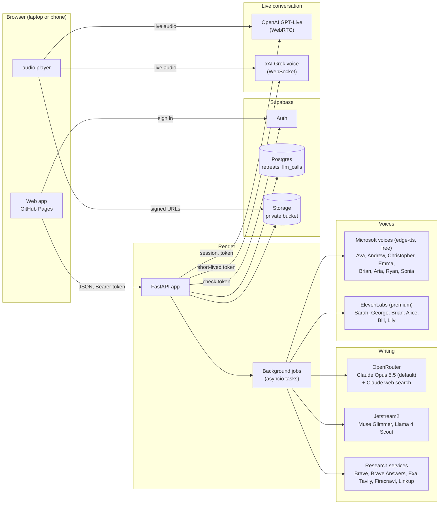

| Piece | Runs on | Job |
| --- | --- | --- |
| Web app | GitHub Pages | Everything the person sees. Plain HTML, CSS, JavaScript; no build step. |
| API | Render, Python 3.12, FastAPI + Uvicorn | Checks who is calling, extracts documents, runs background jobs, saves state, returns JSON. |
| Auth | Supabase Auth | Email sign-in links, anonymous guests, token refresh. |
| Database | Supabase Postgres | One row per retreat (the retreat is a JSON document), and a row per model call. |
| Files | Supabase Storage | Images, every MP3, research records, notes about the person, conversation memory. Private; signed URLs. |
| Writing | Claude through OpenRouter (premium); Jetstream2 open models (free) | Planning, reflections, deep dives, tailoring the guidance, condensing notes. |
| Research | Six web search services: [Brave Search](https://brave.com/search/api/), [Brave Answers](https://brave.com/search/api/), [Exa](https://exa.ai), [Tavily](https://tavily.com), [Firecrawl](https://www.firecrawl.dev), [Linkup](https://www.linkup.so) | Research for deep dives: all of it for free models, a head start before [Claude's own web search](https://docs.anthropic.com/en/docs/agents-and-tools/tool-use/web-search-tool) for premium. |
| Voices | [Microsoft neural voices](https://learn.microsoft.com/en-us/azure/ai-services/speech-service/language-support) through [edge-tts](https://github.com/rany2/edge-tts) (free); [ElevenLabs](https://elevenlabs.io) premade voices (premium). [Hear every voice](https://github.com/bcollier/ignatius-hw4-web#7-voices-hear-them-and-compare). | Scripts to MP3. |
| Conversation | OpenAI GPT-Live, xAI Grok voice | Talk it over. |

---

## 2. Hosting

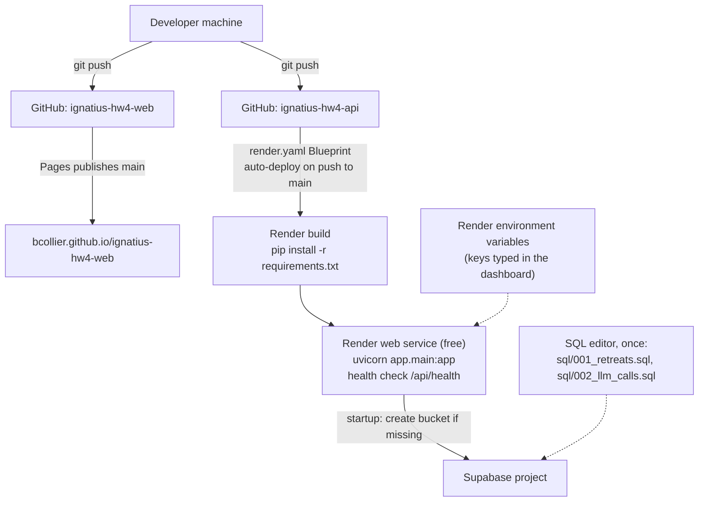

- **Render** ([render.com](https://render.com)) is the server. It's a cloud platform that builds and runs a web service straight from a Git repository: here a free Python 3.12 web service in Virginia, described in [`render.yaml`](render.yaml) (a Render Blueprint). Render runs `pip install -r requirements.txt`, starts `uvicorn app.main:app`, checks `/api/health` before sending traffic to a new version, and redeploys with zero downtime on every push to `main`. Secrets are `sync: false` in the Blueprint and typed into the dashboard, never committed. On this server the FastAPI app answers the web page, extracts uploaded documents, and runs the background jobs (plain asyncio tasks) that plan, write, research and record each retreat; a job that dies with its server is picked up again by the next one, from a heartbeat saved on the retreat. The free instance sleeps after 15 minutes without visitors and takes up to a minute to wake (the web app shows a waiting screen with a breathing circle and quotes meanwhile), and its disk is temporary, which is why everything lives in Supabase. A paid instance (about $7 a month) stays awake. Every service the app uses, free and paid, is listed in the [frontend README](https://github.com/bcollier/ignatius-hw4-web#22-services-what-runs-it-free-and-paid), with how to swap the free model for OpenRouter's free models, your own Ollama, or an OpenAI key.
- **Supabase** provides Auth, Postgres and Storage in one project.
- **Local development** needs none of it: with no Supabase settings the API uses `LocalStore` (JSON and files under `DATA_DIR`) and a single local user, and `LLM_MODE=stub` removes model calls.

---

## 3. What happens when you press "Make my retreat"

One multipart request carries the file and every option. The server checks the options, extracts the document, answers **202** at once, and does the rest in a background job while the page polls.

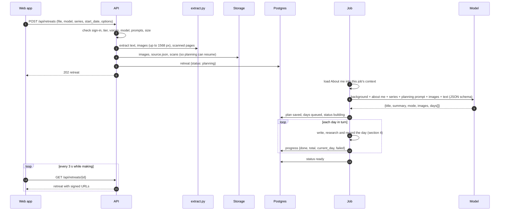

**Plan modes.** If the document already has days ("Day 1", "Day 2"...), they are kept in order with their passages (`follows_source`). If it is loose material, the model composes about seven days (`composed`), choosing a grace, a focus and images for each. Passages are always copied word for word; the model may remove only page furniture and verse numbers. The output is constrained by a JSON schema (with a fallback that describes the schema in the prompt if the gateway refuses structured output).

**Series.** A retreat can continue earlier weeks. Every call for the new retreat then gets every earlier week's titles, graces, passages, reflections and deep dives (shortened oldest-first if over budget: 600k characters for Claude, 80k for Jetstream), with Claude's copy in a cached system block so each day reads it at a fraction of the price.

---

## 4. Inside a day: parts that know about each other

The parts are written in the order they are heard, and each sees what came before.

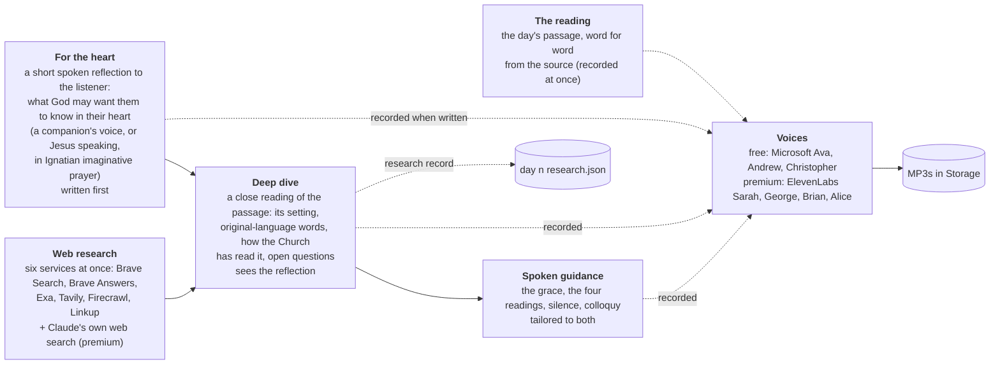

| Part | What it is | Written by | Default voice (free · premium) |
| --- | --- | --- | --- |
| **The reading** | The day's passage, copied word for word from the uploaded material (or the World English Bible, for a retreat made from an idea), read four times in the lectio divina pattern | Nobody: it's the source text | [Andrew](https://bcollier.github.io/ignatius-hw4-web/samples/voices/free-andrew.mp3) · [George](https://bcollier.github.io/ignatius-hw4-web/samples/voices/premium-george.mp3) |
| **For the heart** | A short reflection spoken to the listener, about what God may want them to know in their heart through this passage: in a companion's voice, or, if chosen, the voice of Jesus in the manner of Ignatian imaginative prayer ([prompt](app/agent_prompts/heart_companion.md), [Jesus version](app/agent_prompts/heart_christ.md)) | Claude Opus 5.5 by default (premium) or an open model on Jetstream2 (free) | [Andrew](https://bcollier.github.io/ignatius-hw4-web/samples/voices/free-andrew.mp3) · [Brian](https://bcollier.github.io/ignatius-hw4-web/samples/voices/premium-brian.mp3) |
| **Deep dive** | A close reading for the mind: where and when the passage was written, key words in the original Hebrew or Greek, how the Church and its teachers have read it, and the real open questions; written knowing what the reflection said, from web research ([prompt](app/agent_prompts/deep_dive.md)) | The same model, with the research below | [Christopher](https://bcollier.github.io/ignatius-hw4-web/samples/voices/free-christopher.mp3) · [Alice](https://bcollier.github.io/ignatius-hw4-web/samples/voices/premium-alice.mp3) |
| **Spoken guidance** | The short lines that lead the prayer: asking for the day's grace, introducing each reading, the silence between two bells, the colloquy and closing, tailored to the day's reflection and deep dive ([prompt](app/agent_prompts/guide_tailor.md)) | The same model | [Ava](https://bcollier.github.io/ignatius-hw4-web/samples/voices/free-ava.mp3) · [Sarah](https://bcollier.github.io/ignatius-hw4-web/samples/voices/premium-sarah.mp3) |

**The six web research services** (all at once by default, results interleaved and deduplicated; see [section 5](#5-research-all-the-free-services-at-once)): [Brave Search](https://brave.com/search/api/) (Brave's own independent index), [Brave Answers](https://brave.com/search/api/) (a cited AI answer from that index), [Exa](https://exa.ai) (search by meaning, good for essays and commentary), [Tavily](https://tavily.com) (cleaned page extracts for AI agents), [Firecrawl](https://www.firecrawl.dev) (reads whole pages), and [Linkup](https://www.linkup.so) (standard search, and a slower deep mode offered on its own). Premium deep dives also use [Claude's own web search](https://docs.anthropic.com/en/docs/agents-and-tools/tool-use/web-search-tool), up to five searches.

**The voices:** free voices are [Microsoft neural voices](https://learn.microsoft.com/en-us/azure/ai-services/speech-service/language-support) through [edge-tts](https://github.com/rany2/edge-tts); premium voices are [ElevenLabs](https://elevenlabs.io) premade voices ([voice library](https://elevenlabs.io/voice-library)). Every voice the app offers can be heard in the [frontend README's voice samples](https://github.com/bcollier/ignatius-hw4-web#7-voices-hear-them-and-compare), and each part's voice can be changed when making a retreat.

- **Background for every call.** Every prompt to every model starts with `prompts.BACKGROUND` (the Exercises and their four weeks, the Principle and Foundation, asking for a grace, imaginative contemplation, colloquy, repetition, consolation and desolation, the Examen, Annotations 15 and 19, lectio divina per Guigo II and *Verbum Domini* 87, and how a day is prayed in this app), then the person's About me notes. It is added where calls go out (`llm._call`, `jetstream.complete`), so nothing can skip it.
- **House style for listening:** plain paragraphs, no lists, parentheses or dashes, no verse numbers, and never inventing a Hebrew or Greek word, a variant, a quotation or a fact.
- **Tailoring the guidance** keeps each line's purpose and length and the opening's request for the grace word for word; lines the model drops or overruns keep their default, and any failure falls back to the plain text. It can be turned off.
- **Recording starts as soon as each script exists**, in parallel with the writing of the next part.

---

## 5. Research: all the free services at once

The free Jetstream models can't search, so the server researches for them. By default (`SEARCH_PROVIDER=all`) it asks **every configured service at once** and combines the results:

**Premium too.** Claude models get the same combined free-service results first, as a head start (Claude writes the three searches, the free services run them), and then still use their own web search at its full allowance (up to 5 searches), told to search further wherever the free results are thin and never to be limited by them. The free results save some paid searches; they never cap the depth of a premium deep dive. The research record then holds both: the free results and Claude's own searches and pages.

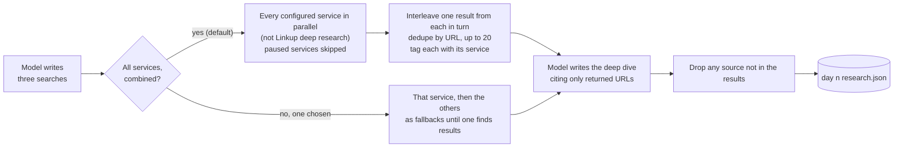

| Service | Call | What becomes a result |
| --- | --- | --- |
| Brave Search | `GET api.search.brave.com/res/v1/web/search` | title, URL, description and extra snippets |
| Brave Answers | `POST api.search.brave.com/res/v1/chat/completions` (own key), streamed, citations | the answer under its first cited URL, and each citation |
| Exa | `POST api.exa.ai/search`, type auto, highlights | title, URL, highlights; reported cost added to the day |
| Tavily | `POST api.tavily.com/search`, basic depth | title, URL, content |
| Firecrawl | `POST api.firecrawl.dev/v2/search` | title, URL, description; credits logged |
| Linkup | `POST api.linkup.so/v1/search`, standard depth | name, URL, content |
| Linkup deep research | same endpoint, deep depth, sourced answer, 2-minute timeout | the answer and each source (only when chosen on its own) |

**Failing softly.** Each service is wrapped so research can never break a build:

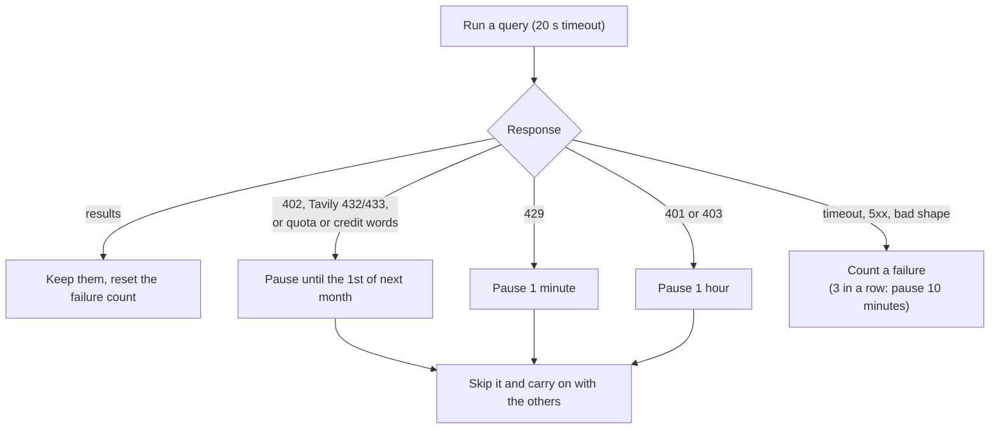

Pauses persist in `system/search_status.json`, so a restart or Render waking from sleep doesn't retry a service that's out of credits; `/api/options` reports each service's status for the menu. Linkup's two modes share one account and pause together. Every query, successful or not, is a row in `llm_calls`.

### Set up the research services yourself

Any one service is enough, and with none the deep dive is written without web research. Sign up, create an API key, and put it in the server's environment under the name below: in `.env` locally, or under Environment on Render. The server uses every service that has a key. Free allowances are as listed in September 2026.

| Service | Free tier | Sign up and get a key | Getting started | API reference (the endpoint this app calls) | Pricing | Environment variable |
| --- | --- | --- | --- | --- | --- | --- |
| Brave Search | About 1,000 searches a month ($5 of monthly credit) | [Register](https://api-dashboard.search.brave.com/register) | [Web search quickstart](https://api-dashboard.search.brave.com/app/documentation/web-search/get-started) | [`GET /res/v1/web/search`](https://api-dashboard.search.brave.com/api-reference/web/search/get) | [Pricing](https://api-dashboard.search.brave.com/documentation/pricing) | `BRAVE_SEARCH_API_KEY` |
| Brave Answers | $5 of monthly credit; a separate plan and key in the same Brave account | [Register](https://api-dashboard.search.brave.com/register) | [Answers guide](https://api-dashboard.search.brave.com/documentation/services/answers) | [`POST /res/v1/chat/completions`](https://api-dashboard.search.brave.com/api-reference/ai/answers) | [Pricing](https://api-dashboard.search.brave.com/documentation/pricing) | `BRAVE_ANSWERS_API_KEY` |
| Exa | About 1,400 searches a month ($10 of credit, reset on the 1st; no card) | [API keys](https://dashboard.exa.ai/api-keys) | [Quickstart](https://exa.ai/docs/reference/quickstart) | [`POST /search`](https://exa.ai/docs/reference/search) | [Pricing](https://exa.ai/pricing) | `EXA_API_KEY` |
| Tavily | 1,000 searches a month (no card) | [Sign in](https://app.tavily.com) | [Quickstart](https://docs.tavily.com/documentation/quickstart) | [`POST /search`](https://docs.tavily.com/documentation/api-reference/endpoint/search) | [Pricing](https://www.tavily.com/pricing), [credits](https://docs.tavily.com/documentation/api-credits) | `TAVILY_API_KEY` |
| Firecrawl | About 500 searches a month (1,000 credits; no card) | [Sign in](https://www.firecrawl.dev/signin), then [API keys](https://www.firecrawl.dev/app/api-keys) | [Introduction](https://docs.firecrawl.dev/introduction) | [`POST /v2/search`](https://docs.firecrawl.dev/api-reference/endpoint/search) | [Pricing](https://www.firecrawl.dev/pricing) | `FIRECRAWL_API_KEY` |
| Linkup (standard and deep) | $20 of credit a month: about 4,000 standard or 360 deep searches | [Sign in](https://app.linkup.so) | [Quickstart](https://docs.linkup.so/pages/documentation/get-started/quickstart) | [`POST /v1/search`](https://docs.linkup.so/pages/documentation/api-reference/endpoint/post-search) | [Pricing](https://docs.linkup.so/pages/documentation/development/pricing) | `LINKUP_API_KEY` (one key for both) |

---

## 6. Voices and recording

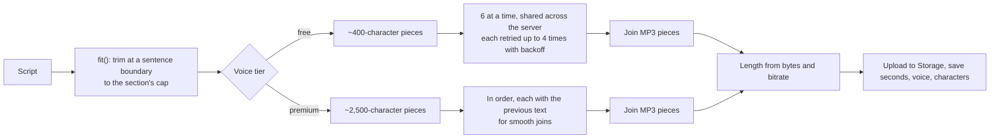

| Tier | Voices | Notes |
| --- | --- | --- |
| Free (Microsoft neural, via `edge-tts`) | Andrew, Ava, Brian, Emma, Christopher, Aria | No key, no cost. 24 kHz mono MP3. |
| Premium (ElevenLabs, `eleven_multilingual_v2`) | Brian, George, Bill, Sarah, Alice, Lily | Only for `ALLOWED_EMAILS`. 44.1 kHz 128 kbit/s MP3. At most 2 requests at once, 429s retried. The account's remaining characters are shown. |

Samples of all twelve: the web app's [About page](https://bcollier.github.io/ignatius-hw4-web/?about#voices), or the links in the [web README](https://github.com/bcollier/ignatius-hw4-web#7-voices-hear-them-and-compare). Both services produce constant-bitrate MP3, so pieces join byte for byte and length follows from size. The reading is recorded once and played four times.

---

## 7. Talk it over

A live spoken conversation with an AI prayer companion, modeled on how spiritual directors are taught to listen (mostly questions, little advice, noticing consolation and desolation and where God may be at work), which never calls itself spiritual direction and gives the 988 lifeline in a crisis.

**Talk now**, the first button on the home page, opens it in one tap and starts talking at once (on today's retreat, with the voice and way of talking they chose last time; free accounts take turns with the free model). The companion's instructions always include **the time where the person is** when they pressed it ("It is Sunday, September 27, 2026, 9:12 pm where they are (in the evening).") and **when they last talked** ("Your last conversation with them was about 3 hours ago (2026-09-27), about Be Still"), followed by the memory of older talks and the latest transcripts. That context is built in `app/talk.py` (`context()`); the companion's own instructions are [`app/agent_prompts/companion.md`](app/agent_prompts/companion.md).

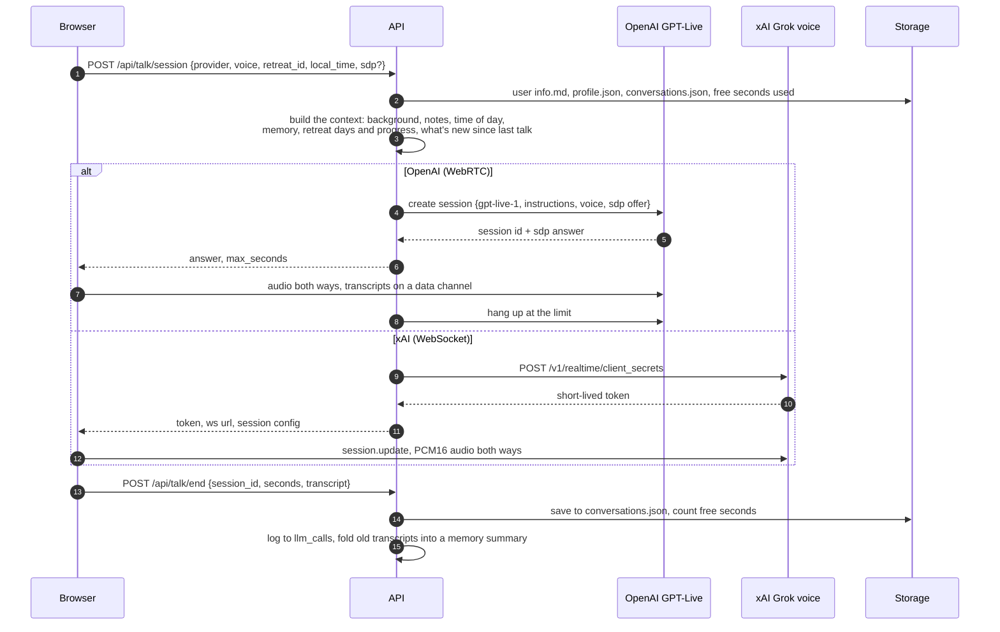

Free accounts get 60 seconds a day; premium up to 30 minutes a call. OpenRouter can't carry live audio, so `OPENAI_API_KEY` and `XAI_API_KEY` are used directly, and never reach the browser. OpenAI costs about $0.05 a minute, Grok about $0.08.

---

## 8. Example retreats

Two ready-made retreats everyone sees at first sign-in, both made from the **"Come and See"** package in [`samples/demo/`](samples/demo) (seven Gospel encounters from the public-domain World English Bible, each day with a public-domain painting: Duccio, Caravaggio, Carl Bloch, Rembrandt, Titian). One was made free (Muse Glimmer, Microsoft voices, combined research), one premium (Claude Fable 5.1, ElevenLabs).

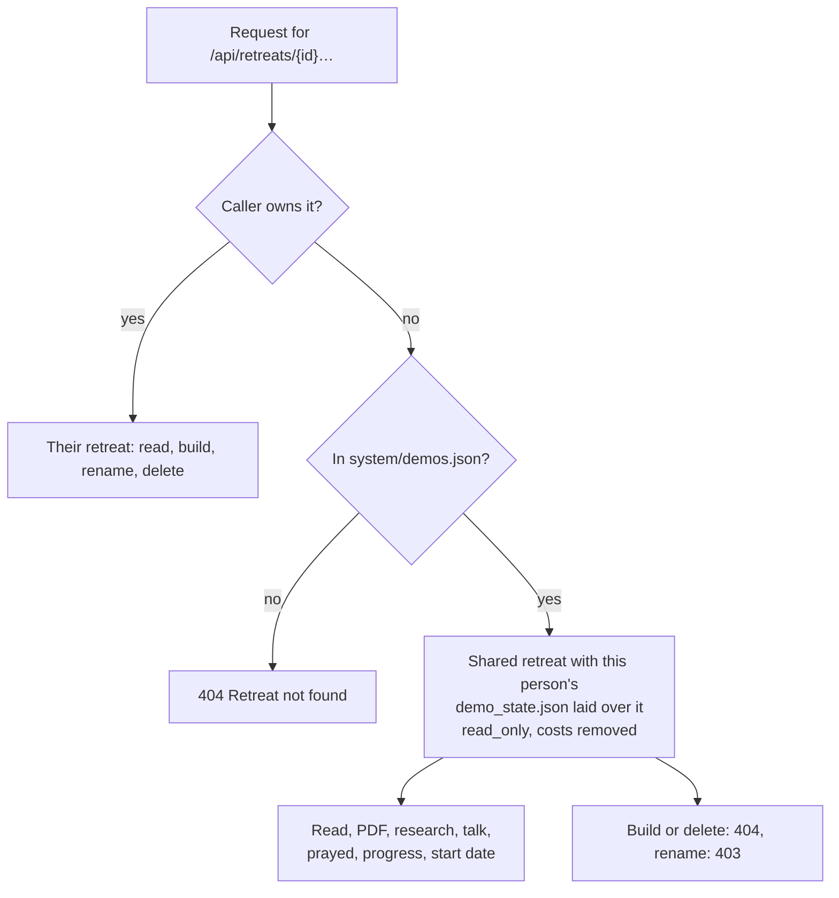

- `readable_retreat` in `app/access.py` returns the owner's retreat or the personal view (`demos.personal`); `save_retreat` writes either the retreat or just the visitor's own fields (start date, prayed, journal, listening) to `{user_id}/demo_state.json`.
- `GET /api/retreats` returns `{retreats, examples}`; each example is a summary with the person's own progress, `demo: {label, kind}`, `read_only: true` and a signed `cover` image URL.
- Nobody's models or voices are spent when someone listens to an example.

---

## 9. The research page

`GET /api/retreats/{id}/research` returns, for each day, the passage and the planner's notes, and the saved research record: the searches, every result (title, URL, snippet, the service that found it), which were cited, which services contributed or were skipped, and the model. For Claude, the searches Claude ran and the pages its web search returned are saved instead. The web app shows it on a desktop-only page turned on under Advanced.

---

## 10. Data model

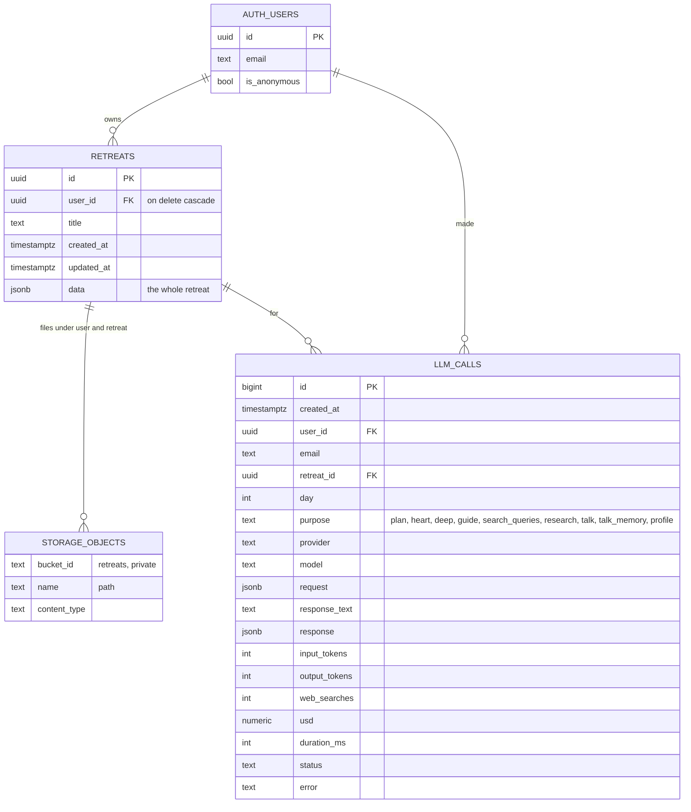

> **Where are the users?** `AUTH_USERS` is Supabase Auth's own table, `auth.users`, in the **`auth` schema**. The Table Editor shows the `public` schema by default, so it won't appear next to `retreats` and `llm_calls`. See it under **Authentication → Users**, or switch the Table Editor's schema dropdown to `auth`. The app never keeps a users table of its own; `user_id` columns point at `auth.users.id`.

**Why a JSON document per retreat.** A retreat is read and written as a whole: one read and one upsert per step, no joins, and the shape grew (guidance clips, costs, progress, journal, research paths) without migrations. The API is the only writer, so it enforces the structure. Row level security is on with **no policies**, so the browser's publishable key can't touch the tables; only the API's secret key can.

**Storage layout**

```
retreats/                                   private bucket
├── {user_id}/
│   ├── {retreat_id}/
│   │   ├── image0.jpg … imageN.jpg         images from the upload (max 8, ≤1568 px)
│   │   ├── source.json, scan0.png …        extracted text and scanned pages, for resuming
│   │   ├── day1_reading.mp3, day1_heart.mp3, day1_deep.mp3
│   │   ├── day1_opening.mp3 … day1_closing.mp3   spoken guidance
│   │   └── day1_research.json              searches, results, citations
│   ├── user info.md                        About me (maybe condensed)
│   ├── profile.json                        summary flag, companion notes
│   ├── conversations.json                  past conversations and memory summary
│   ├── talk_usage.json                     free seconds used today
│   └── demo_state.json                     own progress in example retreats
└── system/
    ├── search_status.json                  paused research services
    └── demos.json                          which retreats are examples
```

The full shape of the retreat document is diagrammed in [ARCHITECTURE.md §3.2](docs/ARCHITECTURE.md#32-inside-a-retreat-data).

---

## 11. Full mode and free mode

| | Full mode (emails on `ALLOWED_EMAILS`) | Free mode (everyone else, and guests) |
| --- | --- | --- |
| Sign-in | Email link | Email link, or **Try it without an account** (anonymous; add an email later to keep the retreats) |
| Models | Claude via OpenRouter: Opus 5.5 (default), Opus 5, Fable 5.1, Sonnet 5, Haiku 4.5 | Jetstream2: Muse Glimmer (default) or Llama 4 Scout |
| Deep-dive research | The six free services combined as a head start, then Claude's own web search at full depth | Six services, combined by default |
| Voices | Microsoft and ElevenLabs, mixed freely | Microsoft |
| Talk it over | Up to 30 minutes a call | 60 seconds a day |
| Retreats | No limit | No limit |
| Cost to the site owner | Model, ElevenLabs and conversation charges | None (Jetstream is an academic allocation; research uses free tiers) |

Free mode is on whenever `JETSTREAM_API_KEY` is set. Jetstream is reached through its Open WebUI proxy (`https://llm.jetstream-cloud.org/api`, OpenAI-compatible), which is reachable from Render. Muse Glimmer is a reasoning model, so it's given generous token limits; images are offered for planning and dropped if refused.

---

## 12. Endpoints

Every error has the shape `{"error": {"status": 400, "message": "..."}}`, with a message meant for people. Endpoints marked 🔒 need `Authorization: Bearer <Supabase access token>` when Supabase is configured. "Readable" means the caller's own retreat or an example retreat (section 8); anything else is 404. Full request and response examples: [ARCHITECTURE.md §10](docs/ARCHITECTURE.md#10-api-reference).

| Method and path | Access | Parameters | Returns |
| --- | --- | --- | --- |
| `GET /` | public | | Name and links |
| `GET /api/health` | public | | `{ok, llm, model, tiers, sign_in}` |
| `GET /api/options` | public | | Voice tiers and voices, default prompts and guidance with labels, limits, models with live prices, default model, web search, ElevenLabs balance, conversation providers, voices and limits, research services with their status and the default, free mode, and the public Supabase settings |
| `GET /api/me` | 🔒 | | `{id, email, anonymous, mode}` |
| `GET /api/retreats` | 🔒 | | `{retreats: [...], examples: [...]}`: summaries with status, days, progress, day states, prayed counts, series; examples add `demo`, `read_only`, `cover` |
| `POST /api/retreats` | 🔒 | multipart: `file` (.pdf/.docx, ≤15 MB, ≤40 pages), `model`, `plan_prompt`, `series`, `start_date`, `options` (JSON: voices, write model, research service, prompts, guidance, tailoring) | **202**, retreat `planning`; then `building` with `progress`; then `ready` |
| `GET /api/retreats/{id}` | 🔒 readable | | The retreat with signed URLs: plan, days, tracks and guidance clips with scripts, sources, lengths; listening and journal; costs (owners only) |
| `GET /api/retreats/{id}/script.pdf` | 🔒 readable | `day`, `order` (`lectio`/`simple`), `grace_silence`, `pause` | Printable script in prayer order, with images, guidance, silences, sources, journal; the whole retreat adds a cover and series titles |
| `GET /api/retreats/{id}/research` | 🔒 readable | | Each day's passage, notes, searches, every result with its service, citations |
| `GET /api/retreats/{id}/log?after=N` | 🔒 readable | | The build log: every step and every model, search and voice call, in order; `full=true` for the complete record |
| `GET /api/examples` | | | Example source documents to build from; `/api/examples/{slug}.pdf`, `.txt`, `/cover.jpg` |
| `GET /api/costs` | 🔒 | | Each of your retreats by part and by company, from the llm_calls log and the recorded voices; totals by company; prices used |
| `PATCH /api/retreats/{id}` | 🔒 readable | `start_date`, `title` | The retreat; renaming an example is 403; an example's start date is saved per person |
| `POST /api/retreats/{id}/days/{n}/prayed` | 🔒 readable | `prayed`, `word` (≤100), `note` (≤2,000) | The retreat |
| `POST /api/retreats/{id}/days/{n}/progress` | 🔒 readable | `step`, `part`, `seconds`, `parts_played`, `finished` | `{listening, prayed_at}`; finishing marks the day prayed |
| `POST /api/retreats/{id}/days/{n}/retry` | 🔒 owner | | **202**; **Try again**: records only the parts that failed, from their saved scripts, with the day's own options (nothing rewritten). 409 if a part has no script, in which case rewrite the day |
| `POST /api/retreats/{id}/days/{n}/build` | 🔒 owner | `voices`, `voice`, `heart_prompt`, `deep_prompt`, `guide`, `keep_scripts`, `model`, `search_provider` | **202**; rewrite or re-record one day. 409 if busy |
| `DELETE /api/retreats/{id}` | 🔒 owner | | `{deleted}`; removes the row and all its files. 409 while a job runs |
| `GET`, `PUT /api/profile` | 🔒 | `about`, `companion_notes` | About me; long notes condensed with `summarized: true` |
| `POST /api/profile/upload` | 🔒 | `.txt`, `.md`, `.docx`, `.pdf` | About me from the file |
| `POST /api/talk/session` | 🔒 | `provider`, `voice`, `retreat_id` (readable), `local_time`, `sdp` | OpenAI: WebRTC answer; xAI: token, WebSocket URL, session config |
| `POST /api/talk/end` | 🔒 | `session_id`, `seconds`, `transcript` | Saved to memory; seconds capped at real elapsed time |
| `GET`, `DELETE /api/talk/history` | 🔒 | | Past conversations and memory; or forget them all |
| `GET /api/files/{path}` | local only | | Files from `DATA_DIR` when Supabase is off |

Interactive docs are at `/docs` on any running server.

---

## 13. Costs

- **Models.** Each response's token usage (input, output including thinking, cache reads and writes, web searches) is priced at OpenRouter's live rates, fetched from `GET /api/v1/models` and cached 6 hours. Jetstream costs nothing. Totals are saved as `costs.plan` on the retreat and `cost` on each day.
- **Research.** Services that report a cost (Exa) or credits (Firecrawl) have it logged; the rest use free monthly allowances.
- **Voices.** Microsoft is free. ElevenLabs is billed by character; the dollar figure uses `ELEVENLABS_USD_PER_1K_CHARS` (default $0.30) and the page shows the account's remaining characters.
- **Conversation.** Minutes × $0.05 (OpenAI) or $0.08 (xAI), logged per call.
- **Estimates** before a retreat is made are computed in the browser from the same prices and the chosen voices. Costs appear only while making, on larger screens, and never for example retreats.

---

## 14. Logging every call

Every call to a model or research service, including failures, adds a row to `llm_calls`: who (user id and email, or "guest"), which retreat and day, the purpose, the provider and model, the full prompt (images replaced by their type and size), the full response (stop reason, web search queries, reasoning), tokens, searches, cost, time and status. The context travels with each job in Python context variables, copied into each asyncio task, so parallel calls never mix up their tags or their person's notes. The `llm_usage_by_user` view totals it per person. A failure to log is recorded in the server log and never stops a job.

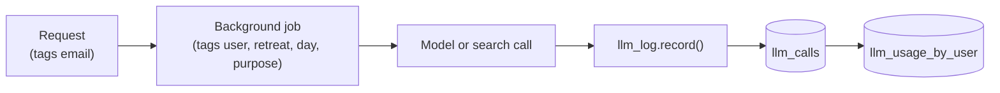

---

## 15. Resilience

| What goes wrong | What happens |
| --- | --- |
| Render redeploys or restarts mid-job | Jobs save a heartbeat every 20 s. A retreat that's mid-job with no task running here and a heartbeat over 90 s old is resumed: planning from the saved source, a day build keeping finished recordings and scripts. After two resumes it's marked failed. A fresh heartbeat is left alone, because during zero-downtime deploys the old server may still be finishing. |
| A day fails | The other days continue; the retreat is ready with that day failed, and "Try again" rebuilds it. |
| Too many jobs | At most `MAX_CONCURRENT_JOBS` (2) run at once; others wait their turn. |
| A research service is out of credits, rate limited, or down | Paused (until next month, a minute, an hour, or ten minutes), skipped, and the others carry on; nothing found means writing without search. |
| Microsoft's free voice service drops a request | Each piece retried up to 4 times with backoff (1.5 s, 3 s, 6 s). |
| ElevenLabs refuses requests (429) | Plans cap simultaneous requests (Starter: 3), and a day's many short guidance clips used to start at once. Now at most 2 ElevenLabs requests run at a time across the server, and a 429 is retried up to 5 times with backoff. This, not credits, was why the first premium example build had failed clips. |
| ElevenLabs out of credits | That section fails with a clear message; switch to a free voice and re-record. |
| A day finished with some clips failed | **Try again** (`POST /days/{n}/retry`, or `tools/retry_days.py RETREAT_ID` for every failed day) records only the failed clips from the saved scripts, so nothing is rewritten or paid for twice. |
| Structured output or web search rejected by the gateway | Retried without it (schema in the prompt; deep dive without search). |
| A Jetstream model refuses images | Retried text only. |
| A reasoning model runs out of room | Limits sized for thinking: planning 64k tokens, writing 32k, tailoring 16k. |
| The About me notes can't be loaded | The job continues without them. |
| Render asleep | The page explains and offers Retry; nothing is lost, since everything is in Supabase. |

---

## 16. Security and secrets

- **Keys live only in environment variables:** `.env` locally (gitignored, never committed) and Render's dashboard in production. `.env.example` lists the names with empty values. No key has ever been committed or typed into a prompt.
- **Supabase:** the secret key stays on the server; the browser gets only the publishable key, which is designed to be public. RLS is on with no policies.
- **Retreats are private:** another person's retreat is 404, the same as a missing one, except example retreats, which are read-only and keep each visitor's progress in their own folder.
- **Files** are in a private bucket, reached through signed URLs that expire after 6 hours (reused for up to 5). Paths start with the owner's id.
- **Live conversation keys** never reach the browser: OpenAI's SDP is relayed by the server, and xAI gets a token that expires in 5 minutes.
- **Spending** is limited to `ALLOWED_EMAILS`; free mode costs nothing; uploads, pages, text, prompts, track lengths and conversation time are capped.
- **CORS** allows only `ALLOWED_ORIGINS`. The local file route exists only without Supabase and refuses paths outside `DATA_DIR`.
- **Fixed after the September 27, 2026 security audit** (tests in `tests/test_security.py`):
  - An example retreat's build log shows other people only its build steps: never conversations, memory, notes or model reasoning. Conversations are filed under a retreat only if it's the person's own.
  - Live voice time is measured and charged by the server, not reported by the browser.
  - A call is checked to be the person's own before it can be ended.
  - Ending an OpenAI call hangs it up, and a call the browser never ends is settled at its limit.
  - One live call at a time; the Grok voice (whose connection the server can't close) is premium-only.
  - The server refuses to start with half-configured sign-in, without sign-in unless `LOCAL_MODE=1`, or with a public storage bucket.
  - The public options no longer show the ElevenLabs balance.
  - Unsaved journal drafts in the browser are kept per account and cleared at sign-out.
  - Deleting a retreat removes its whole storage folder (sources and scans too) and erases the prompts and replies in its log rows (costs are kept); forgetting conversations erases their log copies, and a memory update already running can't restore them; a new Examen removes the old recordings (F08).
  - A retreat is looked up without side effects, and a stalled job is resumed only after ownership is checked; ids can't reach outside the store (F10).
  - Phone sign-in codes: the caller's address is the one Render's edge saw; no global lockout that a flood of guesses could trigger; one code per account (F09).
  - Each person may run a few jobs at once and start only so many a day (free: 1 and 5; full: 3 and 50), with a ceiling for the whole server; the anonymous error-report endpoint is rate limited (F03).
  - Request bodies are capped before anything reads them; Word files are checked for decompression bombs, images for size before decoding, scanned pages drawn within a pixel budget, Google Docs downloads streamed with a ceiling, and parsing runs off the event loop (F04).
  - The sign-in cache keeps hashes, not tokens, honours each token's expiry and is bounded; an empty `ALLOWED_EMAILS` gives no one full mode unless `EVERYONE_FULL=1`; search queries are written without the person's notes; signed file links last 6 hours.
  - Dependencies install from `requirements.lock`, every package pinned by hash; Dependabot opens weekly update pull requests (refresh the lock after merging one).

---

## 17. Configuration

Names only; values go in `.env` or Render's dashboard.

| Variable | Default | Purpose |
| --- | --- | --- |
| `OPENROUTER_API_KEY` | | Claude through OpenRouter |
| `ANTHROPIC_API_KEY` | | Claude directly, if no OpenRouter key |
| `LLM_MODE` | from keys | `openrouter`, `anthropic` or `stub` |
| `LLM_MODEL` | `anthropic/claude-opus-5.5` | Default model |
| `WEB_SEARCH` | `1` | Web search for the deep dive |
| `ELEVENLABS_API_KEY`, `ELEVENLABS_MODEL`, `ELEVENLABS_USD_PER_1K_CHARS` | / `eleven_multilingual_v2` / `0.30` | Premium voices |
| `SUPABASE_URL`, `SUPABASE_PUBLISHABLE_KEY`, `SUPABASE_SECRET_KEY`, `SUPABASE_BUCKET` | / / / `retreats` | Sign-in, database, storage |
| `ALLOWED_EMAILS` | no one | Who gets full mode (the paid models and voices). Empty means no one, unless `EVERYONE_FULL=1` |
| `EVERYONE_FULL` | off | `1` gives every signed-in account full mode when `ALLOWED_EMAILS` is empty (for a private deployment) |
| `LOCAL_MODE` | off | `1` runs without Supabase: one local user, files on disk. Without it, the server won't start unless sign-in is fully set up |
| `JETSTREAM_API_KEY`, `JETSTREAM_BASE_URL`, `JETSTREAM_MODELS` | / proxy URL / `muse-glimmer,llama-4-scout` | Free mode |
| `FREE_MODE`, `LOCAL_USER_MODE` | `1` / | Free mode switch; preview free mode locally |
| `TAVILY_API_KEY`, `TAVILY_SEARCH_DEPTH` | / `basic` | Tavily |
| `EXA_API_KEY`, `BRAVE_SEARCH_API_KEY`, `BRAVE_ANSWERS_API_KEY`, `FIRECRAWL_API_KEY`, `LINKUP_API_KEY` | | The other research services |
| `SEARCH_PROVIDER` | `all` | `all` (combined) or one service |
| `OPENAI_API_KEY` | | Talk it over with GPT-Live |
| `XAI_API_KEY`, `XAI_VOICE_MODEL`, `XAI_DEFAULT_VOICE`, `XAI_USD_PER_MINUTE` | / `grok-voice-latest` / `eve` / `0.08` | Talk it over with Grok voice |
| `FREE_TALK_SECONDS`, `TALK_MAX_SECONDS` | 60 / 1800 | Conversation limits |
| `PROFILE_MAX_CHARS` | 6000 | About me is condensed above this |
| `SERIES_MAX_CHARS`, `SERIES_MAX_CHARS_FREE` | 600000 / 80000 | Series context budgets |
| `ALLOWED_ORIGINS` | localhost ports | CORS |
| `DATA_DIR` | `/tmp/ignatius` | Local storage without Supabase |
| `MAX_UPLOAD_MB`, `MAX_PAGES`, `MAX_SOURCE_CHARS` | 15 / 40 / 80000 | Upload limits |
| `MAX_IMAGES`, `MAX_SCANNED_PAGES` | 8 / 4 | Extraction limits |
| `MAX_DAYS`, `DEFAULT_DAYS` | 14 / 7 | Plan size |
| `MAX_TRACK_CHARS`, `PREMIUM_MAX_TRACK_CHARS` | 6000 / 2500 | Section length caps |
| `MAX_CONCURRENT_JOBS` | 2 | Jobs at once |

---

## 18. Code map

| File | Responsibility |
| --- | --- |
| `app/main.py` | The app: CORS, error format, start-up, and the list of routers |
| `app/routes/` | The routes, one module per area (meta, retreats, days, build log, costs, conversation, about me, example documents) |
| `app/checks.py` | Request checks: prompts, dates, models, series, build options |
| `app/access.py` | `my_retreat` (owner) and `readable_retreat` (owner or example), and saving an example's personal progress |
| `app/auth.py` | Token check with Supabase Auth (cached), allowlist, guests, local user |
| `app/storage.py` | `SupabaseStore` (rows, files, signed URLs, call log) and `LocalStore`; library summaries |
| `app/pipeline.py` | Background jobs: planning, making every day, building a day in listening order, saving research, heartbeat and resume, progress, costs |
| `app/extract.py` | PDF and Word extraction: text, images scaled to fit, scanned pages |
| `app/llm.py` | Claude through OpenRouter (streaming, structured output, web search, caching, fallbacks) and the Jetstream paths; planning, heart, deep dive, tailoring, condensing |
| `app/jetstream.py` | Jetstream2 client |
| `app/agent_prompts/` | Every prompt sent to a model, one plain-text file each, with an [index](app/agent_prompts/README.md) |
| `app/prompts.py` | Loads the prompts; builds each day's context, the retreat so far, and the plan schema |
| `app/search.py` | The six research services, combined mode, pausing, logging |
| `app/tts.py` | Voices, tiers, chunking, Microsoft (with retries) and ElevenLabs recording |
| `app/talk.py` | Talk it over: companion instructions, context, sessions, memory, free allowance |
| `app/profile.py` | About me: `user info.md`, condensing, loading into each job |
| `app/demos.py` | Example retreats: registry, per-person overlay |
| `app/series.py` | Earlier weeks as context, within a budget |
| `app/script_pdf.py` | The printable script |
| `app/pricing.py` | Models, live prices, cost meter, ElevenLabs balance |
| `app/llm_log.py` | The call log and its context |
| `app/config.py` | Settings from the environment |
| `tools/build_demo.py` | Makes and registers an example retreat |
| `tools/retry_days.py` | Finishes a retreat's failed days by re-recording only the failed clips |
| `samples/demo/` | The "Come and See" package and `make_demo.py` |
| `samples/` | Other public-domain sample uploads |
| `sql/` | `001_retreats.sql`, `002_llm_calls.sql` |
| `docs/` | `original-spec/` (the design spec, technical spec and build plan written before any code), `ARCHITECTURE.md`, `IMPROVEMENTS.md` (the redesign spec), `VISUAL_REDESIGN.md` (the visual redesign spec, with its mockups), `CODE_CLEANUP.md` (how the code is organized and kept readable), `CODE_REVIEW.md` (how to review a change) |

---

## 19. Tests

`.venv/bin/python -m pytest` runs 79 tests with no network and no keys: Supabase, the model gateways, the research services and the voice services are all faked (`tests/conftest.py` blanks every key).

| File | Covers |
| --- | --- |
| `test_api.py` | Upload, plan, build, errors, voices, prompts, PDF |
| `test_units.py` | Chunking, fitting, text helpers, cost math |
| `test_supabase.py` | Storage and auth against a fake Supabase |
| `test_free_mode.py` | Free mode, guests, Jetstream, tier rules |
| `test_search.py` | Every research service's parsing, pausing on credits and rate limits, fallback, logging, combined mode, the free head start for Claude |
| `test_llm_log.py` | The call log and its tags |
| `test_series.py` | Series context and budgets |
| `test_one_shot.py` | One-request making, bad options, a failed day and Try again, resume, prayed and journal, progress, start date and title, PDF, parts that know each other, tailoring, images per day |
| `test_talk_profile.py` | About me (short, long, upload), notes in every call, no leaks between jobs, conversation limits and memory, what's new since last talk, Grok tokens |
| `test_demos.py` | The research page, example retreats read only with personal progress |

Beyond the tests, real end-to-end builds were run throughout with free models and voices, and every research service was checked with real keys.

---

## 20. Run it locally

Needs Python 3.12.

```bash
python3.12 -m venv .venv
.venv/bin/pip install -r requirements.txt -r requirements-dev.txt
cp .env.example .env        # then fill in keys; all are optional for a first run
.venv/bin/uvicorn app.main:app --reload --port 8000
```

- **Running without Supabase needs `LOCAL_MODE=1`** (one local user, files under `DATA_DIR`). Without it, the server refuses to start unless `SUPABASE_URL` and `SUPABASE_SECRET_KEY` are both set, so a missing setting in production can never turn sign-in off.
- With no keys, also set `LLM_MODE=stub`: plans and scripts are placeholders, and free voices still record real audio.
- To try free mode locally, set `JETSTREAM_API_KEY` and `LOCAL_USER_MODE=free`.
- Serve the web repo on port 5500 (`python3 -m http.server 5500`); its `config.js` points at `localhost:8000`.
- Tests: `.venv/bin/python -m pytest -q`.

---

## 21. Supabase setup

1. Create a project. In the SQL editor run [`sql/001_retreats.sql`](sql/001_retreats.sql) and [`sql/002_llm_calls.sql`](sql/002_llm_calls.sql).
2. Authentication → URL Configuration: add the frontend URLs (GitHub Pages, `http://localhost:5500`) as redirect URLs.
3. Authentication → Sign In / Providers: turn on **Allow anonymous sign-ins** for guests.
4. Copy the project URL, publishable key and secret key into the environment. The private `retreats` bucket is created on first start.

---

## 22. Deploy on Render

1. Push to GitHub. In Render choose **New → Blueprint** and pick the repo; `render.yaml` defines the free web service.
2. Enter the secret values in the Environment tab.
3. Check `https://<service>.onrender.com/api/health`.

Every push to `main` redeploys.

---

## 23. Building the example retreats

```bash
.venv/bin/python samples/demo/make_demo.py                         # rebuilds come-and-see.pdf (fetches WEB text and paintings once)
.venv/bin/python tools/build_demo.py free    <OWNER_USER_ID>       # Muse Glimmer, Microsoft voices, combined research
.venv/bin/python tools/build_demo.py premium <OWNER_USER_ID>       # Claude Fable 5.1, ElevenLabs voices
```

Run against the production store (the `.env` Supabase settings), `build_demo.py` extracts the package, makes the retreat with that kind's models and voices through the normal pipeline, waits for every day, then registers it in `system/demos.json`. The premium build prints the ElevenLabs balance first (a full premium week is roughly 70,000 to 100,000 characters). If any clips fail (a dropped connection, an ElevenLabs 429), `tools/retry_days.py RETREAT_ID` finishes them from the saved scripts. `demos.unregister(id)` removes an example from the list.

---

## 24. Rights and copyright

Users upload only material they own or have permission to use, and every retreat is private to the account that made it. The public examples and samples use only public-domain material: the World English Bible and paintings that are public domain or CC0 on Wikimedia Commons. Parish retreat handouts and copyrighted translations are never in these repositories.
