# Ignatius at Home: how it works

This document describes the whole system: what runs where, how the pieces talk to each other, what is stored, and what happens step by step when someone signs in, uploads a document, builds a day and prays it. Diagrams are written in [Mermaid](https://mermaid.js.org), which GitHub draws in place.

**Contents**

1. [The system at a glance](#1-the-system-at-a-glance)
2. [Hosting and deployment](#2-hosting-and-deployment)
3. [Data model](#3-data-model)
4. [User journey](#4-user-journey)
5. [Signing in](#5-signing-in)
6. [Uploading and planning a retreat](#6-uploading-and-planning-a-retreat)
7. [Building a day](#7-building-a-day)
8. [Praying a day: the player](#8-praying-a-day-the-player) · [8a progress](#8a-listening-progress-prayed-days-and-the-journal) · [8b About me](#8b-about-me-user-infomd) · [8c Talk it over](#8c-talk-it-over-live-conversation) · [8d Example retreats](#8d-example-retreats) · [8e Research page](#8e-research-done-for-this-retreat)
9. [Status lifecycles](#9-status-lifecycles)
10. [API reference](#10-api-reference)
11. [Costs](#11-costs)
12. [Security and privacy](#12-security-and-privacy)
13. [Failures and recovery](#13-failures-and-recovery)
14. [Code map](#14-code-map)
15. [Configuration](#15-configuration)

---

## 1. The system at a glance

Ignatius at Home turns a document the user has rights to (a prayer handout, scripture passages, a reading, with images) into a guided audio retreat. Each day has three recorded sections (the reading, a reflection for the heart, and a deep dive into theology, history and hermeneutics), wrapped in short spoken guidance, and is prayed in a lectio sequence with silences.

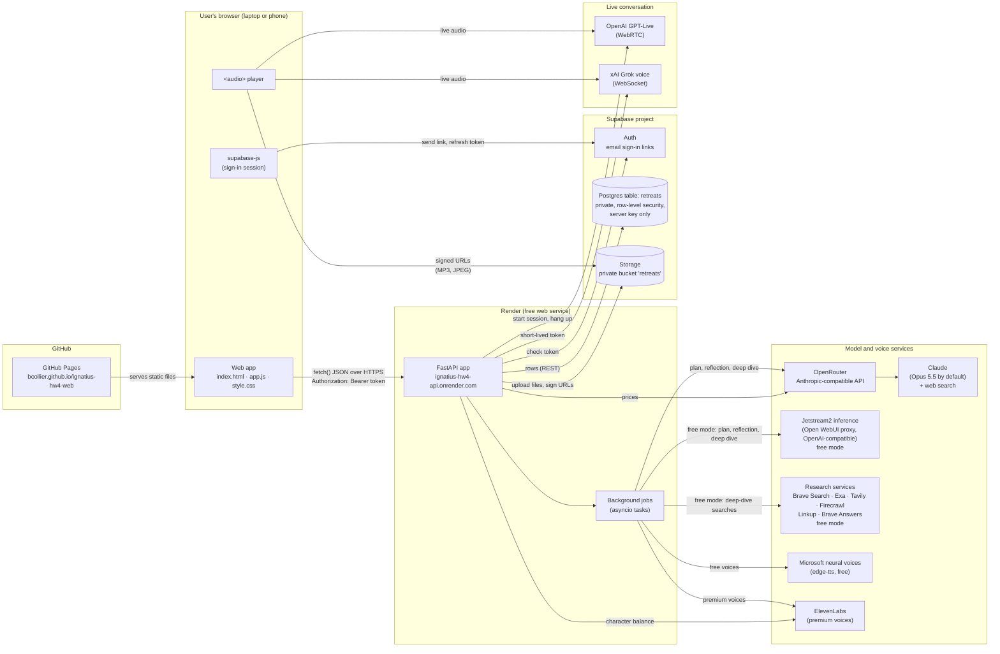
```mermaid
flowchart LR
    subgraph Browser["User's browser (laptop or phone)"]
        UI["Web app<br/>index.html · app.js · style.css"]
        SBJS["supabase-js<br/>(sign-in session)"]
        AUDIO["&lt;audio&gt; player"]
    end

    subgraph GH["GitHub"]
        PAGES["GitHub Pages<br/>bcollier.github.io/ignatius-hw4-web"]
    end

    subgraph RENDER["Render (free web service)"]
        API["FastAPI app<br/>ignatius-hw4-api.onrender.com"]
        JOBS["Background jobs<br/>(asyncio tasks)"]
    end

    subgraph SUPA["Supabase project"]
        AUTH["Auth<br/>email sign-in links"]
        DB[("Postgres table: retreats<br/>private, row-level security,<br/>server key only")]
        ST[("Storage<br/>private bucket 'retreats'")]
    end

    subgraph LIVE["Live conversation"]
        GPTLIVE["OpenAI GPT-Live<br/>(WebRTC)"]
        GROK["xAI Grok voice<br/>(WebSocket)"]
    end

    subgraph AI["Model and voice services"]
        OR["OpenRouter<br/>Anthropic-compatible API"]
        JS["Jetstream2 inference<br/>(Open WebUI proxy, OpenAI-compatible)<br/>free mode"]
        TV["Research services<br/>Brave Search · Exa · Tavily · Firecrawl<br/>Linkup · Brave Answers<br/>free mode"]
        CLAUDE["Claude<br/>(Opus 5.5 by default)<br/>+ web search"]
        EDGE["Microsoft neural voices<br/>(edge-tts, free)"]
        ELEVEN["ElevenLabs<br/>(premium voices)"]
    end

    PAGES -- "serves static files" --> UI
    UI -- "fetch() JSON over HTTPS<br/>Authorization: Bearer token" --> API
    SBJS -- "send link, refresh token" --> AUTH
    API -- "check token" --> AUTH
    API -- "rows (REST)" --> DB
    API -- "upload files, sign URLs" --> ST
    AUDIO -- "signed URLs<br/>(MP3, JPEG)" --> ST
    API --> JOBS
    JOBS -- "plan, reflection, deep dive" --> OR --> CLAUDE
    JOBS -- "free mode: plan, reflection, deep dive" --> JS
    JOBS -- "free mode: deep-dive searches" --> TV
    JOBS -- "free voices" --> EDGE
    JOBS -- "premium voices" --> ELEVEN
    API -- "prices" --> OR
    API -- "start session, hang up" --> GPTLIVE
    API -- "short-lived token" --> GROK
    AUDIO -- "live audio" --> GPTLIVE
    AUDIO -- "live audio" --> GROK
    API -- "character balance" --> ELEVEN
```

| Piece | Runs on | Job |
| --- | --- | --- |
| Web app | GitHub Pages (static) | Sign-in, library, making a retreat, progress, the prayer screen, about me, talk it over. Plain HTML, CSS and JavaScript; no build step. Installable on a phone's home screen. |
| API | Render, Python 3.12, FastAPI + Uvicorn | Checks who is calling, extracts documents, runs background jobs, saves state, returns JSON. |
| Auth | Supabase Auth | Emails sign-in links, issues and refreshes access tokens. |
| Database | Supabase Postgres | One row per retreat; the retreat itself is a JSON document. |
| File storage | Supabase Storage | Extracted images and every MP3, in a private bucket. |
| Claude | Anthropic, reached through OpenRouter | Plans the retreat, writes the reflection and deep dive, searches the web for the deep dive (full mode). |
| Open models | Jetstream2 inference service (Llama 4 Scout, Muse Glimmer) | The same writing jobs for free-mode users. |
| Research services | Brave Search, Exa, Tavily, Firecrawl, Linkup, Brave Answers | Web research for free-mode deep dives, run by the server; by default every service at once with the results combined, or one chosen service with the others as fallbacks. |
| Voices | Microsoft (free), ElevenLabs (premium) | Turn scripts into MP3. |

---

## 2. Hosting and deployment

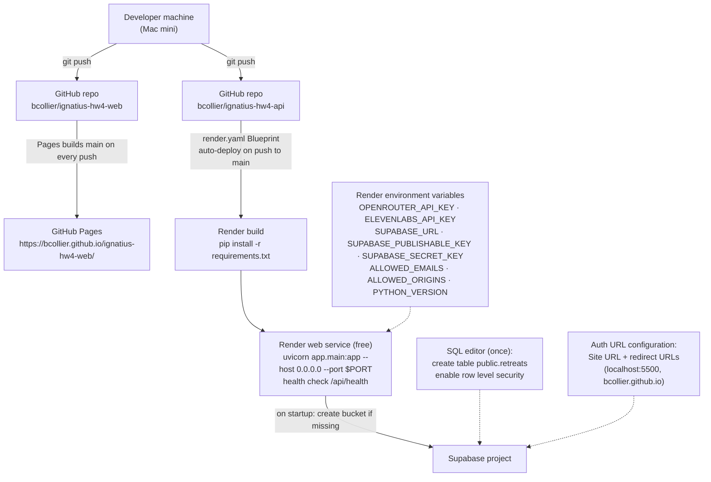
```mermaid
flowchart TB
    DEV["Developer machine<br/>(Mac mini)"] -- "git push" --> REPO_API["GitHub repo<br/>bcollier/ignatius-hw4-api"]
    DEV -- "git push" --> REPO_WEB["GitHub repo<br/>bcollier/ignatius-hw4-web"]

    REPO_WEB -- "Pages builds main on every push" --> PAGES["GitHub Pages<br/>https://bcollier.github.io/ignatius-hw4-web/"]

    REPO_API -- "render.yaml Blueprint<br/>auto-deploy on push to main" --> BUILD["Render build<br/>pip install -r requirements.txt"]
    BUILD --> SVC["Render web service (free)<br/>uvicorn app.main:app --host 0.0.0.0 --port $PORT<br/>health check /api/health"]
    ENV["Render environment variables<br/>OPENROUTER_API_KEY · ELEVENLABS_API_KEY<br/>SUPABASE_URL · SUPABASE_PUBLISHABLE_KEY · SUPABASE_SECRET_KEY<br/>ALLOWED_EMAILS · ALLOWED_ORIGINS · PYTHON_VERSION"] -.-> SVC

    SVC -- "on startup: create bucket if missing" --> SUPA["Supabase project"]
    SQL["SQL editor (once):<br/>create table public.retreats<br/>enable row level security"] -.-> SUPA
    URLS["Auth URL configuration:<br/>Site URL + redirect URLs<br/>(localhost:5500, bcollier.github.io)"] -.-> SUPA
```

**How each part is set up**

- **Frontend.** GitHub Pages serves the `main` branch of `ignatius-hw4-web` as it is. `config.js` picks the API address: `http://localhost:8000` when the page itself is on localhost, otherwise the Render URL. Script and stylesheet links carry a version (`app.js?v=9`) so browsers fetch new code after each release.
- **Backend.** Render builds from `render.yaml`: a free Python web service in Virginia. Secrets are typed into Render's dashboard (`sync: false` in the Blueprint), never committed. Every push to `main` redeploys.
- **Free-tier behavior.** The Render service sleeps after 15 minutes without traffic and takes about a minute to wake. Its disk is temporary, which is why nothing is kept there: retreats live in Postgres and files in Storage. The page explains a slow first request and offers Retry.
- **Supabase.** One project provides Auth, Postgres and Storage. The table is created once with SQL; the private `retreats` bucket is created by the API on startup (`SupabaseStore.setup`).
- **Local development.** With no Supabase variables, the API switches to `LocalStore` (JSON files and media under `DATA_DIR`, served from `/api/files/...`) and a single local user, so it runs with no accounts at all. `LLM_MODE=stub` removes model calls too.

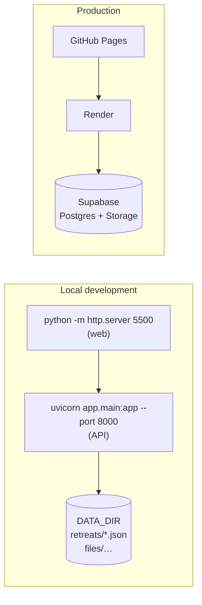
```mermaid
flowchart LR
    subgraph Local["Local development"]
        L1["python -m http.server 5500<br/>(web)"] --> L2["uvicorn app.main:app --port 8000<br/>(API)"]
        L2 --> L3[("DATA_DIR<br/>retreats/*.json<br/>files/…")]
    end
    subgraph Prod["Production"]
        P1["GitHub Pages"] --> P2["Render"]
        P2 --> P3[("Supabase<br/>Postgres + Storage")]
    end
```

---

## 3. Data model

### 3.1 Tables

The database has one application table, linked to Supabase's own users table. Row level security is on with **no policies**, so the browser's publishable key cannot read or write it; only the API, using the secret key, can.

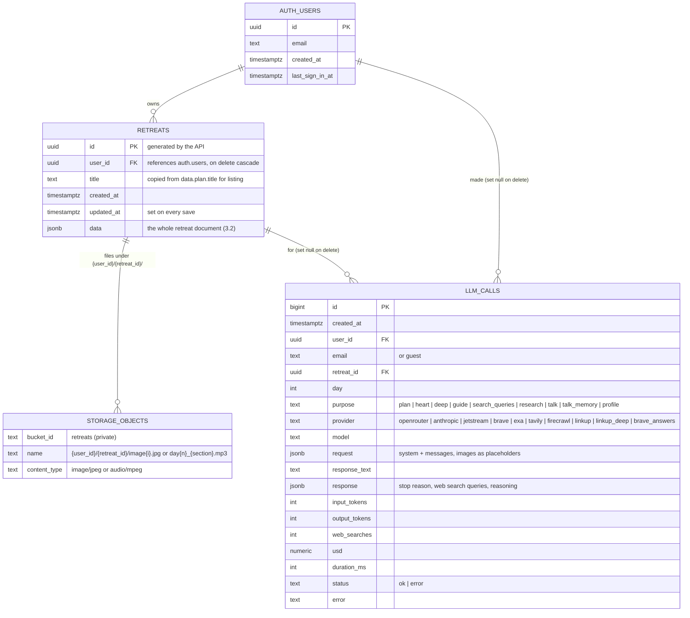
```mermaid
erDiagram
    AUTH_USERS ||--o{ RETREATS : owns
    RETREATS ||--o{ STORAGE_OBJECTS : "files under {user_id}/{retreat_id}/"
    AUTH_USERS ||--o{ LLM_CALLS : "made (set null on delete)"
    RETREATS ||--o{ LLM_CALLS : "for (set null on delete)"

    AUTH_USERS {
        uuid id PK
        text email
        timestamptz created_at
        timestamptz last_sign_in_at
    }
    RETREATS {
        uuid id PK "generated by the API"
        uuid user_id FK "references auth.users, on delete cascade"
        text title "copied from data.plan.title for listing"
        timestamptz created_at
        timestamptz updated_at "set on every save"
        jsonb data "the whole retreat document (3.2)"
    }
    LLM_CALLS {
        bigint id PK
        timestamptz created_at
        uuid user_id FK
        text email "or guest"
        uuid retreat_id FK
        int day
        text purpose "plan | heart | deep | guide | search_queries | research | talk | talk_memory | profile"
        text provider "openrouter | anthropic | jetstream | brave | exa | tavily | firecrawl | linkup | linkup_deep | brave_answers"
        text model
        jsonb request "system + messages, images as placeholders"
        text response_text
        jsonb response "stop reason, web search queries, reasoning"
        int input_tokens
        int output_tokens
        int web_searches
        numeric usd
        int duration_ms
        text status "ok | error"
        text error
    }
    STORAGE_OBJECTS {
        text bucket_id "retreats (private)"
        text name "{user_id}/{retreat_id}/image{i}.jpg or day{n}_{section}.mp3"
        text content_type "image/jpeg or audio/mpeg"
    }
```

> **Where are the users?** `AUTH_USERS` is Supabase Auth's own table, `auth.users`, in the **`auth` schema**. The Table Editor shows the `public` schema by default, so it won't appear next to `retreats` and `llm_calls`. See it under **Authentication → Users**, or switch the Table Editor's schema dropdown to `auth`. The app never keeps a users table of its own; `user_id` columns point at `auth.users.id`.

```sql
create table public.retreats (
  id uuid primary key,
  user_id uuid not null references auth.users on delete cascade,
  title text,
  created_at timestamptz not null default now(),
  updated_at timestamptz not null default now(),
  data jsonb not null
);
create index retreats_user_idx on public.retreats (user_id, created_at desc);
alter table public.retreats enable row level security;
```

The SQL for both tables is in [`sql/`](../sql): `001_retreats.sql` and `002_llm_calls.sql`, which also creates the `llm_usage_by_user` summary view.

### 3.1a The model call log

Every call to a model, Claude or Jetstream, adds one row to `llm_calls`, including calls that fail. The row records:
- who made it (user id and email, or "guest");
- which retreat and day, and the purpose: planning, reflection, deep dive, or free-mode search questions;
- the provider and model;
- the full prompt (system and messages), with images replaced by their type and size;
- the full response, with the stop reason, Claude's web search queries, or a Jetstream model's reasoning;
- tokens, web searches, cost, time taken, and status or error.

Prompts and responses over 200,000 characters are cut, with a note. The log is locked like `retreats` and read in the Supabase dashboard (Table Editor → `llm_calls`, or the `llm_usage_by_user` view for per-user totals). A failure to write a log row is recorded in the server log and never stops the job.

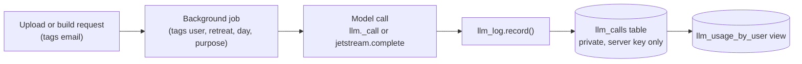
```mermaid
flowchart LR
    REQ["Upload or build request<br/>(tags email)"] --> JOB["Background job<br/>(tags user, retreat, day, purpose)"]
    JOB --> CALL["Model call<br/>llm._call or jetstream.complete"]
    CALL --> ROW["llm_log.record()"]
    ROW --> DB[("llm_calls table<br/>private, server key only")]
    DB --> VIEW[("llm_usage_by_user view")]
```

The context travels with the job: the request handler tags the email, the job tags the retreat and day, and the reflection and deep-dive tasks each tag their own purpose. Python context variables are copied into each asyncio task, so parallel calls don't overwrite each other's tags.

**Why a JSON document.** A retreat is read and written as a whole: the page asks for one retreat, and each job step saves one retreat. Keeping it as one `jsonb` value means one read and one upsert per step, no joins, and the shape can grow (as it did with guidance clips and costs) without migrations. The trade-off is that the database can't enforce the inner structure; the API is the only writer, so it enforces it in code.

### 3.2 Inside a retreat (`data`)

This is the logical model stored in `retreats.data`. Solid lines are nesting inside the JSON document.

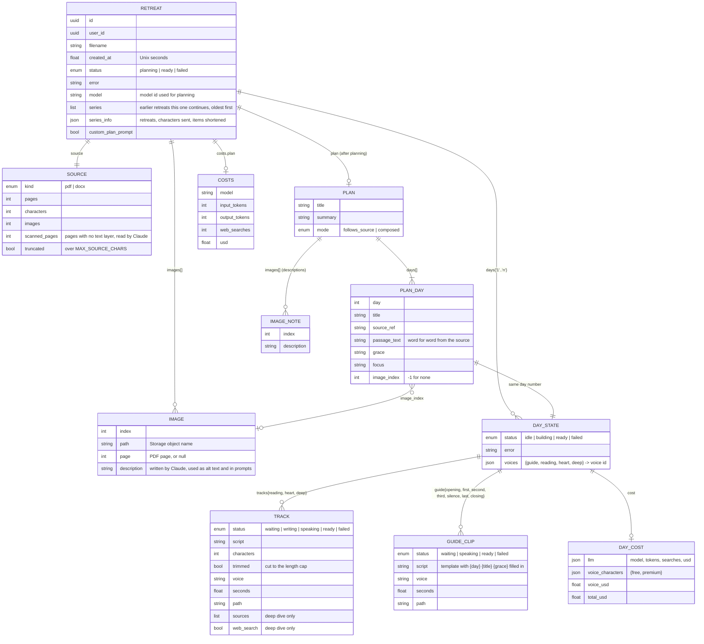
```mermaid
erDiagram
    RETREAT ||--|| SOURCE : "source"
    RETREAT ||--o{ IMAGE : "images[]"
    RETREAT ||--o| PLAN : "plan (after planning)"
    RETREAT ||--o| COSTS : "costs.plan"
    PLAN ||--|{ PLAN_DAY : "days[]"
    PLAN ||--o{ IMAGE_NOTE : "images[] (descriptions)"
    RETREAT ||--o{ DAY_STATE : "days{'1'..'n'}"
    PLAN_DAY ||--|| DAY_STATE : "same day number"
    DAY_STATE ||--o{ TRACK : "tracks{reading, heart, deep}"
    DAY_STATE ||--o{ GUIDE_CLIP : "guide{opening, first, second, third, silence, last, closing}"
    DAY_STATE ||--o| DAY_COST : "cost"
    PLAN_DAY }o--o| IMAGE : "image_index"

    RETREAT {
        uuid id
        uuid user_id
        string filename
        float created_at "Unix seconds"
        enum status "planning | ready | failed"
        string error
        string model "model id used for planning"
        list series "earlier retreats this one continues, oldest first"
        json series_info "retreats, characters sent, items shortened"
        bool custom_plan_prompt
    }
    SOURCE {
        enum kind "pdf | docx"
        int pages
        int characters
        int images
        int scanned_pages "pages with no text layer, read by Claude"
        bool truncated "over MAX_SOURCE_CHARS"
    }
    IMAGE {
        int index
        string path "Storage object name"
        int page "PDF page, or null"
        string description "written by Claude, used as alt text and in prompts"
    }
    PLAN {
        string title
        string summary
        enum mode "follows_source | composed"
    }
    PLAN_DAY {
        int day
        string title
        string source_ref
        string passage_text "word for word from the source"
        string grace
        string focus
        int image_index "-1 for none"
    }
    DAY_STATE {
        enum status "idle | building | ready | failed"
        string error
        json voices "{guide, reading, heart, deep} -> voice id"
    }
    TRACK {
        enum status "waiting | writing | speaking | ready | failed"
        string script
        int characters
        bool trimmed "cut to the length cap"
        string voice
        float seconds
        string path
        list sources "deep dive only"
        bool web_search "deep dive only"
    }
    GUIDE_CLIP {
        enum status "waiting | speaking | ready | failed"
        string script "template with {day} {title} {grace} filled in"
        string voice
        float seconds
        string path
    }
    COSTS {
        string model
        int input_tokens
        int output_tokens
        int web_searches
        float usd
    }
    DAY_COST {
        json llm "model, tokens, searches, usd"
        json voice_characters "{free, premium}"
        float voice_usd
        float total_usd
    }
    IMAGE_NOTE {
        int index
        string description
    }
```

### 3.3 Storage layout

```
retreats/                                   private bucket
└── {user_id}/
    └── {retreat_id}/
        ├── image0.jpg … imageN.jpg         images extracted from the upload (max 8, ≤1568 px)
        ├── source.json, scan0.png …        extracted text and scanned pages, so planning can resume
        ├── day1_reading.mp3                recorded once, played four times
        ├── day1_heart.mp3
        ├── day1_deep.mp3
        ├── day1_opening.mp3                spoken guidance clips
        ├── day1_first.mp3 … day1_closing.mp3
        ├── day1_research.json              the deep dive's searches, every result, what was cited (8e)
        └── day2_…
    ├── user info.md                        what the person wrote about themselves (maybe a summary)
    ├── profile.json                        summary flag, original length, what they want from the companion
    ├── conversations.json                  past conversations with the companion and its memory summary
    ├── talk_usage.json                     seconds of free conversation used today
    └── demo_state.json                     this person's start date, progress and notes in example retreats (8d)
system/search_status.json                   research services paused for credits or errors
system/demos.json                           which retreats are examples, with their labels (8d)
```

Files are never public. The API hands the browser **signed URLs** that expire after 24 hours and caches them for 23 hours, so a page left open longer than a day needs a reload.

---

## 4. User journey

The web app has seven views, chosen by the URL: the library (`./`), a new retreat (`?new`, with Simple and Advanced tabs), a retreat (`?r=ID`), praying a day full-screen (`?r=ID&pray=N`), talking it over (`?talk&r=ID`), about me (`?me`) and about the tradition (`?about`).

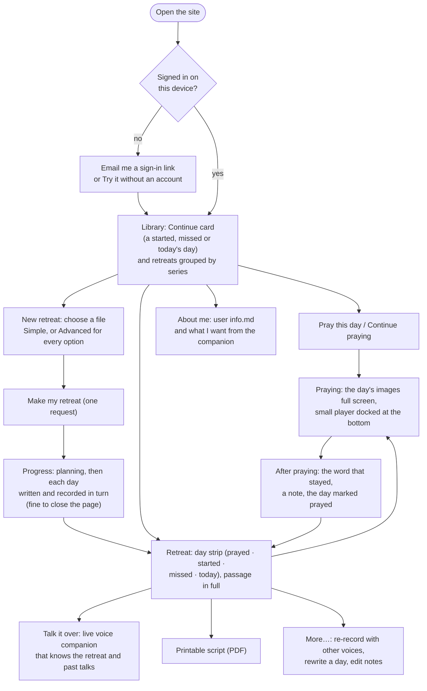
```mermaid
flowchart TD
    A([Open the site]) --> B{Signed in on<br/>this device?}
    B -- no --> SI["Email me a sign-in link<br/>or Try it without an account"] --> L
    B -- yes --> L["Library: Continue card<br/>(a started, missed or today's day)<br/>and retreats grouped by series"]
    L --> CONT["Pray this day / Continue praying"] --> PRAY
    L --> NEW["New retreat: choose a file<br/>Simple, or Advanced for every option"]
    NEW --> GO["Make my retreat (one request)"]
    GO --> PROG["Progress: planning, then each day<br/>written and recorded in turn<br/>(fine to close the page)"]
    PROG --> R["Retreat: day strip (prayed · started ·<br/>missed · today), passage in full"]
    L --> R
    R --> PRAY["Praying: the day's images full screen,<br/>small player docked at the bottom"]
    PRAY --> AFTER["After praying: the word that stayed,<br/>a note, the day marked prayed"]
    AFTER --> R
    R --> TALK["Talk it over: live voice companion<br/>that knows the retreat and past talks"]
    R --> PDF["Printable script (PDF)"]
    R --> MORE["More…: re-record with other voices,<br/>rewrite a day, edit notes"]
    L --> ME["About me: user info.md<br/>and what I want from the companion"]
```

Laptop and phone are the same flow: the phone signs in (or a guest adds an email), then finds the same retreats, listening progress and conversations, because all of it is on the server.

---

## 5. Signing in

Sign-in uses Supabase's email links (the implicit flow), so a link opened on any device signs in *that* device. The API never sees a password; it only checks the access token the browser sends.

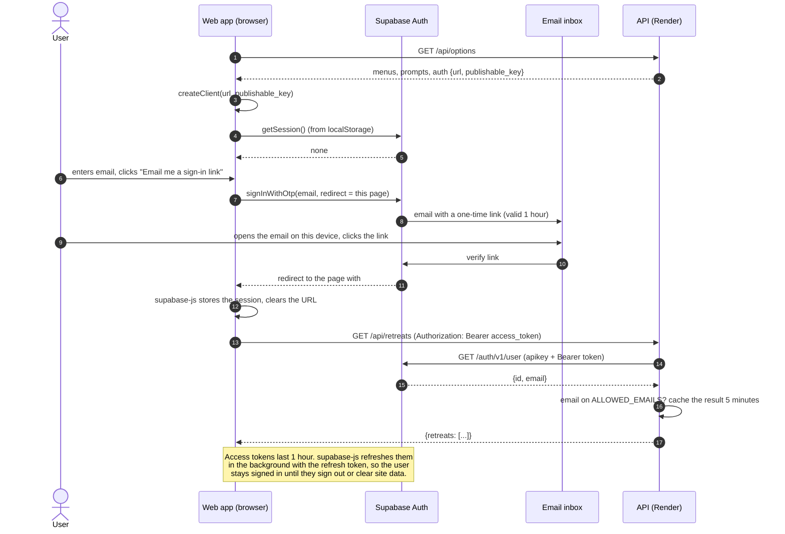
```mermaid
sequenceDiagram
    autonumber
    actor U as User
    participant W as Web app (browser)
    participant SA as Supabase Auth
    participant M as Email inbox
    participant API as API (Render)

    W->>API: GET /api/options
    API-->>W: menus, prompts, auth {url, publishable_key}
    W->>W: createClient(url, publishable_key)
    W->>SA: getSession() (from localStorage)
    SA-->>W: none
    U->>W: enters email, clicks "Email me a sign-in link"
    W->>SA: signInWithOtp(email, redirect = this page)
    SA->>M: email with a one-time link (valid 1 hour)
    U->>M: opens the email on this device, clicks the link
    M->>SA: verify link
    SA-->>W: redirect to the page with #access_token & refresh_token
    W->>W: supabase-js stores the session, clears the URL
    W->>API: GET /api/retreats  (Authorization: Bearer access_token)
    API->>SA: GET /auth/v1/user (apikey + Bearer token)
    SA-->>API: {id, email}
    API->>API: email on ALLOWED_EMAILS? cache the result 5 minutes
    API-->>W: {retreats: [...]}
    Note over W,SA: Access tokens last 1 hour. supabase-js refreshes them<br/>in the background with the refresh token, so the user<br/>stays signed in until they sign out or clear site data.
```

**Guests.** "Try it without an account" calls `signInAnonymously()`. Supabase creates an anonymous user and session in this browser only; `/auth/v1/user` reports `is_anonymous: true`, and the API treats the session as free mode.

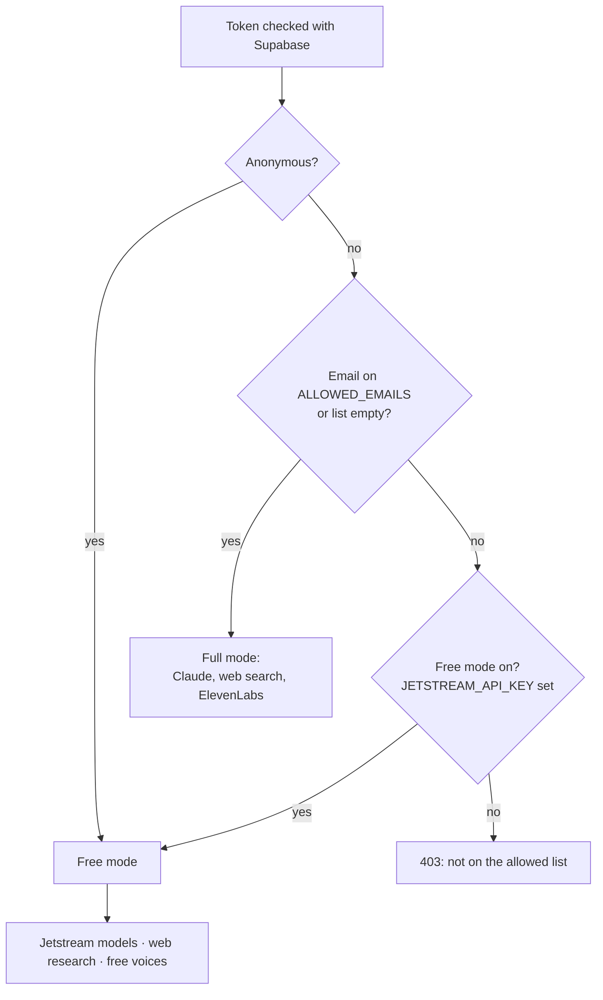
```mermaid
flowchart TD
    T["Token checked with Supabase"] --> A{Anonymous?}
    A -- yes --> F["Free mode"]
    A -- no --> E{Email on ALLOWED_EMAILS<br/>or list empty?}
    E -- yes --> FULL["Full mode:<br/>Claude, web search, ElevenLabs"]
    E -- no --> FM{Free mode on?<br/>JETSTREAM_API_KEY set}
    FM -- yes --> F
    FM -- no --> X["403: not on the allowed list"]
    F --> FL["Jetstream models · web research · free voices"]
```

**Rules the API applies**

| Case | Response |
| --- | --- |
| No `Authorization` header | 401 "Sign in to continue." |
| Token rejected by Supabase (expired, revoked) | 401 "Your sign-in has expired. Sign in again." The page shows the sign-in form. |
| Valid token, email not on `ALLOWED_EMAILS` (or a guest) | Free mode if Jetstream is configured; otherwise 403 "This account isn't on the list of allowed users for this demo." |
| Free-mode user asks for Claude or an ElevenLabs voice | 403 "Free mode uses the Jetstream models…" / "…the free Microsoft voices." |
| Valid token for another user's retreat | 404 "Retreat not found." (same answer as a missing retreat) |
| Supabase Auth unreachable | 503 "Couldn't reach the sign-in service." |

---

## 6. Uploading and planning a retreat

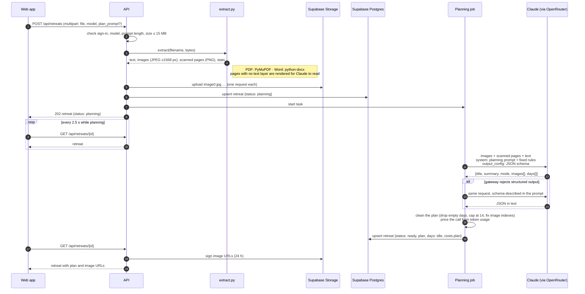
```mermaid
sequenceDiagram
    autonumber
    participant W as Web app
    participant API as API
    participant X as extract.py
    participant ST as Supabase Storage
    participant DB as Supabase Postgres
    participant J as Planning job
    participant C as Claude (via OpenRouter)

    W->>API: POST /api/retreats (multipart: file, model, plan_prompt?)
    API->>API: check sign-in, model, prompt length, size ≤ 15 MB
    API->>X: extract(filename, bytes)
    X-->>API: text, images (JPEG ≤1568 px), scanned pages (PNG), stats
    Note right of X: PDF: PyMuPDF · Word: python-docx<br/>pages with no text layer are rendered for Claude to read
    API->>ST: upload image0.jpg … (one request each)
    API->>DB: upsert retreat {status: planning}
    API->>J: start task
    API-->>W: 202 retreat (status: planning)

    loop every 2.5 s while planning
        W->>API: GET /api/retreats/{id}
        API-->>W: retreat
    end

    J->>C: images + scanned pages + text<br/>system: planning prompt + fixed rules<br/>output_config: JSON schema
    C-->>J: {title, summary, mode, images[], days[]}
    alt gateway rejects structured output
        J->>C: same request, schema described in the prompt
        C-->>J: JSON in text
    end
    J->>J: clean the plan (drop empty days, cap at 14, fix image indexes)<br/>price the call from token usage
    J->>DB: upsert retreat {status: ready, plan, days: idle, costs.plan}
    W->>API: GET /api/retreats/{id}
    API->>ST: sign image URLs (24 h)
    API-->>W: retreat with plan and image URLs
```

**Series.** A retreat can continue earlier ones ("This retreat is part of a series"), for someone praying a long retreat week by week. The API checks that each earlier retreat is the user's and has been planned, and stores them oldest first. Every model call for the new retreat (planning, and each day's reflection and deep dive) then receives the whole series: for each earlier week, every day's title, source, grace, passage, reflection and deep dive, with instructions to continue the arc, refer back, and not repeat earlier explanations.

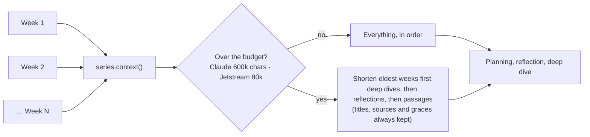
```mermaid
flowchart LR
    W1["Week 1"] --> S["series.context()"]
    W2["Week 2"] --> S
    WN["… Week N"] --> S
    S --> B{"Over the budget?<br/>Claude 600k chars · Jetstream 80k"}
    B -- no --> ALL["Everything, in order"]
    B -- yes --> CUT["Shorten oldest weeks first:<br/>deep dives, then reflections, then passages<br/>(titles, sources and graces always kept)"]
    ALL --> M["Planning, reflection, deep dive"]
    CUT --> M
```

With Claude the series goes in its own system block marked for prompt caching, so the calls for the days of a week read it from the cache at a fraction of the input price. Jetstream receives it at the start of the request. The retreat records what was sent in `series_info`, and the page shows "Week N of a series, continuing: …".

**Plan modes.** If the source already lays out days ("Day 1", "Day 2"...), Claude keeps them in order with their titles and passages (`follows_source`). If it is loose material, Claude composes about seven days from it (`composed`), reusing a passage for repetition when the source is thin. In both modes `passage_text` is copied word for word; only page furniture and verse numbers may be removed.

---

## 7. Making a retreat and building its days

**One request.** `POST /api/retreats` carries the file and every option (models, voices, prompts, guidance, research service, start date) as the `options` field. The server checks the options before touching the upload, plans the retreat, then builds every day one after another in the same background job (`_build_all`), saving progress as it goes. Retreat status runs `planning` → `building` → `ready`; `progress` counts days done and lists any that failed. A failed day doesn't stop the others; it can be retried from the retreat view. If the server restarts, the job resumes from the first unfinished day (see section 13).

**Parts that know about each other.** Within a day the parts are written in the order they're heard, and each sees what came before:

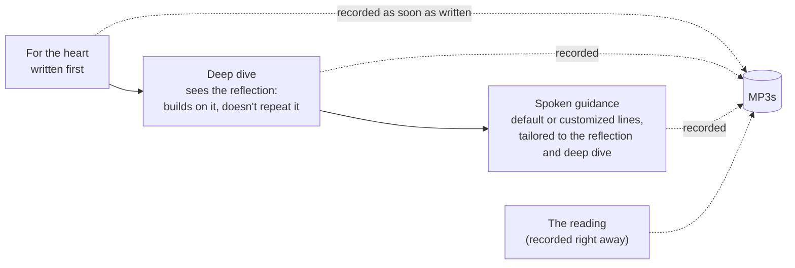
```mermaid
flowchart LR
    READ["The reading<br/>(recorded right away)"]
    HEART["For the heart<br/>written first"] --> DEEP["Deep dive<br/>sees the reflection:<br/>builds on it, doesn't repeat it"]
    DEEP --> GUIDE["Spoken guidance<br/>default or customized lines,<br/>tailored to the reflection and deep dive"]
    HEART -. recorded as soon as written .-> REC[("MP3s")]
    DEEP -. recorded .-> REC
    GUIDE -. recorded .-> REC
    READ -.-> REC
```

Tailoring keeps each line's purpose and length and the opening's request for the grace word for word; lines the model drops or overruns keep their default, and any failure falls back to the plain text. It can be turned off in Advanced. Re-recording with other voices reuses the written reflection, deep dive and tailored guidance.

**Every model call starts with the same background** (`prompts.BACKGROUND`): the Spiritual Exercises (the four weeks, the Principle and Foundation, asking for a grace, imaginative contemplation, colloquy, repetition, consolation and desolation, the Examen, Annotation 15), retreats in daily life (Annotation 19), lectio divina (Guigo II; Verbum Domini 87) and how a day in this app is prayed. It is added where calls go out (`llm._call`, `jetstream.complete`), so no step can miss it; with a series it joins the cached system block. Then comes the person's own notes, if any (section 8b).

A build records three sections and up to seven guidance clips, each in the voice chosen for its section.

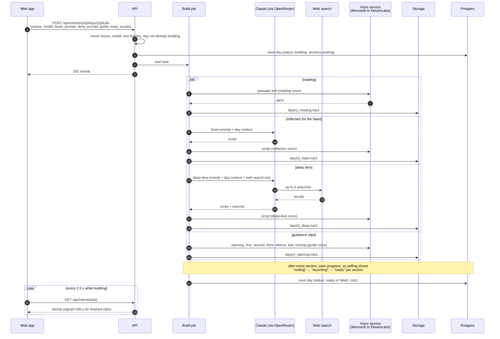
```mermaid
sequenceDiagram
    autonumber
    participant W as Web app
    participant API as API
    participant J as Build job
    participant C as Claude (via OpenRouter)
    participant WS as Web search
    participant T as Voice service<br/>(Microsoft or ElevenLabs)
    participant ST as Storage
    participant DB as Postgres

    W->>API: POST /api/retreats/{id}/days/{n}/build<br/>{voices, model, heart_prompt, deep_prompt, guide, keep_scripts}
    API->>API: check voices, model, text lengths, day not already building
    API->>DB: save day {status: building, sections waiting}
    API->>J: start task
    API-->>W: 202 retreat

    par reading
        J->>T: passage text (reading voice)
        T-->>J: MP3
        J->>ST: day{n}_reading.mp3
    and reflection for the heart
        J->>C: heart prompt + day context
        C-->>J: script
        J->>T: script (reflection voice)
        J->>ST: day{n}_heart.mp3
    and deep dive
        J->>C: deep-dive prompt + day context + web search tool
        C->>WS: up to 5 searches
        WS-->>C: results
        C-->>J: script + sources
        J->>T: script (deep-dive voice)
        J->>ST: day{n}_deep.mp3
    and guidance clips
        J->>T: opening, first, second, third, silence, last, closing (guide voice)
        J->>ST: day{n}_opening.mp3 …
    end
    Note over J,DB: after every section: save progress, so polling shows<br/>"writing" → "recording" → "ready" per section
    J->>DB: save day {status: ready or failed, cost}

    loop every 2.5 s while building
        W->>API: GET /api/retreats/{id}
        API-->>W: retreat (signed URLs for finished clips)
    end
```

**Inside a recording**

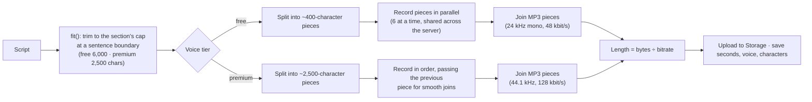
```mermaid
flowchart LR
    S["Script"] --> F["fit(): trim to the section's cap<br/>at a sentence boundary<br/>(free 6,000 · premium 2,500 chars)"]
    F --> V{Voice tier}
    V -- free --> E1["Split into ~400-character pieces"] --> E2["Record pieces in parallel<br/>(6 at a time, shared across the server)"] --> J1["Join MP3 pieces<br/>(24 kHz mono, 48 kbit/s)"]
    V -- premium --> L1["Split into ~2,500-character pieces"] --> L2["Record in order, passing the previous<br/>piece for smooth joins"] --> J2["Join MP3 pieces<br/>(44.1 kHz, 128 kbit/s)"]
    J1 --> D["Length = bytes ÷ bitrate"]
    J2 --> D
    D --> U["Upload to Storage · save seconds, voice, characters"]
```

Both services produce constant-bitrate MP3, so pieces can be joined byte for byte and the length follows directly from the file size.

**Free-mode deep dive.** Jetstream's models can't search, so the server does it for them. The page's "Web research for the deep dive" menu offers **All services, combined** (the default, `SEARCH_PROVIDER=all`) or any one service:

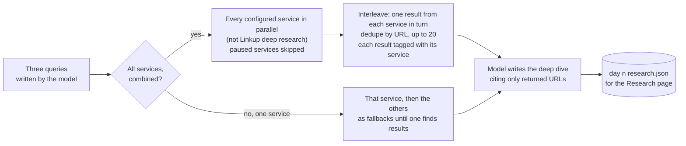
```mermaid
flowchart LR
    Q["Three queries<br/>written by the model"] --> ALL{"All services,<br/>combined?"}
    ALL -- yes --> PAR["Every configured service in parallel<br/>(not Linkup deep research)<br/>paused services skipped"]
    PAR --> MIX["Interleave: one result from each service in turn<br/>dedupe by URL, up to 20<br/>each result tagged with its service"]
    ALL -- "no, one service" --> ONE["That service, then the others<br/>as fallbacks until one finds results"]
    MIX --> W["Model writes the deep dive<br/>citing only returned URLs"]
    ONE --> W
    W --> SAVE[("day n research.json<br/>for the Research page")]
```

**Premium too.** Claude models get the same combined free-service results first, as a head start (Claude writes the three searches, the free services run them), and then still use their own web search at its full allowance (up to 5 searches), told to search further wherever the free results are thin and never to be limited by them. The free results save some paid searches; they never cap the depth of a premium deep dive. The research record then holds both: the free results and Claude's own searches and pages.

Combining means no single index decides what the model reads: Brave's independent index, Exa's meaning-based search, Tavily's cleaned extracts, Firecrawl's page content, Linkup and Brave Answers' sourced answers all land in one numbered list. The services are:

| Service | Call | What becomes a result |
| --- | --- | --- |
| Tavily | `POST api.tavily.com/search` (Bearer key), basic depth, 4 results | title, URL, content snippet |
| Exa | `POST api.exa.ai/search` (`x-api-key`), type auto, 4 results with highlights | title, URL, highlights; Exa's reported cost is added to the day's cost |
| Brave Search | `GET api.search.brave.com/res/v1/web/search` (`X-Subscription-Token`), 4 results with extra snippets | title, URL, description and extra snippets |
| Firecrawl | `POST api.firecrawl.dev/v2/search` (Bearer key), 4 results | title, URL, description; credits used are logged |
| Linkup Search | `POST api.linkup.so/v1/search` (Bearer key), depth `standard`, `searchResults`, 4 results | name, URL, content |
| Linkup Deep Research | same endpoint and key, depth `deep`, `sourcedAnswer`, 2-minute timeout | the sourced answer (under its first source) and each source's snippet |
| Brave Answers | `POST api.search.brave.com/res/v1/chat/completions` (its own key), model `brave`, streamed, citations on | the written answer (under its first cited URL) and each citation's snippet |

Linkup Search and Deep Research share one account, so if either runs out of credits both are paused. Linkup reports running out of credits as a 429, which the credit-word check tells apart from an ordinary rate limit.

**Keeping research from breaking a build.** Research is optional, so it's written to fail softly:

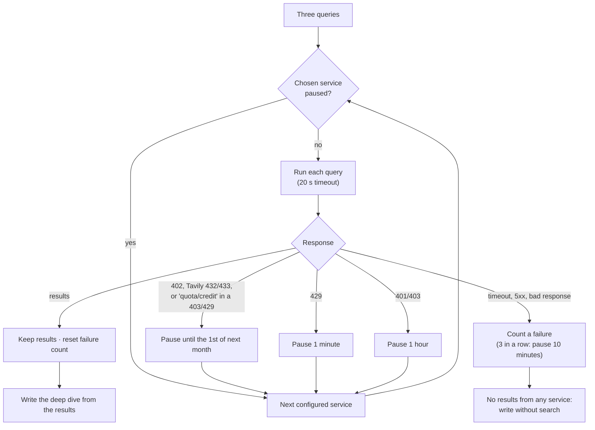
```mermaid
flowchart TD
    Q["Three queries"] --> P{"Chosen service<br/>paused?"}
    P -- no --> RUN["Run each query<br/>(20 s timeout)"]
    P -- yes --> NEXT
    RUN --> R{Response}
    R -- "results" --> OK["Keep results · reset failure count"]
    R -- "402, Tavily 432/433,<br/>or 'quota/credit' in a 403/429" --> CR["Pause until the 1st of next month"] --> NEXT
    R -- "429" --> RL["Pause 1 minute"] --> NEXT
    R -- "401/403" --> KEY["Pause 1 hour"] --> NEXT
    R -- "timeout, 5xx, bad response" --> F["Count a failure<br/>(3 in a row: pause 10 minutes)"]
    NEXT["Next configured service"] --> P
    OK --> DONE["Write the deep dive from the results"]
    F --> DONE2["No results from any service:<br/>write without search"]
```

Pauses are saved to `system/search_status.json` in storage, so a restart (or Render waking from sleep) doesn't retry a service that's out of credits. The page's research menu shows a paused service with its reason and date. Every call, successful or not, adds a row to `llm_calls` with provider set to the service, purpose `research`, the query, the results it returned, credits or cost where reported, and any error.

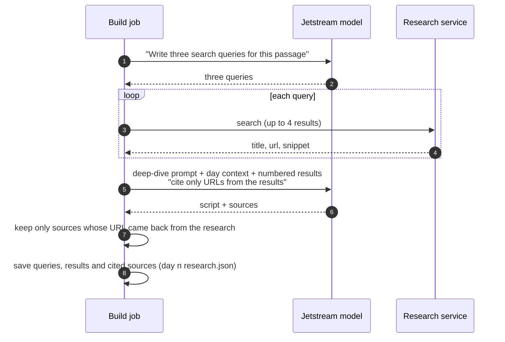
```mermaid
sequenceDiagram
    autonumber
    participant J as Build job
    participant M as Jetstream model
    participant T as Research service
    J->>M: "Write three search queries for this passage"
    M-->>J: three queries
    loop each query
        J->>T: search (up to 4 results)
        T-->>J: title, url, snippet
    end
    J->>M: deep-dive prompt + day context + numbered results<br/>"cite only URLs from the results"
    M-->>J: script + sources
    J->>J: keep only sources whose URL came back from the research
    J->>J: save queries, results and cited sources (day n research.json)
```

**What Claude is asked.** Each prompt has an editable part (shown on the page) and a fixed part the server always appends: the length target and the output format (`<script>…</script>`, plus `<sources>` for the deep dive). A house style for listening applies to both: plain paragraphs, no lists, parentheses or dashes, no verse numbers with colons, and never inventing a Hebrew or Greek word, a textual variant, a quotation or a historical fact.

---

## 8. Praying a day: the player

"Pray this day" plays everything through **one `<audio>` element**, one file after another. Silences are real audio files (a synthesized bell, 5 and 30 seconds of quiet), so the prayer keeps going when a phone screen locks, and the lock screen shows the current part through the Media Session API.

**The lectio order** (parts are what Back and Skip move between):

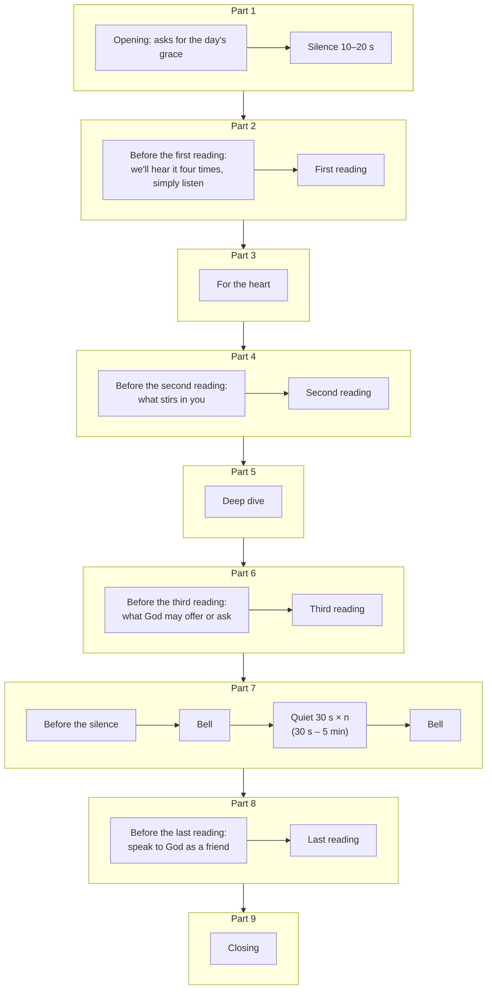
```mermaid
flowchart TD
    subgraph P1["Part 1"]
        a1["Opening: asks for the day's grace"] --> a2["Silence 10–20 s"]
    end
    subgraph P2["Part 2"]
        b1["Before the first reading:<br/>we'll hear it four times, simply listen"] --> b2["First reading"]
    end
    subgraph P3["Part 3"]
        c1["For the heart"]
    end
    subgraph P4["Part 4"]
        d1["Before the second reading:<br/>what stirs in you"] --> d2["Second reading"]
    end
    subgraph P5["Part 5"]
        e1["Deep dive"]
    end
    subgraph P6["Part 6"]
        f1["Before the third reading:<br/>what God may offer or ask"] --> f2["Third reading"]
    end
    subgraph P7["Part 7"]
        g1["Before the silence"] --> g2["Bell"] --> g3["Quiet 30 s × n<br/>(30 s – 5 min)"] --> g4["Bell"]
    end
    subgraph P8["Part 8"]
        h1["Before the last reading:<br/>speak to God as a friend"] --> h2["Last reading"]
    end
    subgraph P9["Part 9"]
        i1["Closing"]
    end
    P1 --> P2 --> P3 --> P4 --> P5 --> P6 --> P7 --> P8 --> P9
```

Every spoken clip is followed by 5 seconds of quiet so sections don't run together. The **simple order** is: opening and silence, reading, reflection, deep dive, the silence, closing. Any guidance clip left empty on the page is skipped.

**Total length.** Every clip stores its length in seconds, and the fixed sounds have known lengths, so the page adds up the whole sequence and shows it on the day card ("About 24 minutes in the lectio order, including silences") and as time left in the player. It updates when the order, the silence after the grace or the pause length changes. Clips recorded before lengths were saved are measured from the file's metadata once.

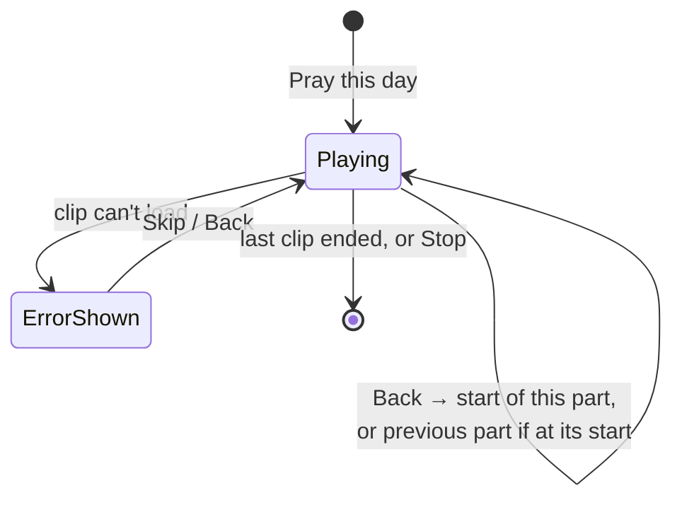
```mermaid
stateDiagram-v2
    [*] --> Playing: Pray this day
    Playing --> Playing: clip ended → next clip
    Playing --> Playing: Skip → first clip of next part
    Playing --> Playing: Back → start of this part,<br/>or previous part if at its start
    Playing --> ErrorShown: clip can't load
    ErrorShown --> Playing: Skip / Back
    Playing --> [*]: last clip ended, or Stop
```

---

## 8a. Listening progress, prayed days and the journal

The player reports what has been heard (`POST /days/{n}/progress`) when each part starts, every 30 seconds, and when the page is hidden or the prayer stops; finishing the sequence marks the day prayed. Each day keeps `listening` (parts played, last step and part, times) and `prayed_at`, and, after praying, a `journal` with the word or phrase that stayed and an optional note (`POST /days/{n}/prayed`). Because it's on the server, stopping on the phone and opening the laptop shows the same place.

With the retreat's `start_date`, the page works out each day's calendar date, so a day can be **today**, **missed** (its date has passed and it isn't prayed) or **started** (some parts heard, not finished). The library's Continue card and the retreat's default day pick, in order: a started day, a missed day, today, the first unprayed day. A started day offers **Continue praying** from where it stopped, or **Start over**.

## 8b. About me ("user info.md")

A person can type or upload (text, Markdown, Word or PDF) anything they'd like the app to know about them. It's saved as `user info.md` in their storage folder. If it's longer than 6,000 characters a model condenses it (Claude for premium users, the free model otherwise), and the page says plainly that a summary is being used and can be edited. A separate field says what they want from the conversation companion.

The notes are loaded at the start of every job (`profile.use_for_job`) into a context variable, and every model call made in that job, planning, writing, tailoring and search questions, includes them after the background, with an instruction to let them shape examples and tone without quoting them back. Context variables are per task, so two people's jobs running at once never see each other's notes (tested).

## 8c. Talk it over (live conversation)

A spoken conversation about the retreat with an AI prayer companion. The app never calls it spiritual direction, and the companion says it's an AI if asked; but its instructions follow how spiritual directors are taught to accompany someone: listen more than speak, ask open questions, gently probe, help the person notice consolation, desolation and where God may be at work, give very little advice, help them engage with the retreat (including missed days, without scolding), and in a crisis stop exploring and point to 988 or local emergency help.

What the companion is given (`talk.context`):

- the background on the Exercises and lectio divina;
- the person's notes and what they want from the companion;
- **the time where they are** (the browser sends its local time with offset): date, time, and part of the day ("early in the morning", "at night");
- **its memory**: when they last talked ("yesterday", "4 days ago"), a summary of older conversations, and the last three transcripts in full;
- **the retreat**: each day's title, grace, passage and the start of its reflection; which days are prayed or started and where they stopped; the words and notes saved after praying; which day it is by the calendar; and **which days they've listened to since the last conversation**.

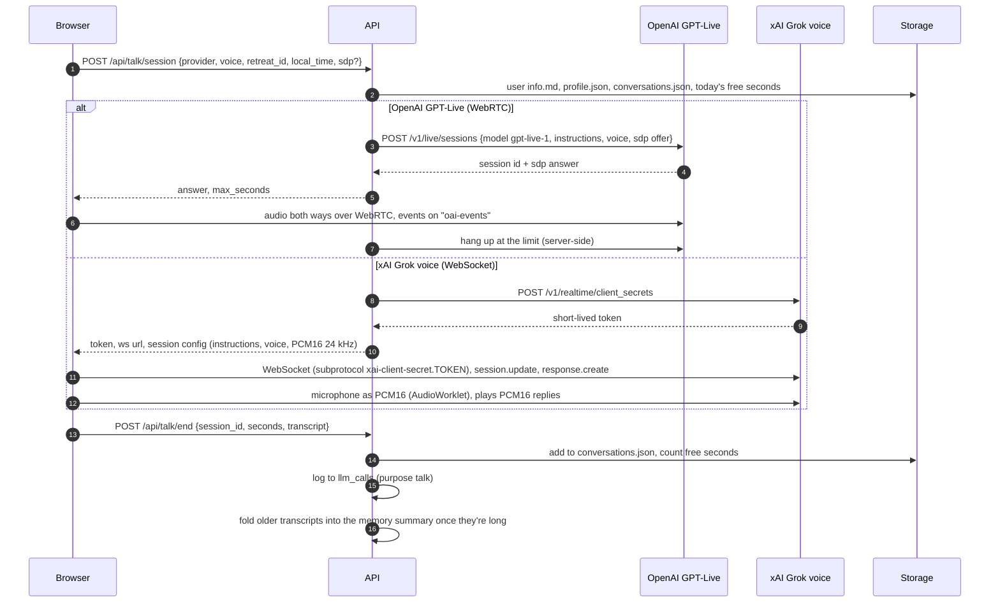
```mermaid
sequenceDiagram
    autonumber
    participant B as Browser
    participant API as API
    participant O as OpenAI GPT-Live
    participant X as xAI Grok voice
    participant ST as Storage

    B->>API: POST /api/talk/session {provider, voice, retreat_id, local_time, sdp?}
    API->>ST: user info.md, profile.json, conversations.json, today's free seconds
    alt OpenAI GPT-Live (WebRTC)
        API->>O: POST /v1/live/sessions {model gpt-live-1, instructions, voice, sdp offer}
        O-->>API: session id + sdp answer
        API-->>B: answer, max_seconds
        B->>O: audio both ways over WebRTC, events on "oai-events"
        API->>O: hang up at the limit (server-side)
    else xAI Grok voice (WebSocket)
        API->>X: POST /v1/realtime/client_secrets
        X-->>API: short-lived token
        API-->>B: token, ws url, session config (instructions, voice, PCM16 24 kHz)
        B->>X: WebSocket (subprotocol xai-client-secret.TOKEN), session.update, response.create
        B->>X: microphone as PCM16 (AudioWorklet), plays PCM16 replies
    end
    B->>API: POST /api/talk/end {session_id, seconds, transcript}
    API->>ST: add to conversations.json, count free seconds
    API->>API: log to llm_calls (purpose talk)
    API->>API: fold older transcripts into the memory summary once they're long
```

- **Providers and voices** are chosen on the Talk it over page, under "Change voice" (any time, remembered per device): OpenAI (GPT-Live, `gpt-live-1`, $0.05/min, voices such as marin, cedar, vesper) and xAI (Grok voice, `grok-voice-latest`, $0.08/min, voices from xAI's list). OpenRouter can't carry live voice, so these use `OPENAI_API_KEY` and `XAI_API_KEY` directly; the keys never reach the browser.
- **Limits:** free users get 60 seconds a day (`FREE_TALK_SECONDS`), checked by the server before a session starts and enforced in the browser; OpenAI sessions are also hung up by the server. Premium users get up to 30 minutes a call.
- **Memory** lives in the person's storage folder (Supabase Storage in production). The page lists past conversations with their transcripts and has **Forget all our conversations**. Transcripts are also logged in `llm_calls`.

## 8d. Example retreats

Everyone who signs in, guests included, finds two ready-made retreats under **Examples** in the library, made from the same "Come and See" package (`samples/demo/`: seven Gospel encounters from the public-domain World English Bible, each with a public-domain painting). One was made the free way (Muse Glimmer, Microsoft voices, combined web research), the other the premium way (Claude Fable 5.1, ElevenLabs voices), so anyone can hear the difference without spending anything. Until someone has a retreat of their own, the Continue card offers "Start here · an example retreat."

Examples are ordinary retreats owned by whoever built them, listed in `system/demos.json`. Everyone else sees them read only, with their own progress:

```mermaid
flowchart TD
    REQ["GET or POST on /api/retreats/{id}…"] --> OWN{"Caller owns<br/>the retreat?"}
    OWN -- yes --> FULL["Their retreat:<br/>read, build, rename, delete"]
    OWN -- no --> REG{"Listed in<br/>system/demos.json?"}
    REG -- no --> NF["404 Retreat not found"]
    REG -- yes --> OVER["Shared retreat + this person's<br/>demo_state.json laid over it<br/>(start date, prayed, journal, listening)<br/>read_only, costs removed"]
    OVER --> READS["Read, PDF, Research page,<br/>Talk it over"]
    OVER --> WRITES["Prayed, progress, start date<br/>saved to their demo_state.json only"]
    OVER --> BLOCK["Build, delete: 404<br/>Rename: 403"]
```

- `readable_retreat` (in `app/access.py`) returns either the owner's retreat or the personal view (`demos.personal`); `save_retreat` writes the owner's retreat, or for an example only the person's own fields to `{user_id}/demo_state.json`. Build and delete keep the owner-only `my_retreat` check.
- `GET /api/retreats` returns `examples` beside `retreats`: each a summary with the person's own progress, `demo: {label, kind}`, `read_only: true` and a signed `cover` image URL.
- The web page shows examples as cards with the first day's painting, notes on the retreat view that it's an example and that progress is personal, and hides Rewrite, Re-record and Delete.
- To make one: `python tools/build_demo.py free|premium OWNER_USER_ID` makes the retreat with that kind's models and voices, waits for every day, then registers it. `demos.unregister` removes it from the list.

## 8e. Research done for this retreat

A page for seeing how each day was made, meant for a computer (hidden on phones) and always available: a **Research notes** link in each day's row of small links opens that day, and **Research notes for this retreat** sits at the foot of the retreat page. It works for any retreat at any time; nothing has to be decided when the retreat is made.

For each day it shows the passage and notes the planner took from the document (theme, grace, image description); how the deep dive was researched (the service or services, "results from Brave Search, Exa, Tavily…", services skipped and why); the searches; every result with its title, link, snippet and the service that found it, with the cited ones marked; and the deep dive's source list.

```mermaid
sequenceDiagram
    autonumber
    participant J as Build job
    participant M as Model
    participant R as Research services
    participant ST as Storage
    participant B as Browser (Research page)
    participant API as API
    J->>M: write three searches (free models)
    J->>R: run them (all services, combined)
    R-->>J: results, each tagged with its service
    J->>M: write the deep dive from the results
    M-->>J: script + sources
    J->>ST: day n research.json {queries, results, cited, contributors, skipped, model}
    Note over J,ST: For Claude models the free results and the searches Claude ran itself, with the pages returned, are both saved
    B->>API: GET /api/retreats/{id}/research
    API->>ST: each day's research.json
    API-->>B: days with passage, notes, research, cited sources
```

Days made before research was saved show only their cited sources. The research file lives with the retreat's other files and is deleted with it.

## 9. Status lifecycles

```mermaid
stateDiagram-v2
    direction LR
    state "Retreat" as R {
        [*] --> planning: upload accepted
        planning --> building: plan saved, options given
        planning --> ready: plan saved, no options (plan only)
        building --> ready: every day made (some may have failed)
        planning --> planning: server restarted, resumed from saved source
        planning --> failed: model error, or interrupted more than twice
    }
```

```mermaid
stateDiagram-v2
    direction LR
    state "Day" as D {
        [*] --> queued: plan saved, retreat being made
        [*] --> idle: plan saved, plan only
        queued --> building: its turn
        idle --> building: Build audio
        building --> ready: every section recorded
        building --> building: server restarted, resumed (finished parts kept)
        building --> failed: any section failed, or interrupted more than twice
        ready --> building: Re-record or Rewrite
        failed --> building: Rebuild
    }
```

```mermaid
stateDiagram-v2
    direction LR
    state "Section (track or guidance clip)" as S {
        [*] --> waiting
        waiting --> writing: Claude writing (heart, deep only)
        waiting --> speaking: reading, guidance, or kept scripts
        writing --> speaking: script ready
        speaking --> ready: MP3 stored
        writing --> failed
        speaking --> failed
    }
```

---

## 10. API reference

Base URL: `https://ignatius-hw4-api.onrender.com` (production) or `http://localhost:8000` (local). Interactive docs: `/docs`.

**Conventions**

- JSON in and out, except the upload (multipart).
- Endpoints marked 🔒 need `Authorization: Bearer <Supabase access token>` when Supabase is configured.
- Every error has the same shape, with a message written to be shown to the user:

  ```json
  {"error": {"status": 409, "message": "Day 3 is already being built."}}
  ```

- CORS allows only the origins in `ALLOWED_ORIGINS`, with methods GET, POST, DELETE and headers `Content-Type`, `Authorization`.

### `GET /api/health`

```json
{"ok": true, "llm": "openrouter", "model": "anthropic/claude-opus-5.5", "tiers": ["free", "premium"], "sign_in": true}
```

### `GET /api/options`

Everything the page needs before sign-in.

```json
{
  "tiers": {
    "free":    {"label": "Free (Microsoft voices)", "max_chars": 6000, "voices": {"en-US-AndrewMultilingualNeural": "Andrew (warm, male)", "…": "…"}},
    "premium": {"label": "Premium (ElevenLabs)",   "max_chars": 2500, "voices": {"nPczCjzI2devNBz1zQrb": "Brian (deep, comforting, male)", "…": "…"}}
  },
  "prompts": {
    "plan": "You design short retreats…",
    "heart": {"companion": "…", "christ": "…"},
    "deep": "You write the deep dive…",
    "guide": {"opening": "Day {day}. {title}. Settle yourself… {grace} Stay with that desire…", "first": "…", "second": "…", "third": "…", "silence": "…", "last": "…", "closing": "…"},
    "guide_labels": {"opening": "Opening: asking for the grace", "…": "…"}
  },
  "limits": {"max_upload_mb": 15, "max_pages": 40},
  "models": [
    {"id": "anthropic/claude-opus-5.5", "label": "Claude Opus 5.5 (default)", "input_per_m": 4.0, "output_per_m": 20.0, "web_search_each": 0.01},
    {"id": "anthropic/claude-opus-5", "label": "Claude Opus 5", "input_per_m": 5.0, "output_per_m": 25.0, "web_search_each": 0.01},
    {"id": "anthropic/claude-haiku-4.5", "label": "Claude Haiku 4.5 (fastest, cheapest)", "input_per_m": 1.0, "output_per_m": 5.0, "web_search_each": 0.01}
  ],
  "default_model": "anthropic/claude-opus-5.5",
  "web_search": true,
  "elevenlabs": {"usd_per_1k_chars": 0.3, "balance": {"tier": "free", "used": 523, "limit": 10000, "remaining": 9477}},
  "auth": {"url": "https://<project>.supabase.co", "publishable_key": "sb_publishable_…"}
}
```

### `GET /api/me` 🔒

```json
{"id": "7423e07a-…", "email": "ben@collier.phd"}
```

### `GET /api/retreats` 🔒

The signed-in user's retreats, newest first, and the example retreats (section 8d) with the person's own progress. Each example also has `demo: {label, kind}`, `read_only: true` and a signed `cover` URL; an example the caller owns appears only under `retreats`.

```json
{"retreats": [
  {"id": "bc609f06-…", "title": "Rest and Return: A Seven-Day Retreat", "filename": "loose-passages-web.pdf",
   "created_at": 1790437900.1, "status": "ready", "days": 7, "days_built": 1}
]}
```

### `POST /api/retreats` 🔒

Multipart form:

| Field | Required | Notes |
| --- | --- | --- |
| `file` | yes | `.pdf` or `.docx`, ≤ 15 MB, ≤ 40 pages |
| `model` | no | A model id from `/api/options`; default `LLM_MODEL` |
| `plan_prompt` | no | Replaces the editable part of the planning prompt; ≤ 8,000 characters |

Returns **202** with the retreat in `status: "planning"`.

| Error | When |
| --- | --- |
| 400 | Not a PDF or .docx; unreadable; password protected; no text; unknown model; prompt too long |
| 413 | Larger than 15 MB |

### `GET /api/retreats/{id}` 🔒

The whole retreat, with signed URLs. A trimmed example of a built day; the token counts, lengths and costs are illustrative, not measurements:

```json
{
  "id": "2e048ec8-…",
  "filename": "loose-passages-web.pdf",
  "status": "ready",
  "model": "anthropic/claude-opus-5.5",
  "costs": {"plan": {"model": "anthropic/claude-opus-5.5", "input_tokens": 3120, "output_tokens": 5410, "web_searches": 0, "usd": 0.1207}},
  "source": {"kind": "pdf", "pages": 2, "characters": 2543, "images": 1, "scanned_pages": 0, "truncated": false},
  "images": [{"index": 0, "page": 2, "description": "Rembrandt, The Return of the Prodigal Son…", "path": "…/image0.jpg", "url": "https://…supabase.co/storage/v1/object/sign/retreats/…/image0.jpg?token=…"}],
  "plan": {
    "title": "Rest and Return: A Seven-Day Retreat",
    "summary": "…",
    "mode": "composed",
    "days": [{"day": 5, "title": "While He Was Still Far Off", "source_ref": "Luke 15:20-21 (World English Bible)",
              "passage_text": "He arose, and came to his father…", "grace": "…", "focus": "…", "image_index": 0}]
  },
  "days": {
    "5": {
      "status": "ready",
      "error": null,
      "voices": {"guide": "en-US-AvaMultilingualNeural", "reading": "en-US-AndrewMultilingualNeural", "heart": "nPczCjzI2devNBz1zQrb", "deep": "en-US-ChristopherNeural"},
      "tracks": {
        "reading": {"status": "ready", "script": "He arose…", "characters": 326, "trimmed": false, "voice": "en-US-AndrewMultilingualNeural", "seconds": 24.1, "path": "…/day5_reading.mp3", "url": "https://…?token=…"},
        "heart":   {"status": "ready", "script": "…", "characters": 2310, "voice": "nPczCjzI2devNBz1zQrb", "seconds": 141.9, "url": "…"},
        "deep":    {"status": "ready", "script": "…", "characters": 5489, "voice": "en-US-ChristopherNeural", "seconds": 402.6,
                    "sources": ["Thayer's Greek Lexicon entry on splagchnizomai — https://…"], "web_search": true, "url": "…"}
      },
      "guide": {
        "opening": {"status": "ready", "script": "Day 5. While He Was Still Far Off. Settle yourself…", "voice": "en-US-AvaMultilingualNeural", "seconds": 14.3, "url": "…"},
        "first":   {"status": "ready", "script": "We will hear today's reading four times…", "seconds": 9.4, "url": "…"}
      },
      "cost": {
        "llm": {"model": "anthropic/claude-opus-5.5", "input_tokens": 52340, "output_tokens": 6120, "web_searches": 5, "usd": 0.3818},
        "voice_characters": {"free": 6630, "premium": 2310},
        "voice_usd": 0.693,
        "total_usd": 1.1577
      }
    }
  }
}
```

### `GET /api/retreats/{id}/script.pdf` 🔒

A printable script to follow along on paper or a tablet, laid out in the same order and with the same silences as the player (see section 8).

| Query | Default | Notes |
| --- | --- | --- |
| `day` | whole retreat | One day, or omit for all days with a cover page and contents |
| `order` | `lectio` | `lectio` or `simple` |
| `grace_silence` | 15 | Seconds of silence after asking for the grace |
| `pause` | 30 | Seconds of silence between the bells |

Each day starts on a new page: title, source, the day's image, the grace, then each part with its label: guidance in italics, readings indented, the reflection and deep dive in full with their sources, and the silences marked. Days not built yet show the passage and grace. Built on the server with PyMuPDF's HTML layout (`app/script_pdf.py`); the web app fetches it with the sign-in token and opens it from a blob URL.

### `DELETE /api/retreats/{id}` 🔒

Deletes the row and all its files. **409** while a job is running for it.

```json
{"deleted": "2e048ec8-…"}
```

### `POST /api/retreats/{id}/days/{n}/build` 🔒

```json
{
  "voices": {"guide": "en-US-AvaMultilingualNeural", "reading": "en-US-AndrewMultilingualNeural",
             "heart": "nPczCjzI2devNBz1zQrb", "deep": "en-US-ChristopherNeural"},
  "model": "anthropic/claude-opus-5.5",
  "heart_prompt": "…optional…",
  "deep_prompt": "…optional…",
  "guide": {"closing": ""},
  "keep_scripts": false
}
```

| Field | Notes |
| --- | --- |
| `voices` | A voice id per section. Free and premium voices can be mixed; the tier follows from the id. Missing sections use `voice` (default Andrew). |
| `model` | Model for the reflection and deep dive. |
| `heart_prompt`, `deep_prompt` | Replace the editable part of those prompts; ≤ 8,000 characters. |
| `guide` | Spoken guidance by name. Missing names use the defaults; `""` skips that clip. Placeholders `{day}`, `{title}`, `{grace}`. ≤ 1,000 characters each. |
| `keep_scripts` | Re-record with the new voices without calling Claude. Falls back to writing if there are no scripts yet. |

Returns **202** with the retreat. Errors: **400** unknown voice or model, text too long · **404** no such day · **409** plan not ready, or day already building.

### `POST /api/retreats` with options (one request makes everything)

Add to the multipart form: `options` (JSON with the same fields as a day build: `voices`, `model` for writing, `search_provider`, `heart_prompt`, `deep_prompt`, `guide`, `tailor_guide`) and `start_date` (`YYYY-MM-DD`, default today). Bad options fail with 400 or 403 before the file is processed. The retreat comes back `planning`, then `building` with `progress: {done, total, current_day, failed}`, then `ready`.

### `PATCH /api/retreats/{id}` 🔒

`{"start_date": "2026-10-05", "title": "…"}`, either or both. Returns the retreat.

### `POST /api/retreats/{id}/days/{n}/prayed` 🔒

`{"prayed": true, "word": "called by name", "note": "…"}`. Sets or clears `prayed_at`; word ≤ 100 characters, note ≤ 2,000; empty word and note clear the journal. Returns the retreat.

### `POST /api/retreats/{id}/days/{n}/progress` 🔒

`{"step": 6, "part": "For the heart", "seconds": 40.2, "parts_played": ["opening", "first", "reading1"], "finished": false}`. Merges into `days[n].listening`; `finished: true` sets `finished_at` and `prayed_at`. Returns `{listening, prayed_at}`. Sent with `keepalive` so it survives the page closing.

### `GET /api/profile`, `PUT /api/profile`, `POST /api/profile/upload` 🔒

The person's notes (`user info.md`). `GET` returns `{file, about, summarized, original_characters, companion_notes, updated_at, max_characters}`. `PUT {"about": "…", "companion_notes": "…"}` saves either or both; long `about` is condensed and `summarized` is true. `upload` takes a `.txt`, `.md`, `.docx` or `.pdf` and replaces `about` with its text (condensed if long).

### `POST /api/talk/session` 🔒

`{"provider": "openai" | "xai", "voice": "marin", "retreat_id": "…", "local_time": "2026-09-26T21:30:00-04:00", "sdp": "<offer, OpenAI only>"}`. OpenAI returns `{session_id, sdp, provider, voice, max_seconds}`; xAI returns `{session_id, token, ws_url, session, provider, voice, max_seconds}`. 403 when a free user has used today's seconds; 400 when the provider isn't configured.

### `POST /api/talk/end` 🔒

`{"session_id": "…", "seconds": 312, "transcript": "You: …\nCompanion: …"}`. Saves the conversation to memory, counts free seconds, logs it. Reported time is capped at the real elapsed time.

### `GET /api/talk/history`, `DELETE /api/talk/history` 🔒

`GET` returns `{memory, conversations: [{id, started_at, ended_at, retreat_id, retreat_title, provider, voice, seconds, transcript}]}` (older transcripts are `null` once folded into `memory`). `DELETE` forgets everything.

### `POST /api/retreats/{id}/days/{n}/retry` 🔒

Try again after a failed day: records only the tracks and guidance clips that aren't ready, from their saved scripts, with the options the day was made with. Nothing is rewritten. Returns **202** with the retreat; **409** if a failed part has no script (rewrite the day instead). Owner only.

### `GET /api/retreats/{id}/research` 🔒

The research behind each day (section 8e). Works for the caller's own retreats and for examples.

```json
{"id": "…", "title": "Come and See", "model": "jetstream/muse-glimmer", "source_filename": "come-and-see.pdf",
 "days": [{"day": 1, "title": "Follow Me", "source_ref": "Mark 1:16-20", "passage_text": "…",
           "notes": {"grace": "…", "image_description": "…"}, "status": "ready",
           "web_search": true, "research_service": "several services, combined",
           "cited": ["Title — https://…"],
           "research": {"how": "server search", "service": "all", "queries": ["…", "…", "…"],
                        "contributors": ["brave", "exa", "tavily"], "skipped": [],
                        "results": [{"title": "…", "url": "https://…", "content": "…", "service": "exa"}],
                        "cited": ["…"], "model": "jetstream/muse-glimmer", "made_at": 1790500000.0}}]}
```

`research` is `null` for a day made before research was saved or made without research.

### Example retreats and the other endpoints

For an example retreat (section 8d), `GET /api/retreats/{id}`, `script.pdf`, `/research`, `/days/{n}/prayed`, `/days/{n}/progress`, `PATCH` with `start_date`, and `POST /api/talk/session` with its `retreat_id` all work, with the person's own progress; `PATCH` with `title` returns 403, and `build` and `DELETE` return 404.

### `GET /api/files/{path}` (local development only)

Serves files from `DATA_DIR` when Supabase isn't configured. In production, files come from signed Storage URLs and this route doesn't exist.

### Calls the API makes to other services

| Service | Call | When |
| --- | --- | --- |
| Supabase Auth | `GET /auth/v1/user` | Checking a token (cached 5 minutes per token) |
| Supabase REST | `POST /rest/v1/retreats` (upsert), `GET` (by id, by user), `DELETE` | Every save, load, list, delete |
| Supabase Storage | `POST /storage/v1/object/retreats/{path}` (upsert) | Each image and MP3 |
| Supabase Storage | `POST /storage/v1/object/sign/retreats` (batch) | Building responses; URLs cached until 1 hour before expiry |
| Supabase Storage | `GET/POST /storage/v1/bucket` | Startup: create the bucket if missing |
| OpenRouter | `POST /api/v1/messages` (Anthropic Messages format, streamed) | Planning, reflection, deep dive |
| OpenRouter | `GET /api/v1/models` | Prices, cached 6 hours |
| Brave Search / Exa / Tavily / Firecrawl / Linkup / Brave Answers | See section 7 | Free-mode deep dives: three queries sent to every service at once (default), or to one chosen service falling back to the others |
| OpenAI | `POST /v1/live/sessions` (SDK `live.create`), `POST /v1/live/sessions/{id}/hangup` | Talk it over (GPT-Live) |
| xAI | `POST /v1/realtime/client_secrets`, `GET /v1/tts/voices` | Talk it over (Grok voice): token and voice list |
| Jetstream2 | `POST /api/chat/completions` (OpenAI format, `Authorization: Bearer <token>`) | Free-mode planning and writing; images are offered for planning and dropped if refused |
| Microsoft (edge-tts) | WebSocket speech synthesis | Free voices |
| ElevenLabs | `POST /v1/text-to-speech/{voice}` | Premium voices |
| ElevenLabs | `GET /v1/user/subscription` | Character balance, cached 5 minutes |

---

## 11. Costs

```mermaid
flowchart LR
    subgraph Before["Before a build (estimate, in the browser)"]
        E1["Model prices from /api/options"] --> E3["Reflection: ~2.5k tokens in,<br/>script × 2.5 out (includes thinking)"]
        E1 --> E4["Deep dive: + 5 searches × ~8k tokens,<br/>+ $0.01 per search"]
        E2["Chosen voices and caps"] --> E5["Characters per tier:<br/>reading + reflection + deep dive + guidance"]
        E5 --> E6["Premium characters × $/1,000"]
    end
    subgraph After["After a build (actual, on the server)"]
        A1["Each Claude response's usage:<br/>input, output, cache, web searches"] --> A2["× live OpenRouter prices"]
        A3["Characters recorded per tier"] --> A4["Premium × ELEVENLABS_USD_PER_1K_CHARS"]
        A2 --> A5["day.cost / retreat.costs.plan"]
        A4 --> A5
    end
```

- **Claude.** Priced from each response's token usage at OpenRouter's live rates. Thinking tokens are billed as output, which is why the estimate multiplies the script length. Re-recording costs nothing on the model side.
- **Voices.** Microsoft voices are free. ElevenLabs bills by character; the dollar rate depends on the plan, so the page uses `ELEVENLABS_USD_PER_1K_CHARS` (default $0.30) and shows the account's remaining characters. The reading is recorded once even though it plays four times.
- **Where it shows.** Each day card shows the estimate for a new build, the estimate for a re-record, and the actual cost of the last build. The retreat header shows the total spent so far, including planning.

---

## 12. Security and privacy

| Concern | How it is handled |
| --- | --- |
| API keys | Environment variables only: `.env` locally (gitignored), Render's dashboard in production. `.env.example` lists names with empty values. |
| Supabase keys | The **secret** key stays on the server. The browser gets only the **publishable** key, which is designed to be public. |
| Database access | Row level security is enabled with no policies, so the publishable key can't read or write `retreats`. The API filters every read by the caller's user id. |
| Other users' retreats | Answered with 404, the same as a missing retreat, unless the retreat is a registered example (8d), which everyone can read but only its owner can build, rename or delete; a visitor's progress in it is written to their own folder, never to the shared retreat. |
| Files | Private bucket; the browser gets signed URLs that expire after 24 hours. Paths start with the owner's user id. |
| Spending | Only `ALLOWED_EMAILS` get Claude and ElevenLabs; everyone else is in free mode on Jetstream; upload size, page count, text length, prompt length and track length are capped. |
| Cross-site calls | CORS only for the origins in `ALLOWED_ORIGINS`. |
| Local file route | `/api/files/…` exists only without Supabase and refuses paths outside `DATA_DIR`. |
| Copyright | Users upload only material they own or may use; each retreat is private to its owner. The only shared retreats are the two examples, made from public-domain material (the World English Bible and public-domain paintings). |

---

## 13. Failures and recovery

| What goes wrong | What the user sees | What happens |
| --- | --- | --- |
| Render is asleep | "Can't reach the server… may be waking up" with Retry | First request wakes the service (about a minute). |
| Server restarts or redeploys during a job | Nothing, or a short pause in progress | Jobs save a heartbeat every 20 s. If a retreat is mid-job, no task is running on this server, and the heartbeat is over 90 s old, the job resumes: planning restarts from the saved source (`source.json`, scanned pages, images), and a day build continues, keeping finished recordings and written scripts. After two resumes it's marked failed with a message. A fresh heartbeat is left alone, because during Render's zero-downtime deploys the old server may still be finishing. |
| Claude errors (rate limit, auth, refusal, ran out of room) | The section's reason, e.g. "The model provider is rate limiting requests" | Other sections still finish; the day is `failed` with per-section errors; Rebuild retries. |
| OpenRouter rejects structured output | Nothing | Planning retries with the schema described in the prompt. |
| OpenRouter rejects web search | Nothing; `web_search: false` on the deep dive | The deep dive is written without search, told to keep to well-established claims. |
| ElevenLabs refuses with 429 (too many requests at once) | Nothing, or a slower build | At most 2 ElevenLabs requests run at once across the server; a 429 is retried up to 5 times with backoff. |
| A day finishes with failed clips | "Making this day didn't finish" with **Try again** | `POST /days/{n}/retry` records only the failed clips from their saved scripts with the day's own options; `tools/retry_days.py RETREAT_ID` does every failed day. |
| Free voice service fails | "The free voice service didn't respond…" | Choose another voice or tier and rebuild. |
| ElevenLabs out of credit | "ElevenLabs is out of credits or rate limited…" | Other sections continue; switch that section to a free voice and re-record. |
| Scanned PDF | Planning reads the page images | Up to 4 text-less pages are sent to Claude as images. |
| Sign-in expired | Sign-in form reappears | Any 401 from the API signs the page out. |
| Audio link expired | "This track couldn't be loaded. Reload the page…" | Reloading fetches fresh signed URLs. |

---

## 14. Code map

**Backend (`ignatius-hw4-api`)**

| File | Responsibility |
| --- | --- |
| `app/main.py` | The app: CORS, error format, storage at start-up, and the list of routers |
| `app/routes/` | One module per area: `meta` (health, options, me), `retreats` (library, make, read, research, PDF, rename, delete), `days` (prayed, progress, rebuild, retry), `build_log`, `cost_report`, `conversation` (Talk it over), `about_me`, `example_documents`, `local_files` (development only), and `uploads` (reading an upload within the size limit) |
| `app/checks.py` | Checking a request before work starts: prompts, dates, titles, models, series, and the build options shared by making a retreat and rebuilding a day |
| `app/access.py` | Who may read and change a retreat: your own, or an example with your progress laid over it |
| `app/auth.py` | Token check with Supabase Auth, allowlist, local user |
| `app/storage.py` | `SupabaseStore` (Postgres rows, Storage files, signed URLs) and `LocalStore` |
| `app/pipeline.py` | Background jobs: planning, building a day (the `_DayBuild` class: reading, heart, deep dive, guidance, recording), saving progress, recovery after restart, costs |
| `app/extract.py` | PDF and Word extraction: text, images, scanned pages |
| `app/llm.py` | Model calls: Claude through OpenRouter (streaming, structured output with fallback, web search with fallback), or Jetstream for free mode |
| `app/jetstream.py` | Jetstream2 client (OpenAI-style chat completions) |
| `app/prompts.py` | Default prompts, house style, spoken guidance templates |
| `app/tts.py` | Voices, tiers, chunking, Microsoft and ElevenLabs recording, lengths |
| `app/script_pdf.py` | The printable script PDF |
| `app/series.py` | Earlier retreats in a series as model context, within a size budget |
| `app/llm_log.py` | The model call log |
| `app/profile.py` | About me: `user info.md`, condensing, loading the notes into each job |
| `app/talk.py` | Talk it over: companion instructions and context, GPT-Live and Grok sessions, memory, free allowance |
| `app/search.py` | Research services for free-mode deep dives, alone or all combined |
| `app/demos.py` | Example retreats: the registry, each person's own progress laid over the shared retreat |
| `app/examples.py` | Example source documents (`samples/examples/`) to look at and build from |
| `app/costs.py` | The Costs page: each retreat by part and by company, from the call log and the recordings |
| `tools/retry_days.py` | Finishes a retreat's failed days by re-recording only the failed clips |
| `tools/rerecord.py` | Re-records every day of a retreat with new voices, keeping the words |
| `tools/build_demo.py` | Builds and registers an example retreat (free or premium) from `samples/demo/come-and-see.pdf` |
| `samples/demo/` | The "Come and See" demo package: `make_demo.py`, the PDF, WEB passages and public-domain paintings |
| `app/pricing.py` | Model list, live prices, cost meter, ElevenLabs balance |
| `app/config.py` | Environment settings |
| `tests/` | API flow, errors, storage and auth against a fake Supabase, cost math, text helpers |
| `samples/` | Public-domain sample uploads and the script that builds them |

**Frontend (`ignatius-hw4-web`)**

| File | Responsibility |
| --- | --- |
| `index.html` | Every view, the full-screen prayer screen and the settings dialog; loads the scripts in `js/` in order |
| `js/core.js` | Constants, DOM and date helpers, the API client, shared state |
| `js/settings.js` | The Advanced tab (models, voices and voice sets, research, prayer settings, prompts, guidance) and the estimate |
| `js/router.js` | The URL decides the view; sign-in and guests |
| `js/library.js` | The library: Continue card, series groups, examples |
| `js/new-retreat.js` | New retreat: upload, paste, example documents, the request |
| `js/retreat.js` | A retreat: progress, day strip, the day panel, rebuild and retry, prayer settings, the printable PDF |
| `js/build-log.js` | The terminal-style build log |
| `js/research.js` | Research notes |
| `js/pray.js` | The prayer player: the sequence, images, text on screen with word following, progress, lock screen |
| `js/about-me.js` | About me |
| `js/talk.js` | Talk it over: choosing the voice, WebRTC (OpenAI) and WebSocket (Grok) audio, the orb, transcripts |
| `js/costs.js` | The Costs page |
| `js/start.js` | Wiring the forms, start-up (loaded last) |
| `manifest.webmanifest`, `icons/` | Installing on a phone's home screen (icons drawn by `tools/make_icons.py`) |
| `config.js` | API address |
| `style.css` | Layout, light and dark colors |
| `sounds/` | Bell, 5 s and 30 s quiet (made by `tools/make_sounds.py`) |

---

## 15. Configuration

| Variable | Default | Purpose |
| --- | --- | --- |
| `OPENROUTER_API_KEY` | | Claude through OpenRouter |
| `ANTHROPIC_API_KEY` | | Claude directly, if no OpenRouter key |
| `LLM_MODE` | from keys | `openrouter`, `anthropic` or `stub` |
| `LLM_MODEL` | `anthropic/claude-opus-5.5` | Default model |
| `WEB_SEARCH` | `1` | Web search for the deep dive |
| `ELEVENLABS_API_KEY` | | Enables premium voices |
| `ELEVENLABS_MODEL` | `eleven_multilingual_v2` | ElevenLabs voice model |
| `ELEVENLABS_USD_PER_1K_CHARS` | `0.30` | For cost estimates |
| `SUPABASE_URL`, `SUPABASE_PUBLISHABLE_KEY`, `SUPABASE_SECRET_KEY` | | Sign-in, database, storage |
| `SUPABASE_BUCKET` | `retreats` | Storage bucket |
| `ALLOWED_EMAILS` | anyone | Who gets full mode |
| `JETSTREAM_API_KEY` | | Turns on free mode |
| `JETSTREAM_BASE_URL` | `https://llm.jetstream-cloud.org/api` | Jetstream Open WebUI proxy |
| `JETSTREAM_MODELS` | `muse-glimmer,llama-4-scout` | Free-mode models; the first is the default |
| `FREE_MODE` | `1` | Free mode switch |
| `LOCAL_USER_MODE` | | `free` previews free mode locally |
| `TAVILY_API_KEY` / `TAVILY_SEARCH_DEPTH` | / `basic` | Tavily research |
| `EXA_API_KEY` | | Exa research |
| `BRAVE_SEARCH_API_KEY` | | Brave Search research |
| `BRAVE_ANSWERS_API_KEY` | | Brave Answers research (a separate Brave plan and key) |
| `FIRECRAWL_API_KEY` | | Firecrawl research |
| `LINKUP_API_KEY` | | Linkup search and deep research |
| `SEARCH_PROVIDER` | `all` | Default research: `all` (every service, combined) or one service |
| `ALLOWED_ORIGINS` | localhost ports | CORS origins |
| `DATA_DIR` | `/tmp/ignatius` | Local storage when Supabase is off |
| `MAX_UPLOAD_MB` / `MAX_PAGES` / `MAX_SOURCE_CHARS` | 15 / 40 / 80,000 | Upload limits |
| `MAX_IMAGES` / `MAX_SCANNED_PAGES` | 8 / 4 | Extraction limits |
| `MAX_DAYS` / `DEFAULT_DAYS` | 14 / 7 | Plan size |
| `MAX_TRACK_CHARS` / `PREMIUM_MAX_TRACK_CHARS` | 6,000 / 2,500 | Section length caps |
| `MAX_CONCURRENT_JOBS` | 2 | Jobs running at once |
| `OPENAI_API_KEY` | | Talk it over with GPT-Live |
| `XAI_API_KEY` / `XAI_VOICE_MODEL` / `XAI_DEFAULT_VOICE` / `XAI_USD_PER_MINUTE` | / `grok-voice-latest` / `eve` / 0.08 | Talk it over with Grok voice |
| `FREE_TALK_SECONDS` / `TALK_MAX_SECONDS` | 60 / 1800 | Free seconds a day; longest premium conversation |
| `PROFILE_MAX_CHARS` | 6,000 | Longer notes about the person are condensed |
| `SERIES_MAX_CHARS` / `SERIES_MAX_CHARS_FREE` | 600,000 / 80,000 | How much of an earlier series is sent to Claude / to Jetstream models |

## 16. Feature by feature

The same system, one feature at a time. Each slide shows:
- the screen on the phone;
- the server endpoints and the data behind it;
- the AI models and services it uses.

The sources and notes are in [feature-flows/](feature-flows/).

1. [Signing in](feature-flows/01-sign-in.png): Supabase Auth, guests, and the phone handoff code and QR code. No model.
2. [Making a retreat from a document](feature-flows/02-new-retreat.png): extraction, then planning with Claude Opus 5.5 or the free Jetstream models.
3. [Building a day](feature-flows/03-build-day.png): the heart, the deep dive with six research services, the guidance, and the voices.
4. [Praying a day](feature-flows/04-pray.png): signed links to recordings made earlier. No model at prayer time.
5. [Talk it over and Talk now](feature-flows/05-talk.png): live voice (OpenAI, xAI), or taking turns with a chosen brain and a free voice.
6. [Your own Examen](feature-flows/06-my-examen.png): written by Claude around your days, recorded in ElevenLabs George or Microsoft Ryan.
7. [A retreat from an idea or a photo](feature-flows/07-idea.png): passages chosen by the model, scripture fetched from bible-api.com.

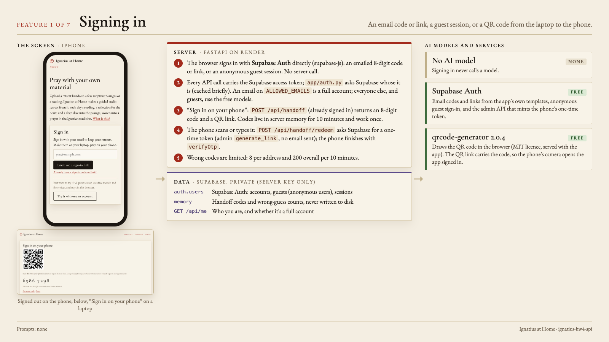
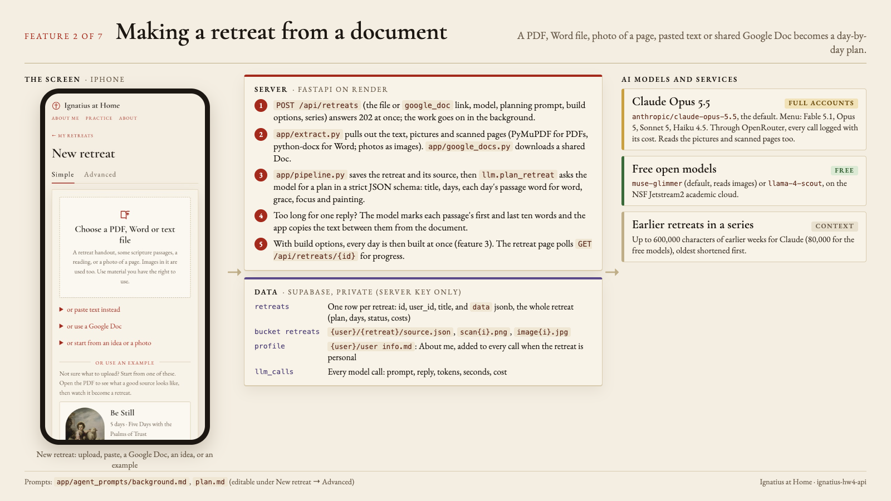
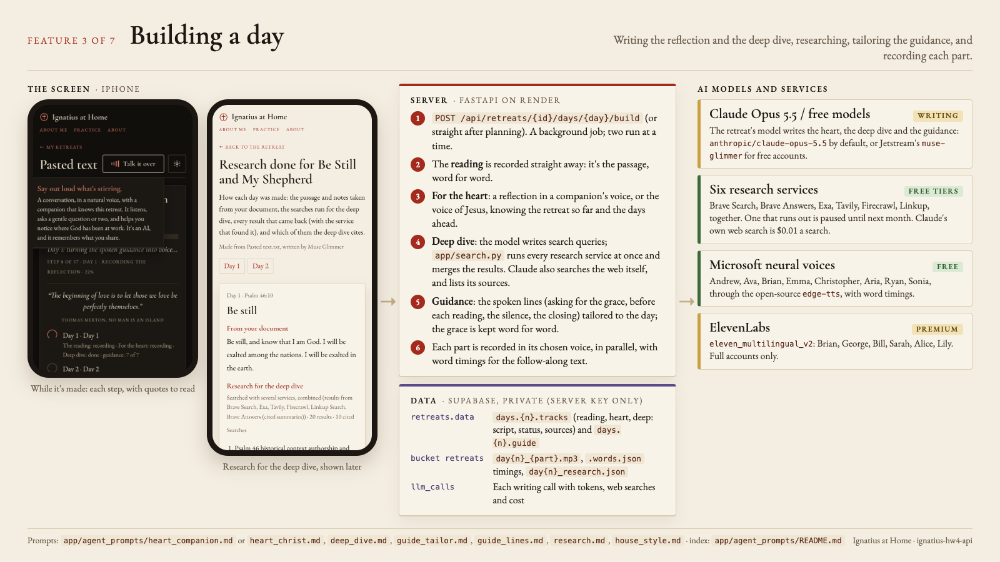
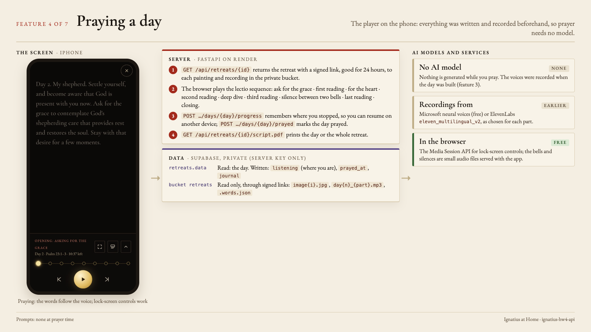
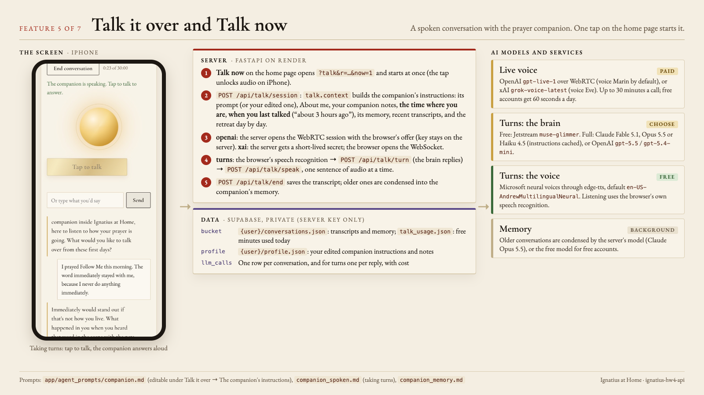
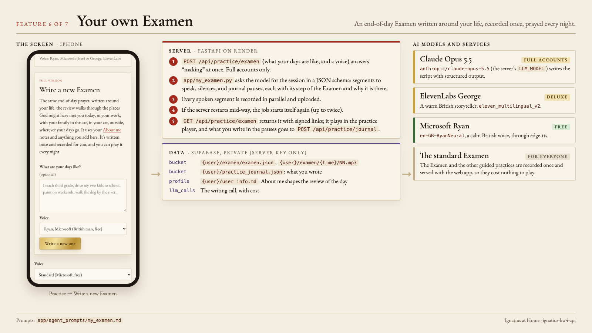
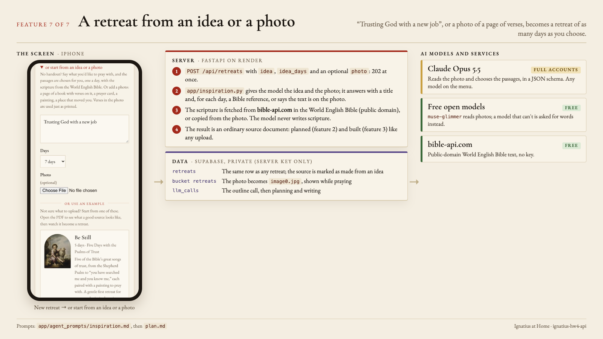

### Every agent and its tools

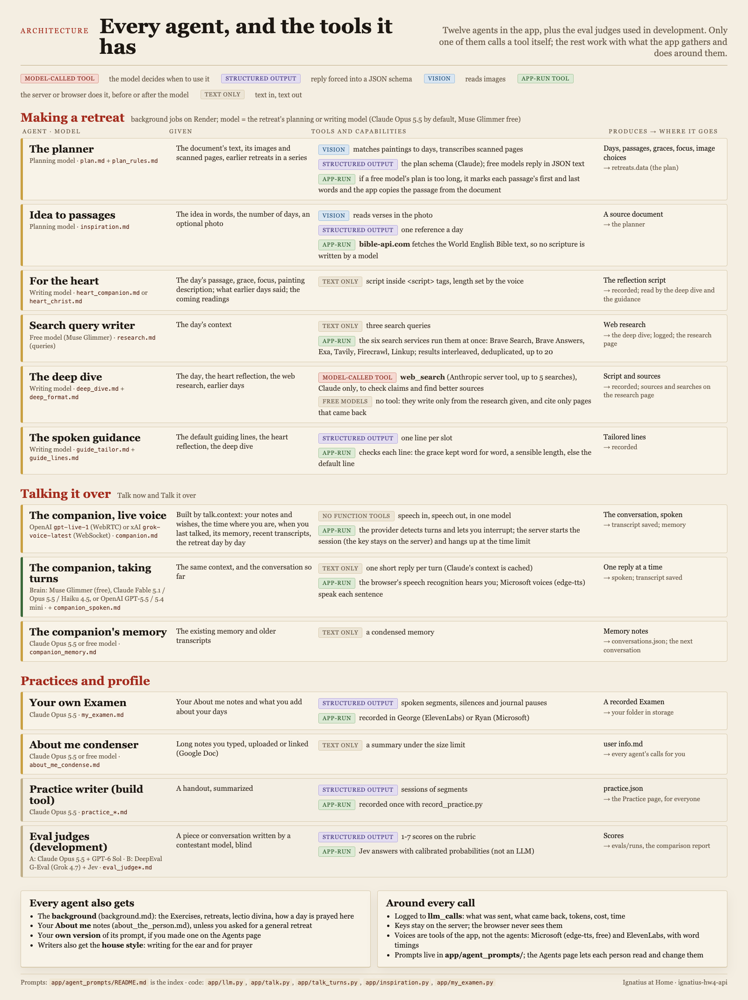

Only the deep dive calls a tool itself (Anthropic's `web_search`, Claude models only). The other agents get structured output, image reading, or tools the app runs around them (the search services, bible-api.com, the voices). Every prompt is in [`app/agent_prompts/`](../app/agent_prompts/README.md), and people can read and change them on the Agents page.
