# Ignatius at Home: how it works

This document describes the whole system: what runs where, how the pieces talk to each other, what is stored, and what happens step by step when someone signs in, uploads a document, builds a day and prays it. Diagrams are written in [Mermaid](https://mermaid.js.org), which GitHub draws in place.

**Contents**

1. [The system at a glance](#1-the-system-at-a-glance)
2. [Hosting and deployment](#2-hosting-and-deployment)
3. [Data model](#3-data-model)
4. [User journey](#4-user-journey)
5. [Signing in](#5-signing-in)
6. [Uploading and planning a retreat](#6-uploading-and-planning-a-retreat)
7. [Building a day](#7-building-a-day)
8. [Praying a day: the player](#8-praying-a-day-the-player)
9. [Status lifecycles](#9-status-lifecycles)
10. [API reference](#10-api-reference)
11. [Costs](#11-costs)
12. [Security and privacy](#12-security-and-privacy)
13. [Failures and recovery](#13-failures-and-recovery)
14. [Code map](#14-code-map)
15. [Configuration](#15-configuration)

---

## 1. The system at a glance

Ignatius at Home turns a document the user has rights to (a prayer handout, scripture passages, a reading, with images) into a guided audio retreat. Each day has three recorded sections (the reading, a reflection for the heart, and a deep dive into theology, history and hermeneutics), wrapped in short spoken guidance, and is prayed in a lectio sequence with silences.

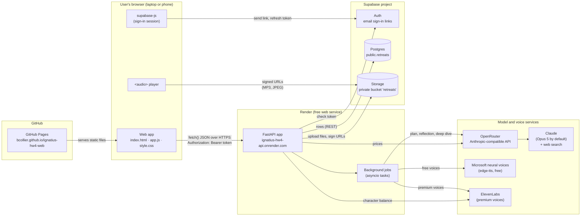

| Piece | Runs on | Job |
| --- | --- | --- |
| Web app | GitHub Pages (static) | Sign-in, upload, settings, progress, prayer player. Plain HTML, CSS and JavaScript; no build step. |
| API | Render, Python 3.12, FastAPI + Uvicorn | Checks who is calling, extracts documents, runs background jobs, saves state, returns JSON. |
| Auth | Supabase Auth | Emails sign-in links, issues and refreshes access tokens. |
| Database | Supabase Postgres | One row per retreat; the retreat itself is a JSON document. |
| File storage | Supabase Storage | Extracted images and every MP3, in a private bucket. |
| Claude | Anthropic, reached through OpenRouter | Plans the retreat, writes the reflection and deep dive, searches the web for the deep dive. |
| Voices | Microsoft (free), ElevenLabs (premium) | Turn scripts into MP3. |

---

## 2. Hosting and deployment

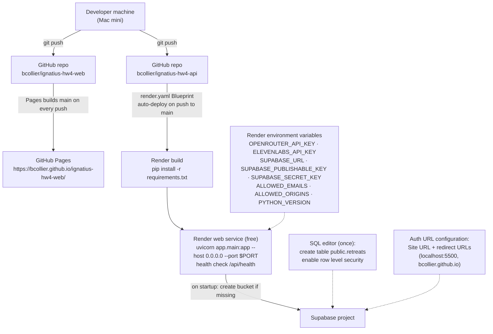

**How each part is set up**

- **Frontend.** GitHub Pages serves the `main` branch of `ignatius-hw4-web` as it is. `config.js` picks the API address: `http://localhost:8000` when the page itself is on localhost, otherwise the Render URL. Script and stylesheet links carry a version (`app.js?v=9`) so browsers fetch new code after each release.
- **Backend.** Render builds from `render.yaml`: a free Python web service in Virginia. Secrets are typed into Render's dashboard (`sync: false` in the Blueprint), never committed. Every push to `main` redeploys.
- **Free-tier behavior.** The Render service sleeps after 15 minutes without traffic and takes about a minute to wake. Its disk is temporary, which is why nothing is kept there: retreats live in Postgres and files in Storage. The page explains a slow first request and offers Retry.
- **Supabase.** One project provides Auth, Postgres and Storage. The table is created once with SQL; the private `retreats` bucket is created by the API on startup (`SupabaseStore.setup`).
- **Local development.** With no Supabase variables, the API switches to `LocalStore` (JSON files and media under `DATA_DIR`, served from `/api/files/...`) and a single local user, so it runs with no accounts at all. `LLM_MODE=stub` removes model calls too.

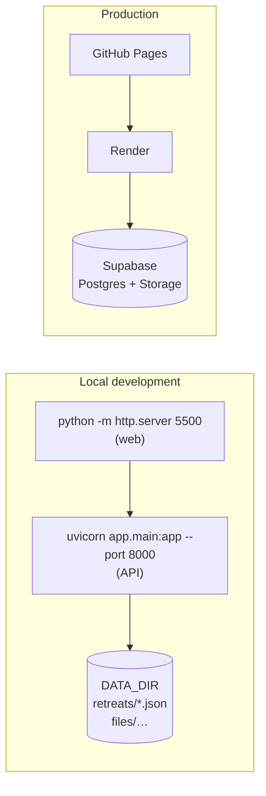

---

## 3. Data model

### 3.1 Tables

The database has one application table, linked to Supabase's own users table. Row level security is on with **no policies**, so the browser's publishable key cannot read or write it; only the API, using the secret key, can.

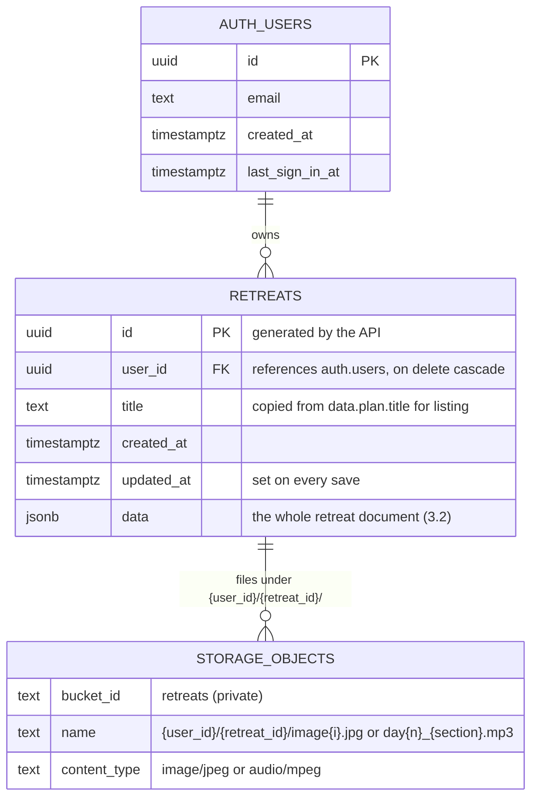

```sql
create table public.retreats (
  id uuid primary key,
  user_id uuid not null references auth.users on delete cascade,
  title text,
  created_at timestamptz not null default now(),
  updated_at timestamptz not null default now(),
  data jsonb not null
);
create index retreats_user_idx on public.retreats (user_id, created_at desc);
alter table public.retreats enable row level security;
```

**Why a JSON document.** A retreat is read and written as a whole: the page asks for one retreat, and each job step saves one retreat. Keeping it as one `jsonb` value means one read and one upsert per step, no joins, and the shape can grow (as it did with guidance clips and costs) without migrations. The trade-off is that the database can't enforce the inner structure; the API is the only writer, so it enforces it in code.

### 3.2 Inside a retreat (`data`)

This is the logical model stored in `retreats.data`. Solid lines are nesting inside the JSON document.

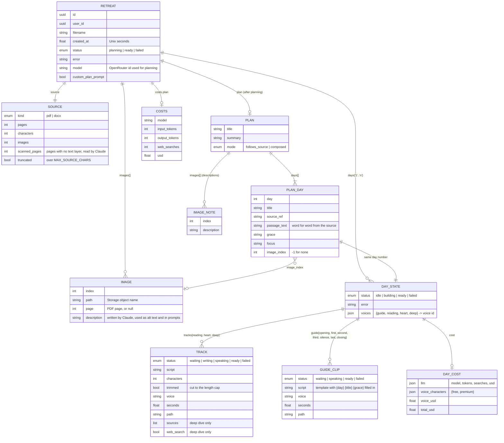

### 3.3 Storage layout

```
retreats/                                   private bucket
└── {user_id}/
    └── {retreat_id}/
        ├── image0.jpg … imageN.jpg         images extracted from the upload (max 8, ≤1568 px)
        ├── day1_reading.mp3                recorded once, played four times
        ├── day1_heart.mp3
        ├── day1_deep.mp3
        ├── day1_opening.mp3                spoken guidance clips
        ├── day1_first.mp3 … day1_closing.mp3
        └── day2_…
```

Files are never public. The API hands the browser **signed URLs** that expire after 24 hours and caches them for 23 hours, so a page left open longer than a day needs a reload.

---

## 4. User journey

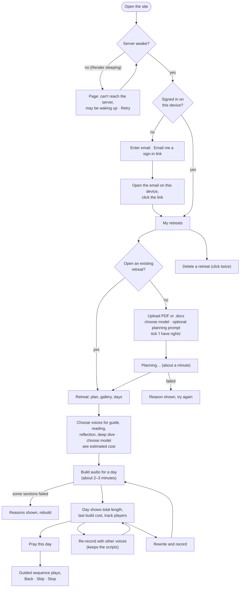

Laptop and phone are the same flow: the phone signs in with its own link, then finds the same retreats in "My retreats".

---

## 5. Signing in

Sign-in uses Supabase's email links (the implicit flow), so a link opened on any device signs in *that* device. The API never sees a password; it only checks the access token the browser sends.

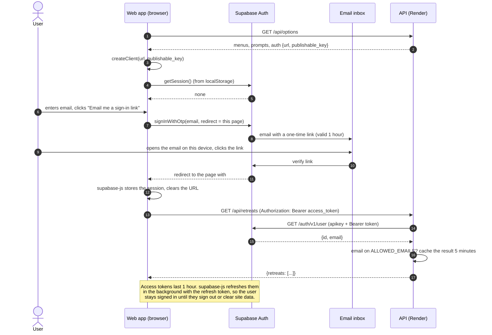

**Rules the API applies**

| Case | Response |
| --- | --- |
| No `Authorization` header | 401 "Sign in to continue." |
| Token rejected by Supabase (expired, revoked) | 401 "Your sign-in has expired. Sign in again." The page shows the sign-in form. |
| Valid token, email not on `ALLOWED_EMAILS` | 403 "This account isn't on the list of allowed users for this demo." |
| Valid token for another user's retreat | 404 "Retreat not found." (same answer as a missing retreat) |
| Supabase Auth unreachable | 503 "Couldn't reach the sign-in service." |

---

## 6. Uploading and planning a retreat

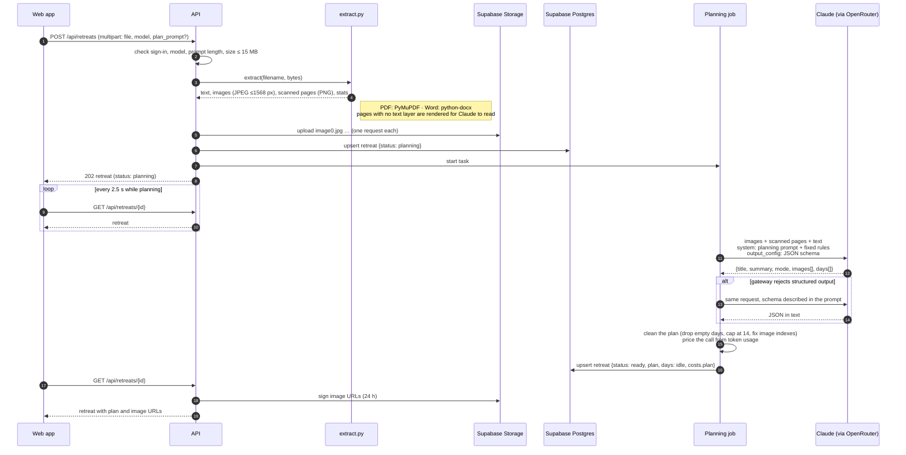

**Plan modes.** If the source already lays out days ("Day 1", "Day 2"...), Claude keeps them in order with their titles and passages (`follows_source`). If it is loose material, Claude composes about seven days from it (`composed`), reusing a passage for repetition when the source is thin. In both modes `passage_text` is copied word for word; only page furniture and verse numbers may be removed.

---

## 7. Building a day

A build records three sections and up to seven guidance clips, each in the voice chosen for its section. The reflection and deep dive are written by Claude unless the user chose **Re-record with these voices**, which reuses the existing scripts.

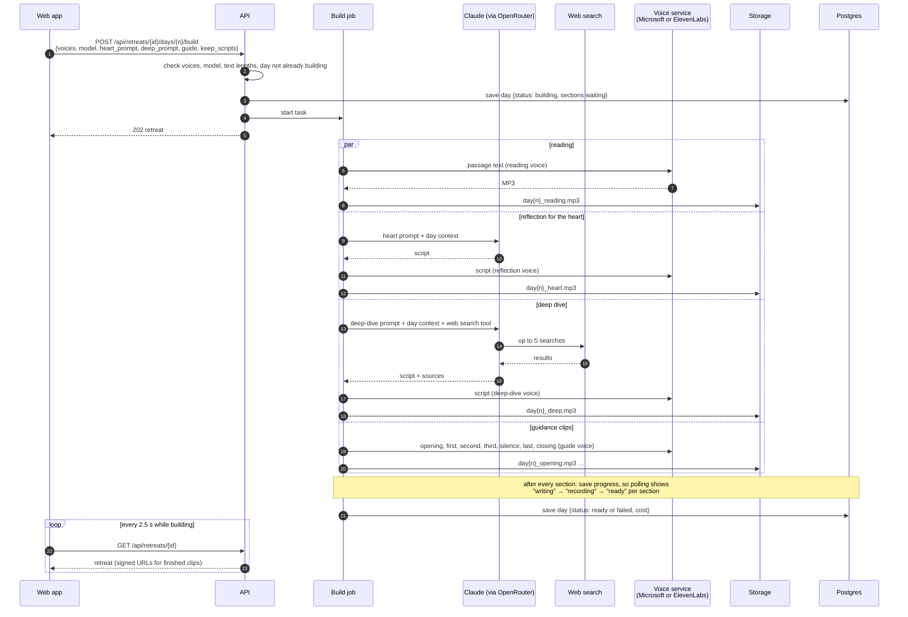

**Inside a recording**

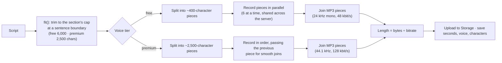

Both services produce constant-bitrate MP3, so pieces can be joined byte for byte and the length follows directly from the file size.

**What Claude is asked.** Each prompt has an editable part (shown on the page) and a fixed part the server always appends: the length target and the output format (`<script>…</script>`, plus `<sources>` for the deep dive). A house style for listening applies to both: plain paragraphs, no lists, parentheses or dashes, no verse numbers with colons, and never inventing a Hebrew or Greek word, a textual variant, a quotation or a historical fact.

---

## 8. Praying a day: the player

"Pray this day" plays everything through **one `<audio>` element**, one file after another. Silences are real audio files (a synthesized bell, 5 and 30 seconds of quiet), so the prayer keeps going when a phone screen locks, and the lock screen shows the current part through the Media Session API.

**The lectio order** (parts are what Back and Skip move between):

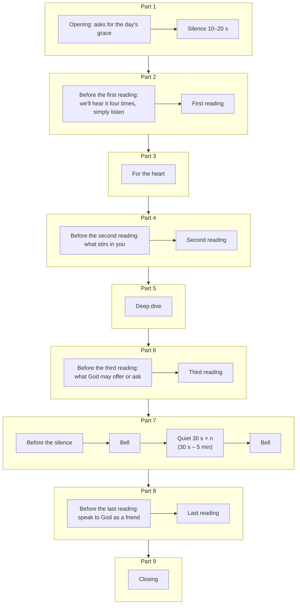

Every spoken clip is followed by 5 seconds of quiet so sections don't run together. The **simple order** is: opening and silence, reading, reflection, deep dive, the silence, closing. Any guidance clip left empty on the page is skipped.

**Total length.** Every clip stores its length in seconds, and the fixed sounds have known lengths, so the page adds up the whole sequence and shows it on the day card ("About 24 minutes in the lectio order, including silences") and as time left in the player. It updates when the order, the silence after the grace or the pause length changes. Clips recorded before lengths were saved are measured from the file's metadata once.

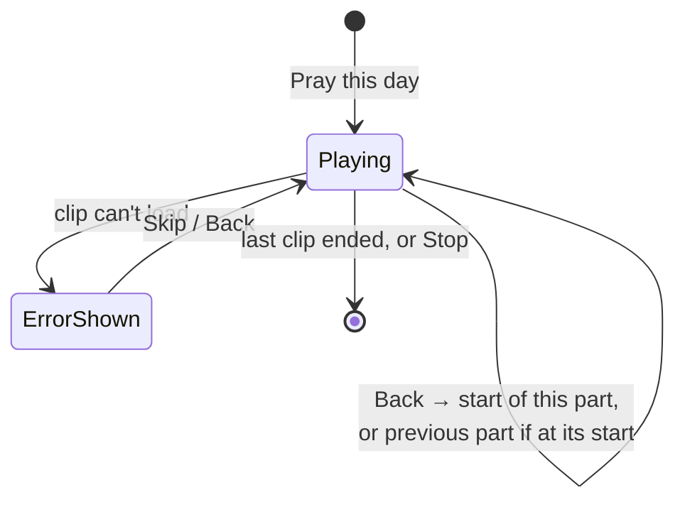

---

## 9. Status lifecycles

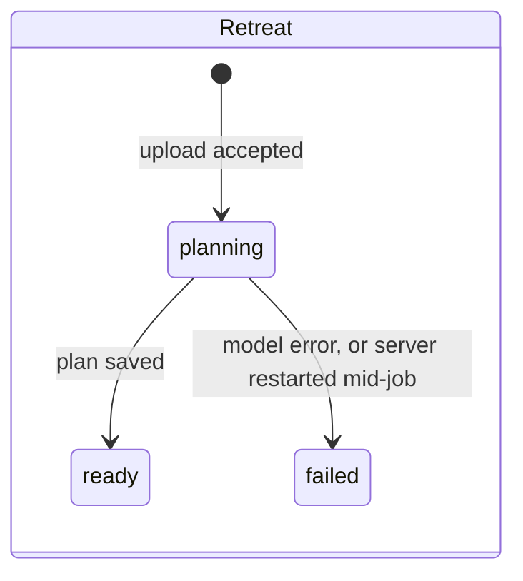

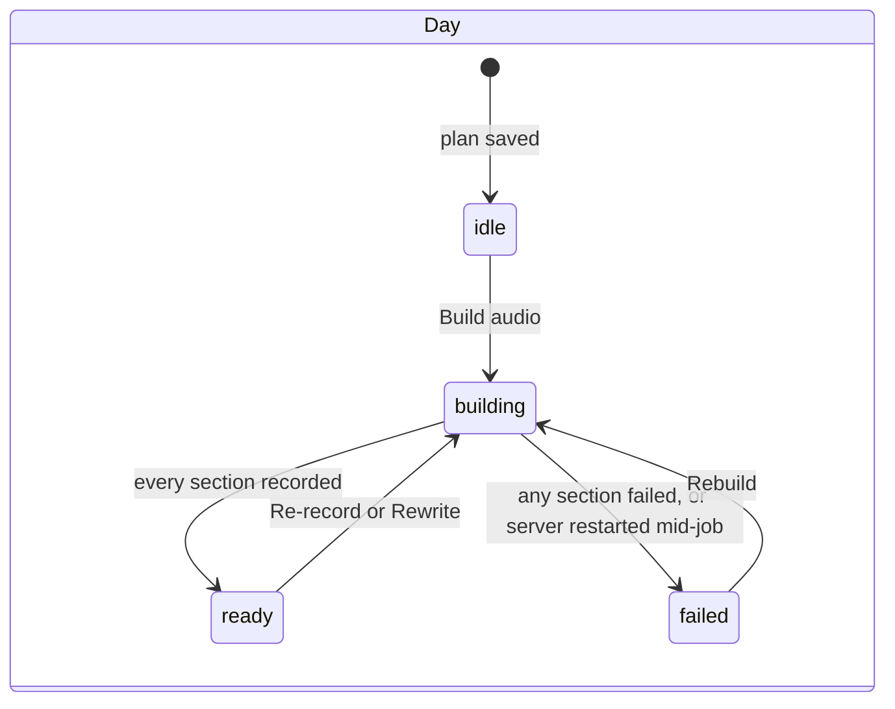

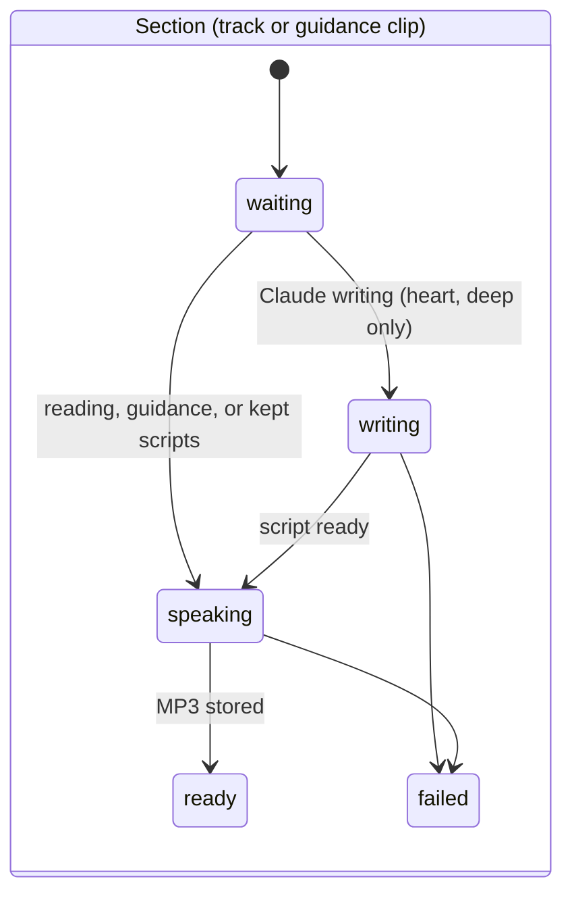

---

## 10. API reference

Base URL: `https://ignatius-hw4-api.onrender.com` (production) or `http://localhost:8000` (local). Interactive docs: `/docs`.

**Conventions**

- JSON in and out, except the upload (multipart).
- Endpoints marked 🔒 need `Authorization: Bearer <Supabase access token>` when Supabase is configured.
- Every error has the same shape, with a message written to be shown to the user:

  ```json
  {"error": {"status": 409, "message": "Day 3 is already being built."}}
  ```

- CORS allows only the origins in `ALLOWED_ORIGINS`, with methods GET, POST, DELETE and headers `Content-Type`, `Authorization`.

### `GET /api/health`

```json
{"ok": true, "llm": "openrouter", "model": "anthropic/claude-opus-5", "tiers": ["free", "premium"], "sign_in": true}
```

### `GET /api/options`

Everything the page needs before sign-in.

```json
{
  "tiers": {
    "free":    {"label": "Free (Microsoft voices)", "max_chars": 6000, "voices": {"en-US-AndrewMultilingualNeural": "Andrew (warm, male)", "…": "…"}},
    "premium": {"label": "Premium (ElevenLabs)",   "max_chars": 2500, "voices": {"nPczCjzI2devNBz1zQrb": "Brian (deep, comforting, male)", "…": "…"}}
  },
  "prompts": {
    "plan": "You design short retreats…",
    "heart": {"companion": "…", "christ": "…"},
    "deep": "You write the deep dive…",
    "guide": {"opening": "Day {day}. {title}. Settle yourself… {grace} Stay with that desire…", "first": "…", "second": "…", "third": "…", "silence": "…", "last": "…", "closing": "…"},
    "guide_labels": {"opening": "Opening: asking for the grace", "…": "…"}
  },
  "limits": {"max_upload_mb": 15, "max_pages": 40},
  "models": [
    {"id": "anthropic/claude-opus-5", "label": "Claude Opus 5", "input_per_m": 5.0, "output_per_m": 25.0, "web_search_each": 0.01},
    {"id": "anthropic/claude-haiku-4.5", "label": "Claude Haiku 4.5 (fastest, cheapest)", "input_per_m": 1.0, "output_per_m": 5.0, "web_search_each": 0.01}
  ],
  "default_model": "anthropic/claude-opus-5",
  "web_search": true,
  "elevenlabs": {"usd_per_1k_chars": 0.3, "balance": {"tier": "free", "used": 523, "limit": 10000, "remaining": 9477}},
  "auth": {"url": "https://<project>.supabase.co", "publishable_key": "sb_publishable_…"}
}
```

### `GET /api/me` 🔒

```json
{"id": "7423e07a-…", "email": "ben@collier.phd"}
```

### `GET /api/retreats` 🔒

The signed-in user's retreats, newest first.

```json
{"retreats": [
  {"id": "bc609f06-…", "title": "Rest and Return: A Seven-Day Retreat", "filename": "loose-passages-web.pdf",
   "created_at": 1790437900.1, "status": "ready", "days": 7, "days_built": 1}
]}
```

### `POST /api/retreats` 🔒

Multipart form:

| Field | Required | Notes |
| --- | --- | --- |
| `file` | yes | `.pdf` or `.docx`, ≤ 15 MB, ≤ 40 pages |
| `model` | no | A model id from `/api/options`; default `LLM_MODEL` |
| `plan_prompt` | no | Replaces the editable part of the planning prompt; ≤ 8,000 characters |

Returns **202** with the retreat in `status: "planning"`.

| Error | When |
| --- | --- |
| 400 | Not a PDF or .docx; unreadable; password protected; no text; unknown model; prompt too long |
| 413 | Larger than 15 MB |

### `GET /api/retreats/{id}` 🔒

The whole retreat, with signed URLs. A trimmed example of a built day; the token counts, lengths and costs are illustrative, not measurements:

```json
{
  "id": "2e048ec8-…",
  "filename": "loose-passages-web.pdf",
  "status": "ready",
  "model": "anthropic/claude-opus-5",
  "costs": {"plan": {"model": "anthropic/claude-opus-5", "input_tokens": 3120, "output_tokens": 5410, "web_searches": 0, "usd": 0.1509}},
  "source": {"kind": "pdf", "pages": 2, "characters": 2543, "images": 1, "scanned_pages": 0, "truncated": false},
  "images": [{"index": 0, "page": 2, "description": "Rembrandt, The Return of the Prodigal Son…", "path": "…/image0.jpg", "url": "https://…supabase.co/storage/v1/object/sign/retreats/…/image0.jpg?token=…"}],
  "plan": {
    "title": "Rest and Return: A Seven-Day Retreat",
    "summary": "…",
    "mode": "composed",
    "days": [{"day": 5, "title": "While He Was Still Far Off", "source_ref": "Luke 15:20-21 (World English Bible)",
              "passage_text": "He arose, and came to his father…", "grace": "…", "focus": "…", "image_index": 0}]
  },
  "days": {
    "5": {
      "status": "ready",
      "error": null,
      "voices": {"guide": "en-US-AvaMultilingualNeural", "reading": "en-US-AndrewMultilingualNeural", "heart": "nPczCjzI2devNBz1zQrb", "deep": "en-US-ChristopherNeural"},
      "tracks": {
        "reading": {"status": "ready", "script": "He arose…", "characters": 326, "trimmed": false, "voice": "en-US-AndrewMultilingualNeural", "seconds": 24.1, "path": "…/day5_reading.mp3", "url": "https://…?token=…"},
        "heart":   {"status": "ready", "script": "…", "characters": 2310, "voice": "nPczCjzI2devNBz1zQrb", "seconds": 141.9, "url": "…"},
        "deep":    {"status": "ready", "script": "…", "characters": 5489, "voice": "en-US-ChristopherNeural", "seconds": 402.6,
                    "sources": ["Thayer's Greek Lexicon entry on splagchnizomai — https://…"], "web_search": true, "url": "…"}
      },
      "guide": {
        "opening": {"status": "ready", "script": "Day 5. While He Was Still Far Off. Settle yourself…", "voice": "en-US-AvaMultilingualNeural", "seconds": 14.3, "url": "…"},
        "first":   {"status": "ready", "script": "We will hear today's reading four times…", "seconds": 9.4, "url": "…"}
      },
      "cost": {
        "llm": {"model": "anthropic/claude-opus-5", "input_tokens": 52340, "output_tokens": 6120, "web_searches": 5, "usd": 0.4647},
        "voice_characters": {"free": 6630, "premium": 2310},
        "voice_usd": 0.693,
        "total_usd": 1.1577
      }
    }
  }
}
```

### `DELETE /api/retreats/{id}` 🔒

Deletes the row and all its files. **409** while a job is running for it.

```json
{"deleted": "2e048ec8-…"}
```

### `POST /api/retreats/{id}/days/{n}/build` 🔒

```json
{
  "voices": {"guide": "en-US-AvaMultilingualNeural", "reading": "en-US-AndrewMultilingualNeural",
             "heart": "nPczCjzI2devNBz1zQrb", "deep": "en-US-ChristopherNeural"},
  "model": "anthropic/claude-opus-5",
  "heart_prompt": "…optional…",
  "deep_prompt": "…optional…",
  "guide": {"closing": ""},
  "keep_scripts": false
}
```

| Field | Notes |
| --- | --- |
| `voices` | A voice id per section. Free and premium voices can be mixed; the tier follows from the id. Missing sections use `voice` (default Andrew). |
| `model` | Model for the reflection and deep dive. |
| `heart_prompt`, `deep_prompt` | Replace the editable part of those prompts; ≤ 8,000 characters. |
| `guide` | Spoken guidance by name. Missing names use the defaults; `""` skips that clip. Placeholders `{day}`, `{title}`, `{grace}`. ≤ 1,000 characters each. |
| `keep_scripts` | Re-record with the new voices without calling Claude. Falls back to writing if there are no scripts yet. |

Returns **202** with the retreat. Errors: **400** unknown voice or model, text too long · **404** no such day · **409** plan not ready, or day already building.

### `GET /api/files/{path}` (local development only)

Serves files from `DATA_DIR` when Supabase isn't configured. In production, files come from signed Storage URLs and this route doesn't exist.

### Calls the API makes to other services

| Service | Call | When |
| --- | --- | --- |
| Supabase Auth | `GET /auth/v1/user` | Checking a token (cached 5 minutes per token) |
| Supabase REST | `POST /rest/v1/retreats` (upsert), `GET` (by id, by user), `DELETE` | Every save, load, list, delete |
| Supabase Storage | `POST /storage/v1/object/retreats/{path}` (upsert) | Each image and MP3 |
| Supabase Storage | `POST /storage/v1/object/sign/retreats` (batch) | Building responses; URLs cached until 1 hour before expiry |
| Supabase Storage | `GET/POST /storage/v1/bucket` | Startup: create the bucket if missing |
| OpenRouter | `POST /api/v1/messages` (Anthropic Messages format, streamed) | Planning, reflection, deep dive |
| OpenRouter | `GET /api/v1/models` | Prices, cached 6 hours |
| Microsoft (edge-tts) | WebSocket speech synthesis | Free voices |
| ElevenLabs | `POST /v1/text-to-speech/{voice}` | Premium voices |
| ElevenLabs | `GET /v1/user/subscription` | Character balance, cached 5 minutes |

---

## 11. Costs

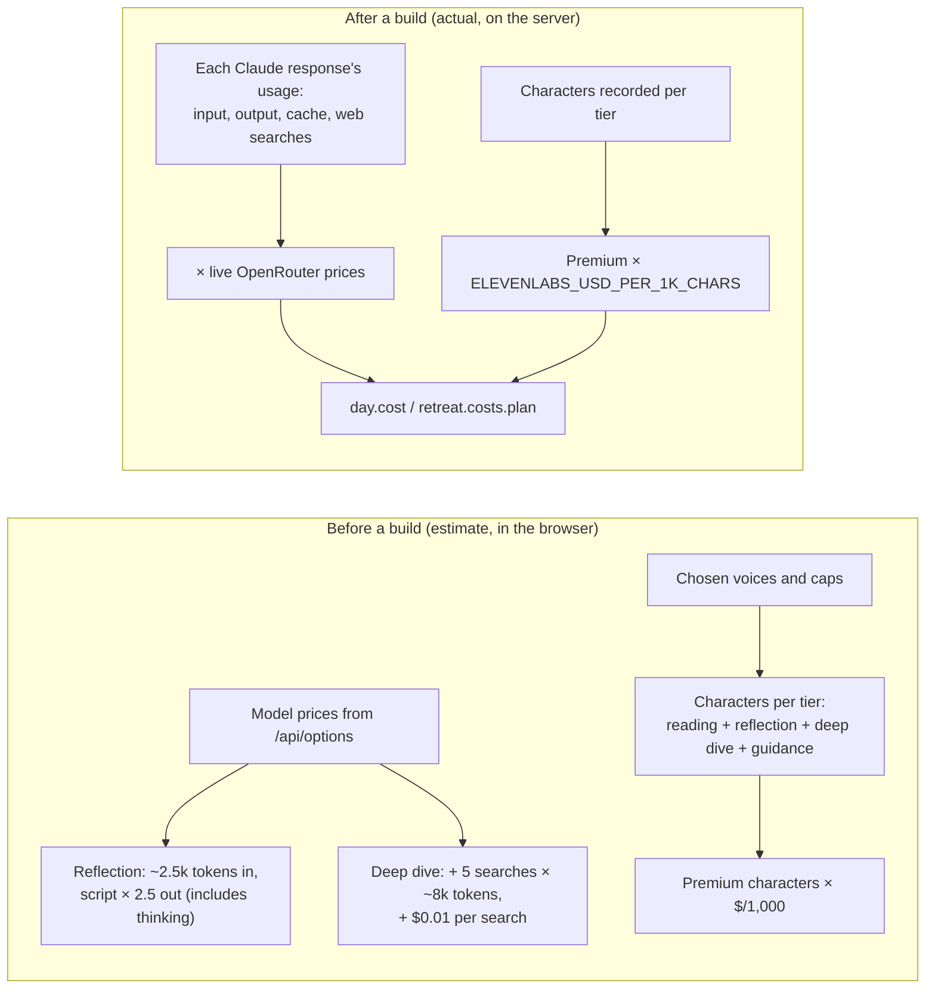

- **Claude.** Priced from each response's token usage at OpenRouter's live rates. Thinking tokens are billed as output, which is why the estimate multiplies the script length. Re-recording costs nothing on the model side.
- **Voices.** Microsoft voices are free. ElevenLabs bills by character; the dollar rate depends on the plan, so the page uses `ELEVENLABS_USD_PER_1K_CHARS` (default $0.30) and shows the account's remaining characters. The reading is recorded once even though it plays four times.
- **Where it shows.** Each day card shows the estimate for a new build, the estimate for a re-record, and the actual cost of the last build. The retreat header shows the total spent so far, including planning.

---

## 12. Security and privacy

| Concern | How it is handled |
| --- | --- |
| API keys | Environment variables only: `.env` locally (gitignored), Render's dashboard in production. `.env.example` lists names with empty values. |
| Supabase keys | The **secret** key stays on the server. The browser gets only the **publishable** key, which is designed to be public. |
| Database access | Row level security is enabled with no policies, so the publishable key can't read or write `retreats`. The API filters every read by the caller's user id. |
| Other users' retreats | Answered with 404, the same as a missing retreat. |
| Files | Private bucket; the browser gets signed URLs that expire after 24 hours. Paths start with the owner's user id. |
| Spending | `ALLOWED_EMAILS` limits who can use the deployed demo; upload size, page count, text length, prompt length and track length are capped. |
| Cross-site calls | CORS only for the origins in `ALLOWED_ORIGINS`. |
| Local file route | `/api/files/…` exists only without Supabase and refuses paths outside `DATA_DIR`. |
| Copyright | Users upload only material they own or may use; each retreat is private to its owner and nothing is shared between users. The public demo uses public-domain material. |

---

## 13. Failures and recovery

| What goes wrong | What the user sees | What happens |
| --- | --- | --- |
| Render is asleep | "Can't reach the server… may be waking up" with Retry | First request wakes the service (about a minute). |
| Server restarts during a job | The job's status becomes failed with "interrupted by a server restart" | On the next read, any retreat or day still marked planning/building with no running task is marked failed. |
| Claude errors (rate limit, auth, refusal, ran out of room) | The section's reason, e.g. "The model provider is rate limiting requests" | Other sections still finish; the day is `failed` with per-section errors; Rebuild retries. |
| OpenRouter rejects structured output | Nothing | Planning retries with the schema described in the prompt. |
| OpenRouter rejects web search | Nothing; `web_search: false` on the deep dive | The deep dive is written without search, told to keep to well-established claims. |
| Free voice service fails | "The free voice service didn't respond…" | Choose another voice or tier and rebuild. |
| ElevenLabs out of credit | "ElevenLabs is out of credits or rate limited…" | Other sections continue; switch that section to a free voice and re-record. |
| Scanned PDF | Planning reads the page images | Up to 4 text-less pages are sent to Claude as images. |
| Sign-in expired | Sign-in form reappears | Any 401 from the API signs the page out. |
| Audio link expired | "This track couldn't be loaded. Reload the page…" | Reloading fetches fresh signed URLs. |

---

## 14. Code map

**Backend (`ignatius-hw4-api`)**

| File | Responsibility |
| --- | --- |
| `app/main.py` | Routes, request validation, error format, CORS, startup |
| `app/auth.py` | Token check with Supabase Auth, allowlist, local user |
| `app/storage.py` | `SupabaseStore` (Postgres rows, Storage files, signed URLs) and `LocalStore` |
| `app/pipeline.py` | Background jobs: planning, building a day, saving progress, recovery after restart, costs |
| `app/extract.py` | PDF and Word extraction: text, images, scanned pages |
| `app/llm.py` | Claude calls through OpenRouter: streaming, structured output with fallback, web search with fallback |
| `app/prompts.py` | Default prompts, house style, spoken guidance templates |
| `app/tts.py` | Voices, tiers, chunking, Microsoft and ElevenLabs recording, lengths |
| `app/pricing.py` | Model list, live prices, cost meter, ElevenLabs balance |
| `app/config.py` | Environment settings |
| `tests/` | API flow, errors, storage and auth against a fake Supabase, cost math, text helpers |
| `samples/` | Public-domain sample uploads and the script that builds them |

**Frontend (`ignatius-hw4-web`)**

| File | Responsibility |
| --- | --- |
| `index.html` | Page structure and templates |
| `app.js` | API helper, sign-in, library, upload and polling, day cards, estimates, prompt and guidance editors, prayer player |
| `config.js` | API address |
| `style.css` | Layout, light and dark colors |
| `sounds/` | Bell, 5 s and 30 s quiet (made by `tools/make_sounds.py`) |

---

## 15. Configuration

| Variable | Default | Purpose |
| --- | --- | --- |
| `OPENROUTER_API_KEY` | | Claude through OpenRouter |
| `ANTHROPIC_API_KEY` | | Claude directly, if no OpenRouter key |
| `LLM_MODE` | from keys | `openrouter`, `anthropic` or `stub` |
| `LLM_MODEL` | `anthropic/claude-opus-5` | Default model |
| `WEB_SEARCH` | `1` | Web search for the deep dive |
| `ELEVENLABS_API_KEY` | | Enables premium voices |
| `ELEVENLABS_MODEL` | `eleven_multilingual_v2` | ElevenLabs voice model |
| `ELEVENLABS_USD_PER_1K_CHARS` | `0.30` | For cost estimates |
| `SUPABASE_URL`, `SUPABASE_PUBLISHABLE_KEY`, `SUPABASE_SECRET_KEY` | | Sign-in, database, storage |
| `SUPABASE_BUCKET` | `retreats` | Storage bucket |
| `ALLOWED_EMAILS` | anyone | Who may use the deployment |
| `ALLOWED_ORIGINS` | localhost ports | CORS origins |
| `DATA_DIR` | `/tmp/ignatius` | Local storage when Supabase is off |
| `MAX_UPLOAD_MB` / `MAX_PAGES` / `MAX_SOURCE_CHARS` | 15 / 40 / 80,000 | Upload limits |
| `MAX_IMAGES` / `MAX_SCANNED_PAGES` | 8 / 4 | Extraction limits |
| `MAX_DAYS` / `DEFAULT_DAYS` | 14 / 7 | Plan size |
| `MAX_TRACK_CHARS` / `PREMIUM_MAX_TRACK_CHARS` | 6,000 / 2,500 | Section length caps |
| `MAX_CONCURRENT_JOBS` | 2 | Jobs running at once |
