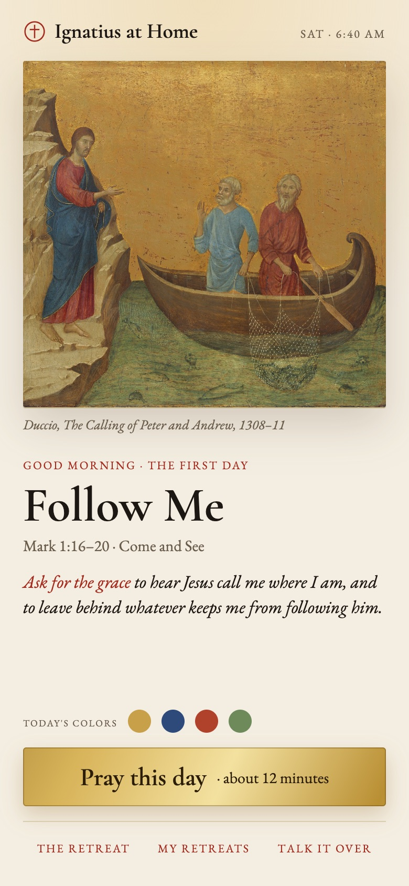
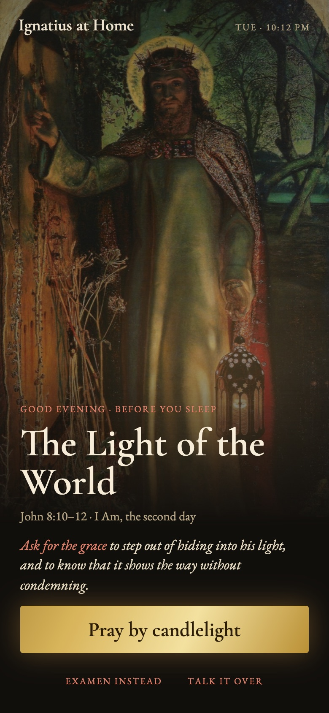
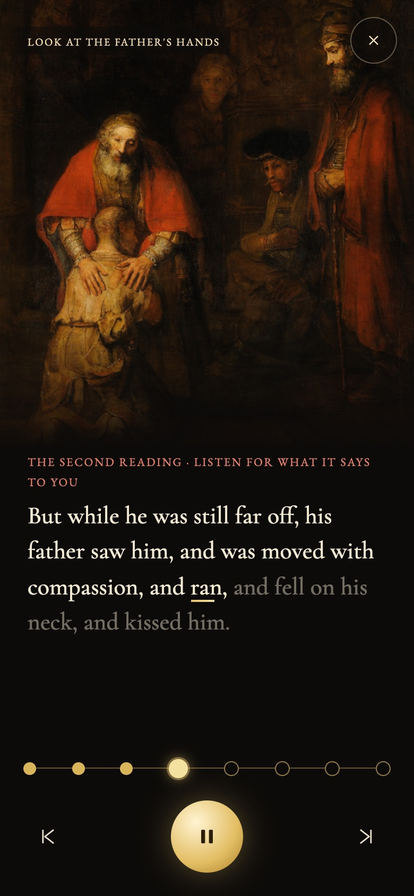
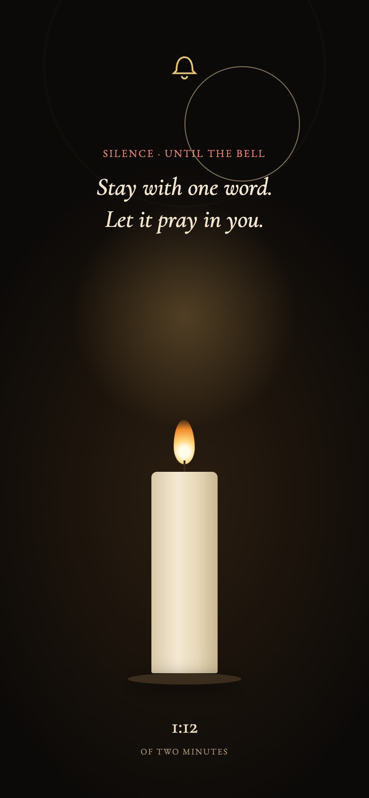
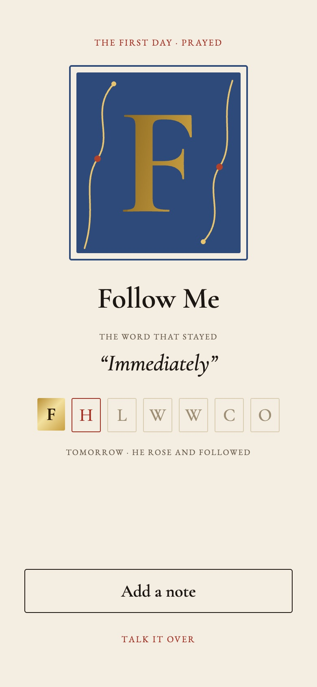
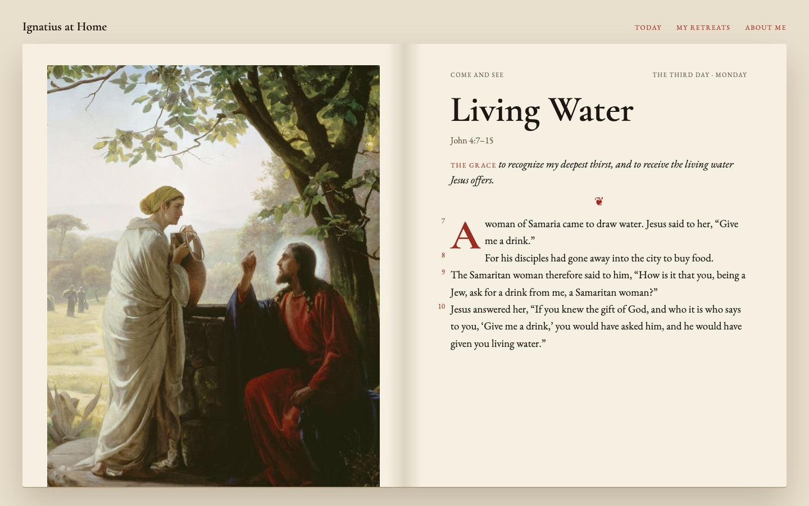
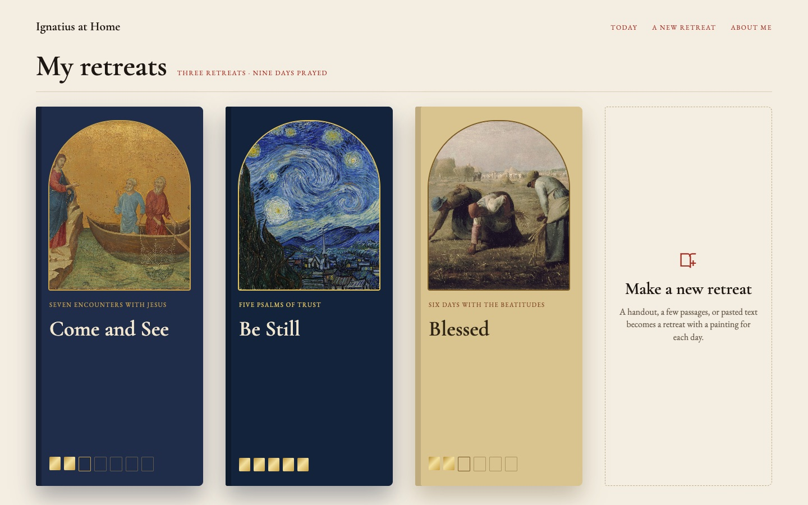

# Visual redesign spec: a modern book of hours

September 26, 2026. The spec behind the app's look: why the earlier look failed, the direction chosen, the mockups that were approved, the decisions made on them, and what was built. The mockups were made in Claude Design; the images here are renders of those boards (paintings are public domain).

This was step six of the [build method](https://github.com/bcollier/ignatius-hw4-web#the-method-spec-driven-in-phases), after the [original spec](original-spec/), the spec-driven revision ([IMPROVEMENTS.md](IMPROVEMENTS.md)) and the [code cleanup](CODE_CLEANUP.md). The result is described in the frontend README's [design choices](https://github.com/bcollier/ignatius-hw4-web#12-design-choices).

## 1. The problem

The first version was parchment and one brown accent: calm, but "blah." A second pass used the defaults of a thousand AI-built startup sites, and looked like it:

- violet-to-pink gradients;
- Inter as the text font;
- frosted-glass cards;
- shiny sweeps across buttons on hover;
- pill-shaped tags and heavily rounded corners;
- every card fading up in the same cascade;
- symbol-font icons (⚙︎, ↑);
- one centered 760-pixel column on every page.

Each is fine alone. Together they say "template." Nothing in the look came from the subject: prayer, scripture, paintings, a 500-year-old tradition.

## 2. The direction: a modern book of hours

Books of hours were the medieval prayer books people prayed at home, day by day, which is exactly this app. They have a strong, specific visual language that almost no app uses, and it can be done in a clean, contemporary way.

1. **Color taken from the painting, not the brand.** Each day's palette comes from its own painting: Rembrandt's ochres and umbers, Fra Angelico's lapis and gold, Van Gogh's blues. The browser reads a few colors from the image, and the day's page, buttons and prayer screen take them on. Every day looks different, and the painting is the design. One fixed brand color stays (a deep ink), plus gold for anything prayed or finished.
2. **Rubrics in red.** Liturgical books print their instructions in red and the words in black; the red instructions are *rubrics*. So: guidance lines, day labels and "Ask for the grace" in a warm red; scripture in black ink; small capitals for labels ("THE THIRD DAY · MONDAY"); old-style numerals; verse numbers in the margin, not inline; a single ornament (❦) between sections instead of divider lines.
3. **Real book typography.** No Inter. A book text face (EB Garamond) with a characterful display face (Cormorant Garamond), a large first letter (a drop cap) on each passage, true quotation marks, and text sizes on a real scale.
4. **Pages that feel like a spread, not a stack of cards.** On a computer a day is a two-page spread: the painting on the left, full height, with a museum-style caption; the passage set like a book page on the right. On a phone the painting stays in view while the text scrolls. Space, fine rules and alignment instead of rounded white cards.
5. **Motion that means something.** Instead of the generic fade-up cascade, a few gestures tied to prayer:
   - the eight parts of a day as **a string of beads**: the current one glows, finished ones turn gold;
   - **silence as a candle** that burns down between the bells;
   - **a prayed day is gilded**: its first letter fills with gold, like illumination being finished;
   - **every painting drifts** slowly (zoom and pan), like light moving in a chapel.
6. **Time of day.** Most people pray at dawn or late at night, so the home screen follows the hour: pale gold at dawn, clear at midday, amber at dusk, candlelit indigo at night with a soft flicker on the painting. It opens to a single screen: "Good morning · the third day", the painting, the grace, and one button.
7. **A custom mark and icons.** An original mark (a cross in a circle) and a small set of consistent line icons drawn in SVG, replacing symbol-font characters and emoji.
8. **Gold leaf, used sparingly.** Gold for "prayed," the Pray button and the day's first letter, with a slow sheen. Kept rare, it feels precious.

**Stripped out with it:** the violet and pink gradients, frosted glass, shiny sweeps, gradient-colored headings, pill tags, uniform fade-ups, most drop shadows, and corners rounder than about 6 px (a book is rectangular).

**References:** Penguin Classics covers and page layouts; the Rijksmuseum website (painting first); the Criterion Collection (editorial restraint); the *Très Riches Heures* (the original book of hours). And, to avoid looking like them, the apps already in the category.

**Priorities:** if only three moves were made: color from each painting (1), red rubrics (2), and motion with meaning (5). Those make it look like nothing else in the category.

## 3. The mockups

Seven boards: five phone screens (390 × 844) and two computer screens (1440 × 900). On the canvas they animate: the paintings drift, the gold sheens, the candle burns, the initial gilds itself.

| | | |
| --- | --- | --- |
|  |  |  |
| **1. Today, at dawn.** One screen per day: Duccio's *Calling of Peter and Andrew* drifting toward Christ's beckoning hand, warm morning light, "Good morning · the first day" and "Ask for the grace" in rubric red, a gold Pray button with a slow sheen. | **2. Today, at night.** The same screen by candlelight: Holman Hunt's *Light of the World* with a lantern glow flickering over it, in deep ink with ivory text. | **3. Praying.** Rembrandt's *Return of the Prodigal Son* moves in on the father's hands ("Look at the father's hands"); the day's eight parts are beads, the current one glowing; the word being read is underlined in gold. |
|  |  | |
| **4. Silence.** A candle burns down over the silence, a bell ripples at the start, and one instruction: "Stay with one word." | **5. A day prayed.** A large illuminated "F" gilds itself inside a painted frame while a vine draws around it; the week becomes seven initials, prayed days in gold. | |

**6. A day as a two-page spread (computer).** Carl Bloch's *Woman at the Well* on the left page with a museum caption; on the right a small-caps running head, the title, the grace, an ornament, the passage with a red drop cap and red verse numbers in the margin, and a gold "Pray this day."

**7. My retreats (computer).** Each retreat is a cover colored from its painting, with the painting in an arched window and a gold square for every day prayed; the shelf ends with "Make a new retreat."

## 4. Decisions on the mockups

- **"Books" became "retreats."** The first mockups called the library "My books" and the last card "Begin a new book," which would confuse people. Rather than explain it with an animated intro, the words changed: "My retreats" and "Make a new retreat," the same word the rest of the app uses. The covers still look like books; "book of hours" is only the name of the design direction, never shown to users.
- **Keep the slow-moving paintings.** Approved in two forms: a slow drift on every painting (home, the retreat page, the prayer screen), still for people who ask their device for reduced motion; and "Look closer" zooms that move to the detail each part talks about. The second needs the planner to note where the details are in each painting, and is not built yet.
- **Build it and push to main**, which followed.

## 5. What was built

| In the spec | In the app |
| --- | --- |
| Color from each painting | Built: `js/look.js` reads the painting's colors in the browser and sets `--day-deep`, `--day-accent`, `--day-light`, `--day-dominant` and `--day-on-deep` on the Today card, the day page, the covers and the prayer screen |
| Rubrics, small caps, old-style numerals, ornament | Built |
| Book typography, drop cap | Built: Cormorant Garamond and EB Garamond; the passage's first letter in the painting's deepest color |
| Two-page spread on a computer | Built |
| Beads, the candle in the silence, the gilded first letter, the drifting paintings | Built, all still under reduced motion |
| Time of day on the home screen | Built: the Today card's greeting and light follow the hour (`hourMood`) |
| Covers colored by their painting, gold squares for prayed days | Built |
| Line icons in SVG, a cross-in-circle mark | Built |
| "Today's colors" (four dots read from the painting) | Built, then removed at the owner's request: they didn't do anything |
| "Look closer" zooms to a detail | Not built yet (needs the planner to mark details in each painting) |

Later work kept the same language: the Examen's paintings and candle in the Practice sessions, the waiting screen's breathing circle, and the gold build progress bar.
