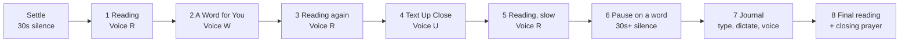
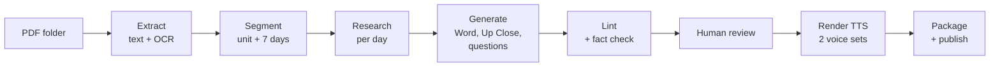
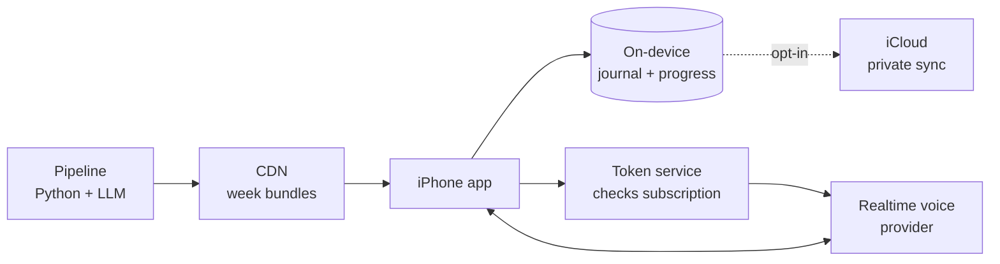

# Spiritual Exercises iPhone App: Design Spec

Sep 25, 2026 · @Ben Collier

An iPhone companion for the Spiritual Exercises in daily life. Each day is played aloud as an immersive lectio divina: the reading, a word from God, a close reading, the reading again, a pause to journal, and a final reading. All the content is pre-generated from a folder of retreat PDFs.

## Product summary

The app turns a 19th Annotation retreat (the Exercises in daily life, roughly 30 weeks) into a daily 20 to 30 minute listening and journaling session. The session is mostly audio with the text on screen, so it works on a walk, in a chair before dawn, or in the car.

**Who it is for**

- Retreatants in a guided program such as Bridges, who get weekly prayer units as PDFs and meet a prayer companion weekly.
- Individuals doing the Exercises alone who want structure and depth.
- Spiritual directors, who can hand a directee a pre-built retreat.

**Design principles**

1. **Listening first.** The phone should feel like a quiet voice reading to you, not an app demanding taps. Text is on screen to follow along, never required.
2. **Repetition is the method.** The same passage returns three times in one session. The repetition is intentional, not filler.
3. **Three distinct voices.** The Reading, A Word for You and The Text Up Close each have their own narrator, so the ear always knows which mode it is in.
4. **One day at a time.** Today's day is open; future days stay locked so no one binges ahead. Past days stay open for repetition.
5. **Silence is a feature.** Timed pauses are real silence with a soft chime, not dead air to skip.
6. **Private by default.** Journals stay on the device unless the user opts in to sync.
7. **Scholarship without showing off.** The Text Up Close is deep, but it is spoken, so it avoids verse numbers read as digits, parentheses and transliteration walls.

## Retreat setup and daily loop

The user picks a retreat and says the date they start. From then on, the app always knows which week and day is "today".

**Onboarding (under 2 minutes)**

1. Choose a retreat. The launch retreat is one program, such as Bridges 2026-2027; later there is a catalog.
2. "When does your retreat begin?" The user speaks or picks a date. Dictation turns "this past Monday" into a date and shows it back for confirmation.
3. Choose a daily prayer time, for a reminder, and optionally an evening Examen reminder.
4. Choose a voice set: Premium (ElevenLabs) or Free (standard neural voices).
5. Pick a journaling default: type, dictate or voice guide.
6. Optionally add a prayer companion's name and meeting day, which sets a weekly "share your week" reminder.

**Day math**

- Day index = days since the start date + 1. Week = ceil(day / 7), day of week = ((day - 1) mod 7) + 1.
- Week 1 Day 1 falls on the start date. If a program's weeks run Monday to Sunday, snap the start to the Monday on or before the chosen date.

**Unlocking and catching up**

- **Today** is always open. **Past days** stay open, marked done or not done. **Future days** are locked, with a preview of the title and passage only.
- Missed days are not piled up as "overdue". Today still shows today's material, with a quiet "You have 2 open days this week" chip. Ignatius asked for fidelity, not completion, so the app should never shame.
- Pause the retreat: a single toggle shifts every future date by the paused days, for illness or travel.
- Monthly group session days, when the program has them, show on Today as a banner.

## The daily session

Every scripture day plays the same eight-step sequence, about 25 minutes. It adapts lectio divina: the reading returns three times, with each return framed by something new.



The diagram shows one pass. Steps 1, 3, 5 and 8 all use the Reading voice, so the ear learns the rhythm.

| Step | Voice | What plays | Typical length | On screen |
| --- | --- | --- | --- | --- |
| 0 Settle | none | Chime, then "Take a breath. Ask for the grace of this week." | 30 s | The week's grace in large type |
| 1 Reading | Reading (R) | Handout text, read plainly | 1.5 to 4 min | Text with the current line highlighted |
| 2 A Word for You | Word (W) | Second-person reflection in the voice of Christ | 6 to 8 min | Scrolling text, dimmed background art |
| 3 Reading again | R | The same passage, same pace | 1.5 to 4 min | Text, highlighted |
| 4 The Text Up Close | Up Close (U) | Word studies, context, what the rabbis and the Fathers said, application | 5 to 7 min | Text with tappable callouts (Hebrew or Greek word cards) |
| 5 Reading, slow | R | Same passage at 0.85x, with 3 s gaps between sentences | 2 to 5 min | Text; the user can tap any phrase that stands out |
| 6 Pause on a word | none | Soft chime, silence, chime | 30 s default, adjustable 15 s to 3 min | The tapped phrase, or the suggested word, alone on screen |
| 7 Journal | optional guide | A reflection question is read aloud, then the journal opens | Open-ended | Question plus journal input |
| 8 Final reading | R | The passage one last time, then a closing line such as the Suscipe or Glory Be | 2 to 5 min | Text, fading to the grace |

**Player controls**

- Play and pause, back 15 s, next step, and a step rail showing all eight steps with the current one lit.
- Speed from 0.75x to 1.25x per voice. The slow reading in step 5 keeps its relative slowdown.
- "Linger": while silence is playing, one tap adds 30 s.
- Tap any sentence in any step to save it as a highlight; highlights feed the Pause step and the Review day.
- Short versions: the user can turn off steps 3 and 5 for a 15-minute session, but the default is the full sequence.

**The word for the pause.** If the user tapped a phrase in steps 1 to 5, the pause uses the last one tapped. Otherwise it uses the day's pre-chosen `pause_word`, a short phrase the pipeline picks as the passage's hinge, for example "a little lower than God" or "called you by name".

**Audio details.** Background art for the day, and optionally a low ambient bed (room tone, distant birds) under the silences only. Audio keeps playing with the screen locked, and shows lock-screen controls with the step name as the track title.

## Day types

The handouts are not uniform, so each day is classified in the pipeline and each type gets its own player template. The eight-step sequence is the scripture template; the others change which steps run.

| Type | Example from the Bridges units | Reading slot holds | A Word for You | Text Up Close | Journal |
| --- | --- | --- | --- | --- | --- |
| Scripture | Psalm 8; Isaiah 55:1-3, 6-12; Mark 10:17-27 | The passage as printed | Yes | Word studies, translation, context | 1 or 2 questions |
| Non-scripture text | Tetlow's "Consideration of the Way Things Are"; the Principle and Foundation (SpEx 23) | The text as printed | Yes | Source history, Ignatius's Spanish, how the translations differ | 1 or 2 questions |
| Guided activity | Prayer Over My Dossier; Meditation on My Birth; writing your own Principle and Foundation | Short instructions, read aloud | Yes, framed around the activity | Short: why Ignatius uses this exercise | A structured form (see Journaling) |
| Repetition | "Repetition of choice; savor the graces" | The passage the user highlighted most this week, or a picker of the week's passages | Yes, about returning to where something stirred | The week's passages side by side | "Where did you feel the most?" |
| Review and savor | "Review and Savor; Review of Dossier" | The week's grace plus the user's own highlights, read back to them | Yes, the quietest of the week | A short essay on what the week was doing | Weekly summary, optionally for the prayer companion |

**The Repetition and Review days use the user's own material.** On these days the reading slot is built on-device from the week's highlights and journal lines, so the Reading voice reads the user's own saved phrases back to them. Those phrases are synthesized on-device (see Voices), because they are private and were not pre-rendered.

**Guided activity forms.** An activity day can declare a form in its content file. The Dossier day, for example, has sections for family data, places lived, six traits you were born with, traits you got from family and friends, what you like about yourself, and what you don't. Each field can be typed, dictated or talked through with the voice guide.

## Reflection and journaling

Every day ships with one or two reflection questions, and activity days ship with a form. The user answers in one of three modes and can switch mid-entry.

| Mode | How it works | Tier | Notes |
| --- | --- | --- | --- |
| Type | Plain text editor with the question pinned above | Free | Works offline |
| Dictate | Hold the mic, speak, and see the words as you go. On-device speech recognition, with punctuation added after. | Free | Audio never leaves the phone; the transcript is saved, the audio is not |
| Voice guide | A live, full-duplex voice conversation that walks the user through the questions one at a time | Premium | A realtime voice model; see below |

**The voice guide**

- **Persona:** a gentle retreat guide, in the spirit of an Ignatian prayer companion. It is **not** the voice of Christ, and it never speaks as God. It says so if asked.
- **Context it gets:** the day's passage, the week's grace, the day's questions or form, and today's highlights. It does not get past journals unless the user turns on "let the guide remember my week".
- **Behavior:** it asks one question, listens, reflects back in a sentence or two, and asks at most one follow-up. It leaves real silences and does not fill them. For activity days, it moves field by field ("Tell me about the places you've lived").
- **Output:** when the session ends, the transcript is saved to the journal with a 3 to 5 line summary the user can edit. Nothing is saved unless the user taps Save.
- **Limits:** a soft cap of 15 minutes per session, with a gentle close at 12 minutes, to control cost. It does not give therapy, medical or confession advice, and it defers to the user's director or companion.
- **Safety:** if the user voices self-harm, abuse or crisis, the guide stops the exercise and gives crisis resources (988 in the US), plus a suggestion to contact their director. That trigger is logged on-device only.
- **Voice choice:** the guide uses a fourth voice, chosen in settings from the realtime provider's voice list. It stays distinct from the three narrators, so the user never confuses the guide with A Word for You.

**Journal model.** Entries are tied to a retreat, week, day and question. They can hold typed text, a dictated transcript, a guide transcript and summary, highlights, and a "consolation / desolation" slider (-2 to +2) that the Review day charts across the week.

**Sharing with a prayer companion.** On the Review day, the user can build a one-page PDF of chosen entries and highlights and send it with the share sheet. Nothing is sent automatically.

## Virtual spiritual director

The director is a voice companion you can talk to after any session, for people who would rather process out loud than journal. It mostly asks questions and reflects back. It remembers the whole retreat and can hand you a summary to bring to a human director. It extends the voice guide from the journaling section: the director and the journaling guide are one persona with one voice.

**Access**

| Plan | Director time | When |
| --- | --- | --- |
| Everyone | 30 minutes a week | On a regular day the user picks (for example Sunday), in one or more sittings that day; a reminder that morning |
| Premium | The weekly 30 minutes plus a daily check-in of up to 15 minutes | Any day, right after the session or later from the Today screen |

**What a session sounds like**

1. **Open:** "How did it go with Psalm 8 today?" If the user just finished a session, the director knows which passage it was, what they highlighted, and what they journaled.
2. **Listen:** about 80% of the talking is the user's. The director leaves silence and does not rush to fill it.
3. **Reflect back** in the user's own words: "You said the crown felt unearned."
4. **Name what it notices,** tentatively: growth since earlier weeks ("In week 2 you said you felt you had to earn attention; today you called it a gift"), consolation or desolation, and a good question the user asked themselves.
5. **Ask one open question** at a time, and never more than one follow-up on the same point.
6. **Close** with one grace or phrase to carry into tomorrow, and offer a short prayer. It asks "Want me to save a note from this?" before writing anything to memory.

**The director's lens.** Its system prompt is built on Ignatian discernment: the Rules for Discernment (Spiritual Exercises 313 to 336), consolation and desolation, noticing movements rather than judging them, and the retreat's graces week by week. It asks and reflects. It does not advise unless asked, and even then it offers options rather than answers. It never says "God is telling you", never gives absolution or moral rulings, and never claims to be human or a priest.

**Voice: one consistent director, male or female**

- In onboarding the user picks a director: one curated male voice or one curated female voice, each with a short audition sample. The pick holds for the whole retreat, and can be changed in settings only between sessions.
- OpenAI's GPT-Live-1 (the ChatGPT voice model, in the API since September 2026) offers 12 named voices: Quartz, Ripple, Vesper, Willow, Stone, Gleam, Meridian, Bossa, Tempo, Beacon, Delta and Cinder. Custom voices are available through sales.
- The gpt-realtime API offers 10 voices: alloy, ash, ballad, coral, echo, sage, shimmer, verse, marin and cedar. OpenAI recommends marin and cedar for best quality. A voice is locked once the model first speaks in a session, which keeps it consistent.
- OpenAI does not document which voices sound male or female. The voice audition in the pipeline should cover the director too: listen to the candidates and pick the two.
- ElevenLabs Agents is the alternative. It can use any voice from their large voice library, which can be filtered by gender, age and accent. It is the easiest path if you want the director to sound like one of your three narrators' voice family.

**Memory across the retreat**

| Layer | What it holds | Where it lives | Sent to the model |
| --- | --- | --- | --- |
| Retreat context | Current week, day, grace, today's passage, today's highlights | Content bundle + device | Every session |
| Director's notebook | A running, structured summary: themes, recurring images, consolations and desolations by week, graces received, open questions, things the user said they want to return to | Device (+ iCloud if sync is on) | Every session |
| Session summaries | 5 to 10 lines per session, which the user approves | Device | The last 3, plus any that match the topic |
| Full transcripts | Every word, only if the user keeps them | Device | Only the relevant excerpts, found by an on-device search at session start |

- After each session, a background step updates the notebook and writes the session summary. The user sees and can edit or delete any line ("forget this").
- A "pause memory" switch makes a session off the record.
- The notebook is the key design choice. It keeps the director's context small, so cost stays down and memory stays reliable across 30 weeks, instead of stuffing every transcript into every call.

**Summaries and exports for a human director**

- The user can ask out loud: "Summarize my week", "What has changed since I started?", or "Make something I can give my prayer partner".
- The export is a 1 to 3 page PDF: the period covered, the graces prayed for, the themes, the user's own words that stood out (only approved quotes), consolations and desolations over time, and 3 to 5 questions to bring to the human director.
- It goes out through the share sheet only. The app never emails anyone on its own. The PDF says clearly that it is a personal reflection aid made with AI, not a clinical or confessional record.

**Safety.** It uses the same crisis handling as the voice guide. On any language about self-harm, abuse or a medical or mental health crisis, the director stops the exercise, gives crisis resources (988 in the US), and encourages a call to a trusted person or their director. It is not therapy, and it says so the first time and in the About sheet.

**How hard is it to build?** It is moderate. It is mostly prompt design, memory and safety work layered on the voice guide, not new infrastructure.

| Piece | Difficulty | Notes |
| --- | --- | --- |
| Live voice session | Low | Already in the plan for the voice guide |
| Director persona and pacing | Medium | Needs listening sessions with real Ignatian directors to tune how often it speaks, and how long it waits in silence |
| Notebook memory and retrieval | Medium | Summarize after each session, on-device search, and user-editable notes |
| Weekly allowance and scheduling | Low | Minute metering in the token service, and a chosen-day reminder |
| PDF export | Low | A template filled from the notebook and approved quotes |
| Safety and evaluation | Medium to high | Scripted test conversations, including crisis cases, reviewed before each release |

That is roughly 4 to 6 weeks on top of the MVP for one developer working with an AI coding assistant, plus a round of review with 2 or 3 real directors.

**Cost of the free 30 minutes.** GPT-Live-1 lists $0.05 a minute for its voice layer alone, before the reasoning model it pairs with. So 30 minutes a week is at least $1.50 per user per week, about $6.50 a month, for users who pay nothing. Two options:

- **A cheaper path for the free weekly session:** on-device speech-to-text, a text LLM with the notebook as context, and neural TTS for the replies. It's less fluid than full-duplex voice, since turn-taking is push-to-talk or voice-activity-based, but it costs well under $1 a session. Premium users get the full realtime voice.
- **Or make the weekly director part of a low base subscription,** and keep the reading, the Word and the Up Close free.

Either way, meter real minutes during the beta before setting prices.

## Voices and audio

All narrated audio is rendered once during content production, not per user, so voice quality is a fixed per-retreat cost rather than a per-listener cost. You pick six voices when producing a retreat: three premium and three free.

| Section | Voice role | Premium (ElevenLabs) | Free tier (cheap neural TTS) | Direction for the voice |
| --- | --- | --- | --- | --- |
| The Reading | R | Your pick from the ElevenLabs library | Your pick from Azure neural or Google Chirp 3 HD | Clear, warm, unhurried; a lector, not a performer |
| A Word for You | W | Your pick | Your pick | Lower, intimate, slower; room to breathe between sentences |
| The Text Up Close | U | Your pick | Your pick | Bright and curious, like a favorite professor telling you something fascinating |
| Voice guide (live) | G | A realtime voice (OpenAI Realtime or ElevenLabs Agents) | Not offered | Friendly and plain, clearly not one of the three narrators |

**How the six voices are chosen.** A small "voice audition" script in the pipeline renders the same three samples with each candidate voice: a psalm, a Word for You paragraph and an Up Close paragraph. You listen side by side and write the chosen voice IDs into `retreat.json`. The app never hardcodes voices, so a retreat can be re-voiced later without an app update.

**Rendering rules**

- The Reading is rendered once per day. The four plays reuse the same file. The slow read in step 5 uses on-device time-stretching at 0.85x, pitch-preserved, plus 3 s of silence inserted at sentence boundaries from the timestamp data.
- Every render is requested with timestamps (character or word alignment), so the app can highlight the current line and let a tap jump to a sentence. ElevenLabs offers a with-timestamps endpoint, and Azure emits word-boundary events.
- Premium audio uses the model that best handles long reflective narration. Test Eleven v3 against Multilingual v2 for stability on 1,000-word blocks. Free audio uses Azure neural or Google Chirp 3 HD.
- Output is AAC or MP3 at 64 to 96 kbps mono. That is plenty for speech and keeps a full retreat around 1 GB of audio per voice set, downloaded a week at a time.
- Text is TTS-safe before rendering: verse references are spelled out as words, there are no parentheses or asterisks, and Hebrew and Greek are glossed rather than spelled.

**Dynamic audio (things that can't be pre-rendered).** The user's own highlights and journal lines, read back on Review days, use Apple's on-device speech synthesizer (AVSpeechSynthesizer, with an enhanced or premium system voice). It's free, private and offline. The voice guide is the only live cloud audio.

**Rough production cost for a 30-week retreat.** About 12,500 characters a day, or 2.6M characters for the retreat, per voice set.

| Voice set | Pricing basis | Approximate cost per retreat |
| --- | --- | --- |
| Premium, ElevenLabs API | About $0.10 per 1,000 characters on v3 or Multilingual v2 | About $260, on a paid plan with commercial rights |
| Free, Azure neural | $15 per 1M characters, with a monthly free allowance | About $40 or less |
| Free, Google Chirp 3 HD | $30 per 1M characters, with a monthly free allowance | About $80 or less |

Prices are from the providers' pricing pages as checked in September 2026. Confirm them before a production run. The live voice guide is billed per minute per user, which is why it is premium-only and capped.

## Content pipeline

The pipeline turns a folder of prayer-unit PDFs into signed, versioned day bundles. It is the same process already used for the Bridges Week 2 to 4 docs, made repeatable, with two added steps: linting and rendering.



Each stage writes its output to disk, so any stage can be re-run without redoing the ones before it.

| Stage | Input | What happens | Output |
| --- | --- | --- | --- |
| 1 Extract | A folder of PDFs, synced from Drive | `pdftotext -layout` for text PDFs. A vision model OCRs image-only PDFs (the Meditation on My Birth handout had no text layer). Strip running footers and form feeds. | `raw/unitN.txt` plus page images |
| 2 Segment | Raw text | An LLM splits it into the unit title, graces, intro text, and 7 days with a type, heading, passage reference and verbatim text. Poem line breaks are kept and wrapped prose is rejoined. Artwork found on pages is noted. | `unitN/unit.json` (checked by a person before stage 3) |
| 3 Research | Each day | A research agent per day identifies the translation used (NASB 1995, NABRE, NRSV, JB and liturgical psalters are all mixed in), verifies word studies, variants and quotes against sources, and records each claim with a URL. Claims it can't verify are dropped. | `dayD/research.json` |
| 4 Generate | unit.json + research | Writes A Word for You (800 to 1,200 words), The Text Up Close in a spoken version (500 to 700 words) and an on-screen version with callouts and sources, 1 or 2 reflection questions, the `pause_word`, and a closing line. | `dayD/content.json` |
| 5 Lint | content.json | Automated checks: no em dashes, no digits or colons in spoken text, no parentheses, no banned phrases, length bands, and every factual sentence in Up Close traceable to a research claim. It also flags lines where the Word for You voice makes doctrinal claims beyond the text. | `dayD/lint.json`; failures go back to stage 4 |
| 6 Human review | content + lint | A reviewer (you, a spiritual director or an editor) reads each day in a Google Doc per day, as with the Bridges docs, and approves it, edits it or sends it back. Edits flow back into content.json. | `approved: true` + reviewer + date |
| 7 Render | Approved content | Two voice sets times three sections, with timestamps, per day. Loudness is normalized to about -16 LUFS, with a chime and a fade. | `dayD/audio/{premium,free}/{R,W,U}.m4a` + alignment JSON |
| 8 Package | Everything above | A bundle per week (7 days) is zipped, hashed and uploaded to a CDN, and `retreat.json` gets a new content version. | Published week bundle |

**Generation prompts (stage 4) carry the house style**

- **A Word for You:** second person, the default voice is Christ speaking to the retreatant, grounded in the day's text, allowed to press, never flattering, never therapeutic. It is one unbroken spoken block: no headers, lists, parentheses or em dashes, and scripture references are spoken as words. The existing "For listening" blocks from Bridges PU2 to PU4 are the few-shot examples.
- **The Text Up Close:** the verb form English can't carry, where translations disagree and why, ancient context, what the rabbis, the Church Fathers or Ignatius said, and the one application the text actually supports. Never invent a Hebrew or Greek root, a variant or a quote.
- **Reflection questions:** concrete and answerable in 5 minutes, tied to the grace of the week, such as "Where this week did you feel handed something you didn't earn?"

**Scale.** One unit is 7 days times 3 texts. Writing runs as parallel agents, one per 3 or 4 days, as the Bridges Weeks 3 and 4 were written. A full unit takes about 15 to 20 minutes of generation, then human review.

## Content schema

A retreat is one `retreat.json` plus a folder per week. The app only reads these files, which lets new retreats ship without an app release.

```json
{
  "id": "bridges-2026-27",
  "title": "Bridges: The Spiritual Exercises in Daily Life",
  "content_version": "2026.09.25-1",
  "week_starts_on": "monday",
  "weeks": 33,
  "voices": {
    "premium": {"R": "elevenlabs:<voice_id>", "W": "elevenlabs:<voice_id>", "U": "elevenlabs:<voice_id>"},
    "free":    {"R": "azure:<voice_name>",     "W": "azure:<voice_name>",     "U": "azure:<voice_name>"}
  },
  "group_sessions": ["2026-10-11", "2026-11-08"],
  "week_bundles": [{"week": 2, "url": "https://cdn.example/bridges/w02.zip", "sha256": "..."}]
}
```

```json
{
  "week": 2, "day": 1, "type": "scripture",
  "unit": {"title": "God's Ongoing Creation", "grace": "wonder at God's ongoing creation; gratitude for the gift of myself..."},
  "heading": "Psalm 8",
  "reading": {"text": "O LORD, our Lord, How majestic is Your name...", "translation": "NASB 1995", "line_breaks": "poetry"},
  "word_for_you": {"spoken": "Go outside if you can...", "voice": "W"},
  "up_close": {
    "spoken": "Start with what the handout left off...",
    "screen": "markdown with callouts",
    "callouts": [{"term": "enosh", "gloss": "humanity, leaning toward frailty", "anchor": "What is man"}],
    "sources": [{"label": "NET Bible note on Psalm 8:1", "url": "https://..."}]
  },
  "pause_word": "a little lower than God",
  "questions": ["Where have you been handed something you did not earn?"],
  "form": null,
  "closing": "Glory Be",
  "art": {"image": "art/w02d1.jpg", "credit": "NASA/ESA spiral galaxy, public domain"},
  "audio": {
    "premium": {"R": "audio/p/R.m4a", "W": "audio/p/W.m4a", "U": "audio/p/U.m4a"},
    "free":    {"R": "audio/f/R.m4a", "W": "audio/f/W.m4a", "U": "audio/f/U.m4a"},
    "alignment": "audio/alignment.json"
  },
  "review": {"approved": true, "by": "Ben Collier", "on": "2026-09-24"}
}
```

**Form days** replace `"form": null` with a field list, such as `{"id": "born_traits", "label": "Six traits you were born with", "kind": "list", "min": 6}`. Kinds are text, list, date, place and scale.

**Repetition and Review days** set `"reading": {"source": "user_highlights", "fallback": "picker"}`, which tells the app to assemble that day's reading from the user's own week.

## Screens

There are five main screens and a small set of settings. The visual language is quiet: a warm off-white or deep night palette, a serif for scripture, a sans-serif for interface, a single accent color per week, and large type that can be read at arm's length.

| Screen | Purpose | Key elements |
| --- | --- | --- |
| Onboarding | Set the retreat and the start date | Retreat card, spoken or picked start date with the "this past Monday" parser, reminder times, voice set, journaling default |
| Today | One tap to begin | Week and day ("Week 2, Day 5"), the week's grace, the passage title with art, a big Begin button, estimated minutes, an open-days chip, and a group-session banner when relevant |
| Player | The immersive session | Full-bleed art that dims as each step plays; text scrolling with the current line lit; the eight-step rail; controls for play, back 15 s, next, speed and linger; tap-to-highlight |
| Journal | Write, dictate or talk | The question pinned on top, the three mode buttons, a consolation and desolation slider, today's highlights as chips, and a Save button |
| Week | Look back | Seven day tiles (done, open, locked), the week's highlights, the slider chart, and "Share with my companion" to build a PDF |
| Settings | Preferences | Voice set, per-voice speeds, pause length, short-session mode, reminder times, Examen reminder, pause retreat, data export, and sync on or off |

**Player detail (the heart of the app)**

- **Idle:** the day's art full-screen, the title and passage, and one Begin button. The chime plays and the step rail fades in.
- **Reading steps:** serif text at 22 to 26 pt, the current sentence at full opacity, the others at 40%, and the text auto-scrolls. Tap a sentence to highlight it with a small gold underline. It is saved instantly.
- **A Word for You:** a different background treatment (a candle-dark gradient) and a slightly narrower column, so the mode shift can be seen as well as heard.
- **Text Up Close:** sans-serif body, with Hebrew and Greek terms as small tappable chips that open a card with the gloss and source. Tapping a chip doesn't stop the audio.
- **Pause:** only the chosen word or phrase, centered, with a slow breathing animation (4 s in, 6 s out) and a thin progress ring. Tap once to linger for 30 s.
- **Journal handoff:** the question fades in and the three mode buttons slide up. Skipping is always allowed and never nagged.
- **Final reading and close:** the text fades to the week's grace. Then a "Day complete" state shows a tiny check, the day's highlight and tomorrow's title. No streaks and no confetti.

**Accessibility.** Dynamic Type everywhere. Every audio step has its text on screen. Captions are exactly what is spoken. Full VoiceOver labels are provided, and VoiceOver is not needed during playback. Contrast meets WCAG AA in both palettes. Haptics mark the start and end of each silence for users who close their eyes.

## Technical architecture

The app is a native SwiftUI app with almost no backend. Content is static files on a CDN, journals live on the device, and the only live server call is minting a short-lived key for the voice guide.



The app talks to the realtime provider directly once it has a short-lived key. Neither the token service nor any other server sees the conversation.

| Layer | Choice | Why |
| --- | --- | --- |
| UI | SwiftUI, iOS 17+ | Native feel, Dynamic Type, and one codebase for iPhone and iPad |
| Session engine | AVAudioEngine with a step queue; AVAudioUnitTimePitch for the 0.85x read; silence nodes for pauses | Gapless sequencing, per-step speed, exact silences |
| Background and lock screen | Background audio mode, MPNowPlayingInfoCenter, remote commands | The session keeps going with the screen off |
| Text highlight | Alignment JSON from the TTS render, synced to the player clock | Karaoke highlighting and tap-to-seek |
| Journal and progress | SwiftData on-device | Private and offline |
| Sync (optional) | CloudKit private database | The user's own iCloud; no server of yours holds journals |
| Dictation | Speech framework with on-device recognition | Free, private, works offline for supported languages |
| Dynamic narration | AVSpeechSynthesizer with enhanced or premium system voices | Reads the user's highlights back on Review days, free and on-device |
| Voice guide | OpenAI Realtime or ElevenLabs Agents over WebRTC, using an ephemeral key | Full-duplex, interruptible voice with low latency |
| Token service | One serverless function, such as a Cloudflare Worker | Verifies the App Store subscription, mints a 60-second key, enforces the per-day minute cap |
| Payments | StoreKit 2 subscription, plus App Store Server API checks in the token service | Standard, with no custom billing |
| Reminders | UserNotifications: daily prayer, evening Examen, companion day | Local notifications only |
| Extras | A WidgetKit "Today" widget; App Intents such as "Start my retreat" for Siri and Shortcuts | One-tap start from the lock screen |
| Content delivery | Week bundles (about 30 to 40 MB each) from R2 or S3 behind a CDN; the current and next week are prefetched on Wi-Fi | Offline-ready and cheap to serve |

**Offline behavior.** Everything except the voice guide works offline once the week's bundle is downloaded. The app downloads the next week's bundle 3 days ahead. If the voice guide is offline, the journal falls back to dictation with the same questions.

## Tiers, costs, privacy, pastoral safety and licensing

**Tiers**

|  | Free | Premium |
| --- | --- | --- |
| Full daily content (all three sections, all days) | Yes | Yes |
| Narration voices | Free set (Azure or Google neural) | Premium set (ElevenLabs) |
| Journaling | Type and dictate | Type, dictate and the live voice guide |
| Virtual spiritual director | 30 minutes a week on the chosen day (the cheaper voice path) | The weekly 30 minutes plus a daily check-in of up to 15 minutes, with full realtime voice |
| Director memory and PDF exports | Yes | Yes |
| Companion PDF, week view, reminders | Yes | Yes |
| iCloud sync | Yes | Yes |
| Price | $0 | Monthly or yearly subscription; test $4.99 to $7.99 a month in beta |

Keeping the content itself free matters for a spiritual product: premium buys better voices and the live guide, never access to prayer.

**Costs to run**

- Narration is a fixed cost per retreat: roughly $300 for both voice sets (see Voices), plus CDN egress of about 1 GB per active user per retreat.
- The voice guide is the only variable cost. It is billed per minute of live audio by the provider. Measure real minutes in beta and set the per-session cap (15 min to start) and the monthly price so that a heavy user still covers their cost.

**Privacy**

- No account is required. The retreat, progress and journals live on the device, with optional sync through the user's own iCloud.
- Dictation runs on-device. Voice guide audio goes to the realtime provider for the session only. Pick a provider setting that does not retain or train on the audio, and say so in plain words in the app.
- Analytics are limited to anonymous events (session started, step completed, crash). Journal text and highlights never leave the device.

**Pastoral safety**

- **A Word for You** is labeled once, in onboarding and in the About sheet, as "an imaginative reflection in the voice of Christ, in the tradition of Ignatian contemplation, written with AI and reviewed by a person. It is an aid to prayer, not revelation." A setting switches the framing to third person ("A word on this passage") for users who prefer it.
- Every day's content passes the human review in pipeline stage 6 before release, ideally by someone trained in giving the Exercises.
- The app says plainly that it does not replace a spiritual director or prayer companion, and it nudges toward that relationship on Review days.
- Crisis handling runs in both the journal and the voice guide. Crisis language surfaces 988 (US) and a local equivalent, plus a suggestion to talk to a director.

**Licensing (resolve before any public release)**

| Material | Status | Action |
| --- | --- | --- |
| Program handouts (Bridges / CLC) | Owned by the program | Written permission from the program leaders to adapt and distribute; or keep the app private to the cohort |
| Scripture translations (NASB, NABRE, NRSV, Jerusalem Bible) | Copyrighted, with publisher permission terms for apps | Get permissions, or swap to a public-domain text (World English Bible, Douay-Rheims, KJV) for a public version |
| Spiritual Exercises translations | Mullan 1914 is public domain; Fleming's contemporary paraphrase is copyrighted | Permission from Fleming's publisher, or write your own paraphrase |
| Other quoted authors (for example Tetlow) | Copyrighted | Permission, or summarize instead of quoting |
| Artwork | Paintings such as Sieger Köder's are copyrighted | Public-domain art (NASA, Met Open Access, Wikimedia PD) or commissioned art |
| TTS output | Commercial rights depend on plan | A paid ElevenLabs plan, and disclose AI narration in the app |

## MVP scope, milestones and open questions

The MVP is one retreat, the full eight-step player, typing and dictation, and both voice sets. The voice guide and subscriptions come right after, once the core session feels right in daily use.

| Milestone | Scope | Length | Done when |
| --- | --- | --- | --- |
| M0 Pipeline | Stages 1 to 8 on the Bridges Weeks 2 to 4 PDFs, using the day docs already written; the voice audition, pick six voices, and render | 2 weeks | 21 approved day bundles on a CDN |
| M1 Player prototype | Onboarding with start date, Today, the eight-step player, highlighting, pause, and background audio | 3 weeks | Ben prays one full week with it on TestFlight |
| M2 Journal + Week | Type and dictate, forms for activity days, the slider, the Week view, companion PDF, reminders | 2 weeks | A Review day built from real highlights |
| M3 Premium | StoreKit 2, the token service, the voice guide with caps and crisis handling, premium voice switching | 3 weeks | The voice guide completes a Dossier form end to end |
| M4 Cohort beta | 10 to 20 retreatants from the program (with permission), plus a director reviewing content weekly | 4 to 6 weeks | Retention through 4 weeks; feedback on voices and pacing |

**Open questions**

- [ ] Does the Bridges / CLC program permit an app built on its handouts, or should the public version use public-domain scripture and original unit text?
- [ ] Who is the human reviewer for each week's content before release, and how many days ahead must content be approved?
- [ ] Does A Word for You default to the voice of Christ, or to third person with the Christ voice as opt-in?
- [ ] Is 30 seconds right for the pause, or should the default grow over the retreat (30 s in week 2, 2 min by week 10)?
- [ ] Which realtime provider for the voice guide: OpenAI Realtime or ElevenLabs Agents? Decide on latency, voice quality, data retention and per-minute cost in a side-by-side test.
- [ ] Is iPad or Apple Watch (a haptic pause timer, and an Examen reminder) in scope for v1?
- [ ] Should sessions offer an ambient sound bed under the silences, or pure silence only?

## Sources

- [ElevenLabs API pricing](https://elevenlabs.io/pricing/api)
- [ElevenLabs: publishing generated content](https://elevenlabs.io/docs/help-center/legal/can-i-publish-the-content-i-generate-on-the-platform)
- [Azure AI Speech pricing](https://azure.microsoft.com/en-us/pricing/details/speech/)
- [Google Cloud Text-to-Speech pricing](https://cloud.google.com/text-to-speech/pricing)
- [OpenAI text-to-speech guide](https://developers.openai.com/api/docs/guides/text-to-speech)
- [Speechify API docs](https://docs.speechify.ai/)

* [OpenAI: GPT-Live-1 in the API](https://openai.com/index/introducing-gpt-live-1-in-the-api/)
* [OpenAI: Realtime conversations guide](https://developers.openai.com/api/docs/guides/realtime-conversations)
