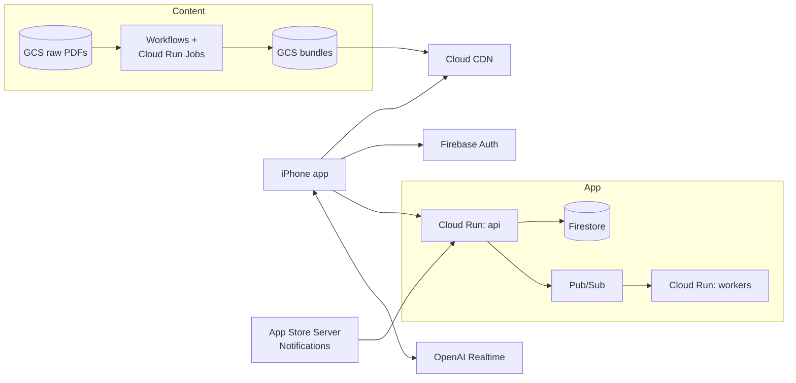
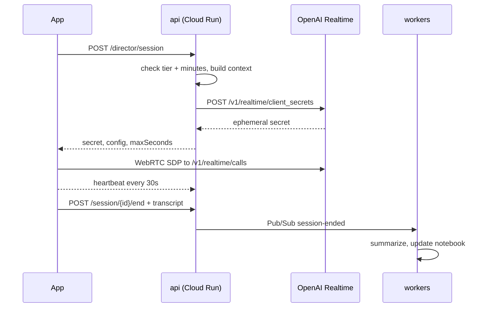
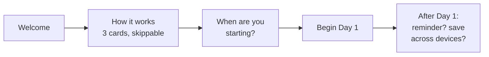

# Spiritual Exercises App: Production Technical Spec (Google Cloud)

Sep 25, 2026 · @Ben Collier

The production system runs on Google Cloud with Firebase: Cloud Run services, Firestore, Cloud Storage with Cloud CDN, and a Workflows content pipeline that uses Claude on Vertex AI. The iPhone app is SwiftUI. Pricing and features come from configuration, not code, so the default model can change without a new build. The default is the full experience free for weeks 1 to 3, a basic voice from week 4, and a premium unlock or subscription.

**Two sides, one contract.** (1) The **iPhone app** plays pre-made content and runs the live director. (2) The **AI production pipeline** turns a folder of notes and PDFs into each day's three audio sections, plus **director notes** that brief the OpenAI GPT-Live-1 director for that day. The only thing they share is the published week bundle format and `retreat.json`. Either side can be rebuilt without touching the other.

| Side | Input | Output | Runs on |
| --- | --- | --- | --- |
| 1 iPhone app | Week bundles from the CDN; the user's own data | The daily session, the journal, director conversations | SwiftUI on iPhone, plus `api`, `workers` and `voice-basic` on Cloud Run |
| 2 Production pipeline | A folder of PDFs and notes for a week | Per day: Reading, A Word for You, Text Up Close audio (premium and free voices), alignment, `content.json`, `director_notes.json` | Workflows + Cloud Run Jobs + Vertex AI + TTS providers |

## System architecture

There are three planes. The **content plane** turns PDFs into audio bundles offline. The **app plane** serves the iPhone app: accounts, sync, entitlements and director sessions. The **voice plane** is realtime audio that goes straight from the phone to OpenAI once your API has issued a short-lived key.



The phone never holds a long-lived provider key. Every paid voice minute starts with a call to `api`, which checks the user's entitlements and remaining minutes before it issues a key.

| Component | Google Cloud service | Responsibility |
| --- | --- | --- |
| Identity | Firebase Authentication (Identity Platform) | Guest accounts, sign in with Apple, Google, Microsoft or an email link; account linking |
| App database | Cloud Firestore (Native mode) | Profiles, retreat progress, journals, director memory, entitlements, usage meters |
| Files | Cloud Storage | Raw PDFs, pipeline work files, published week bundles, exported PDFs |
| Delivery | Cloud CDN in front of a GCS backend bucket, with signed URLs | Week bundles (audio + JSON + art) |
| API | Cloud Run service `api` (Node/TypeScript or Python FastAPI) | Manifest, entitlements, director tokens, metering, exports, App Store webhooks |
| Async work | Pub/Sub + Cloud Run service `workers` | Post-session memory updates, PDF exports, entitlement reconciliation |
| Basic voice | Cloud Run service `voice-basic` (WebSocket) | Cheaper director path: text LLM + Cloud Text-to-Speech |
| Content pipeline | Workflows orchestrating Cloud Run Jobs | Extract, segment, research, generate, lint, review, render, package |
| LLMs | Claude on Vertex AI (primary); Gemini on Vertex AI (OCR help, grounding, fallback) | Generation, research, memory summaries |
| OCR | Document AI OCR processor | Image-only PDFs |
| TTS | ElevenLabs API (premium narration); Cloud Text-to-Speech Chirp 3 HD (free narration and the basic director) | Narration and basic voice |
| Realtime voice | OpenAI Realtime API (GPT-Live-1 or gpt-realtime) over WebRTC | Premium director sessions |
| Config | Firebase Remote Config + a Firestore `plans` collection | Pricing, trials, feature flags, voice choices |
| Secrets | Secret Manager | OpenAI, ElevenLabs, Anthropic and App Store keys |
| Ops | Cloud Logging, Monitoring, Error Reporting, Firebase Crashlytics, Billing budgets | Observability and cost control |

## Projects, environments and infrastructure

There are three Google Cloud projects, each linked to its own Firebase project, all in one region. Everything is created by Terraform from the repo, so staging and prod are identical.

| Project | Purpose | Who uses it |
| --- | --- | --- |
| `sx-dev` | Personal sandbox; the Firebase Emulator Suite covers most local work | You, locally |
| `sx-staging` | TestFlight builds, sandbox App Store purchases, the content pipeline's review stage | TestFlight testers, reviewers |
| `sx-prod` | App Store build, production purchases, published bundles | Everyone |

**Region:** `us-east4` (Northern Virginia) for Cloud Run, Firestore, GCS and Workflows. It's close to Pittsburgh, and Claude and Gemini are available on Vertex AI in US regions. Check model availability per region when you enable them.

**Terraform modules** (`infra/`):

- `project`: APIs enabled, billing budget with alerts at 50%, 90% and 100%, and log retention.
- `firebase`: Firebase project link, Auth providers, Firestore database, rules and indexes deployment, App Check, Remote Config template.
- `storage`: buckets `raw-pdfs`, `pipeline-work`, `bundles` (CDN backend, uniform access, versioned) and `exports` (a 7-day lifecycle delete).
- `cdn`: external HTTPS load balancer, backend bucket with Cloud CDN, signed URL key.
- `run`: services `api`, `workers` and `voice-basic`; jobs `pipeline-*`; each with its own service account and least-privilege IAM.
- `pubsub`: topics `session-ended`, `export-requested`, `appstore-event` with push subscriptions to `workers`.
- `workflows`: `produce-week` definition.
- `secrets`: `OPENAI_API_KEY`, `ELEVENLABS_API_KEY`, `APPSTORE_API_KEY_P8`, `APPSTORE_ISSUER_ID`, `APPSTORE_KEY_ID`, `CDN_SIGNING_KEY`.
- `monitoring`: uptime checks on `api`, alert policies (5xx rate, latency, director-minute spend), log-based metrics.

**CI/CD**

- **Backend:** GitHub, then Cloud Build triggers. Every PR runs tests and `terraform plan`. A merge to `main` deploys to staging; a git tag deploys to prod, with Cloud Run traffic splitting for canary releases (10%, then 100%).
- **iOS:** Xcode Cloud (Apple's CI) builds on every push to `main` and uploads to TestFlight. App Store releases are manual from App Store Connect.
- **Firestore rules and indexes:** deployed by `firebase deploy --only firestore` in the same Cloud Build pipeline, with rules unit tests run against the emulator first.

## Accounts and sign-in

No one has to sign in to start. The app creates a silent guest account on first launch, and offers "Save your retreat across devices" later, at a calm moment, with one-tap providers. Linking keeps the same user ID, so nothing is lost.

**Providers (Firebase Authentication)**

| Provider | iOS SDK | Notes |
| --- | --- | --- |
| Guest | Firebase anonymous auth | Created silently at first launch; everything works |
| Sign in with Apple | AuthenticationServices (`ASAuthorizationAppleIDProvider`) + Firebase OAuth credential with a nonce | Required by App Store Review Guideline 4.8 when other social logins are offered; shown first |
| Google | GoogleSignIn-iOS (Swift Package Manager) | Standard OAuth |
| Microsoft | Firebase `OAuthProvider("microsoft.com")` | Covers Outlook, Hotmail and work accounts |
| Email link (passwordless) | Firebase email-link sign-in + Universal Link back to the app | For people with no social account; no password to forget |
| Facebook, Yahoo (later) | Firebase OAuth providers | Behind a feature flag; add only if users ask |

**Flows**

- **First launch:** `Auth.auth().signInAnonymously()`, then create `users/{uid}` with `accountType: guest`.
- **Upgrade:** `currentUser.link(with: credential)`, which keeps the UID and all data, and sets `accountType: linked`.
- **Credential already in use:** the user already has an account on another device. Sign in to that account, then run the server merge `POST /v1/account/merge`, which copies the guest's progress, journals and director memory into it with newer-wins per day. Tell the user in one sentence.
- **New device:** sign in, then the retreat, progress, journals and director memory load from Firestore, and audio bundles download from the CDN.
- **When to offer linking:** after the first completed session ("Nice start. Want to keep this safe across devices?"), and in Settings. There is never a blocking wall. Sign-in becomes required only for purchases on a second device and for director memory sync.

**Account deletion (App Store requirement).** Settings, then Delete account, which calls `DELETE /v1/account`. The server:

1. Deletes Firestore data and Storage exports.
2. Revokes the Sign in with Apple token through Apple's REST revoke endpoint, when Apple was used.
3. Deletes the Firebase Auth user and writes a tombstone for 30 days in case of billing questions.

It completes in under a minute, and the app confirms.

**Session security.** Firebase ID tokens are sent as `Authorization: Bearer` to `api` and verified with the Admin SDK. Firebase App Check with App Attest is enforced on `api`, Firestore and Storage, so only the genuine app can call them.

## Data model and sync

Firestore holds everything a user creates, under `users/{uid}`, and the iOS SDK's offline cache gives free multi-device sync. Server-owned documents (entitlements, usage meters) are written only by Cloud Run using the Admin SDK.

| Path | Fields (main ones) | Written by |
| --- | --- | --- |
| `users/{uid}` | `accountType`, `createdAt`, `timezone`, `narrationPref` (auto, premium, free), `directorVoice` (male, female), `directorDay` (0 to 6), `reminders{prayer, examen, director}`, `memoryEnabled`, `keepTranscripts` | App |
| `users/{uid}/enrollments/{retreatId}` | `startDate`, `weekStartsOn`, `pausedDays[]`, `contentVersion`, `status` | App |
| `.../enrollments/{retreatId}/days/{w02d1}` | `completedAt`, `stepsDone[]`, `highlights[{text, step, charStart, charEnd}]`, `consolation` (-2 to +2) | App |
| `users/{uid}/journal/{entryId}` | `retreatId`, `week`, `day`, `questionId`, `mode` (typed, dictated, guide), `text`, `formValues{}`, timestamps | App |
| `users/{uid}/director/notebook` | `themes[]`, `images[]`, `movementsByWeek{}`, `gracesReceived[]`, `openQuestions[]`, `returnTo[]`, `updatedAt` (each item has an id so the user can delete it) | `workers` (after a session); the app can edit or delete items |
| `users/{uid}/director/sessions/{sid}` | `startedAt`, `endedAt`, `seconds`, `voiceTier` (realtime, basic), `summary`, `summaryApproved`, `offRecord` | `api` + `workers` |
| `.../sessions/{sid}/turns/{n}` | `role`, `text`, `t` (only when `keepTranscripts` is true) | App (from the live transcript) |
| `users/{uid}/entitlements/current` | `plan`, `source` (trial, iap, subscription, promo), `premiumUntil`, `unlockedForever`, `originalTransactionId` | Server only |
| `users/{uid}/usage/{isoWeek}` | `realtimeSeconds`, `basicSeconds`, `dailyCheckins{date: seconds}` | Server only |
| `retreats/{retreatId}` | `title`, `weeks`, `contentVersion`, `manifestPath`, `publishedWeeks[]` | Pipeline |
| `plans/{planId}` | The pricing and feature rules (see the next section) | You, through Terraform or the admin script |

**Security rules (summary)**

```
match /users/{uid}/{document=**} {
  allow read: if request.auth.uid == uid;
  allow write: if request.auth.uid == uid
    && !(resource != null && resource.__name__.path.matches('.*/(entitlements|usage)/.*'));
}
match /retreats/{id} { allow read: if request.auth != null; }
match /plans/{id}    { allow read: if request.auth != null; }
```

The entitlements and usage paths are denied to clients explicitly in the real rules file, which has unit tests in `firebase/rules.test.ts`.

**Sync behavior**

- Journals, highlights and progress are small documents, so the default of last write wins per document is safe.
- Audio bundles are not in Firestore. The app caches them in Application Support and re-downloads them on a new device.
- Offline first: every write lands in the local cache and syncs later. The director is the only feature that needs a connection.

**Encryption.** Google encrypts Firestore and GCS at rest by default. Customer-managed keys (Cloud KMS CMEK) on the Firestore database and the `exports` bucket are a Terraform switch, if you want key control. Full end-to-end encryption isn't used, because the director's memory has to be readable by the server-side summarizer. Say so plainly in the privacy policy.

## Entitlements and pricing engine

The app never hardcodes a price or a limit. On launch and before every director session, the server resolves the user's **effective features** from three inputs: the active plan document, the user's trial clock and any purchases. Changing the business model, for example a 4-week trial or a subscription-only plan, is a config change, not an app release.

**The default plan**

| Weeks since trial start | Not paid | Paid (unlock or subscription) |
| --- | --- | --- |
| 1 to 3 | Full: premium narration, director on OpenAI realtime voice, 30 min a week | Full + daily check-ins (15 min/day) |
| 4 onward | Basic: free narration voices, director on the basic voice path, 30 min a week | Full + daily check-ins |

All daily content (the Reading, the Word, the Text Up Close) stays free forever. Only the voices and the director's quality change.

**Plan document** (`plans/default-2026`, also mirrored into Remote Config for the client):

```json
{
  "id": "default-2026",
  "trial": {"weeks": 3, "clock": "firstSession"},
  "tiers": {
    "full":  {"narration": "premium", "voiceGuide": true,
              "director": {"engine": "realtime", "weeklyMinutes": 30, "dailyCheckinMinutes": 0}},
    "paid":  {"inherits": "full", "director": {"dailyCheckinMinutes": 15}},
    "basic": {"narration": "free", "voiceGuide": false,
              "director": {"engine": "basic", "weeklyMinutes": 30, "dailyCheckinMinutes": 0}}
  },
  "rules": [
    {"when": "entitled", "tier": "paid"},
    {"when": "trialWeek <= trial.weeks", "tier": "full"},
    {"else": "basic"}
  ],
  "products": {
    "unlock":  "app.bencollier.exercises.unlock",
    "monthly": "app.bencollier.exercises.premium.monthly",
    "yearly":  "app.bencollier.exercises.premium.yearly"
  },
  "realtime": {"model": "gpt-live-1", "fallbackModel": "gpt-realtime", "maxSessionMinutes": 30}
}
```

- `resolveFeatures(user, plan, now)` is one pure function in `api`, with unit tests covering each rule. The app gets its result from `GET /v1/me/features` and caches it for offline use.
- Other models are just other plan documents: a 4-week trial is `trial.weeks: 4`, subscription-only drops `unlock`, and a church or group license adds a rule such as `{"when": "orgMember", "tier": "paid"}`. Users can be assigned a plan by cohort for A/B price tests.

**Trial clock (abuse-resistant).** The clock starts server-side at the user's first completed session (`trialStartedAt`), not at the retreat start date the user types, so re-starting a retreat doesn't reset it. Apple's DeviceCheck two-bit flag is set per device when a trial starts, so deleting and recreating a guest account on the same phone doesn't grant a new trial.

**Purchases (StoreKit 2)**

- Products in App Store Connect: one non-consumable **Premium Unlock**, and one subscription group with **Monthly** and **Yearly**.
- At purchase, the app passes `appAccountToken` set to a UUID derived from the Firebase UID, which ties every transaction to the account.
- After purchase, the app posts the signed transaction to `POST /v1/entitlements/verify`. `api` verifies it with Apple's App Store Server Library and writes `entitlements/current`.
- **App Store Server Notifications V2** go to `POST /v1/appstore/notifications` (a separate URL each for sandbox and production). They handle renewals, expirations, refunds and revocations, and are re-verified and published to `appstore-event` for `workers`.
- **Restore Purchases** in Settings calls `AppStore.sync()` and then verify again.

**Week 4, gently.** When the trial ends, Today shows one soft card: "Your first three weeks included our premium voices. You can keep going free with standard voices, or unlock premium." It has two equal buttons and a quiet "Not now". It's shown once, then lives in Settings. Nothing is ever locked mid-session: a downgrade takes effect at the next session boundary.

## Backend services on Cloud Run

Three services and one set of jobs. `api` is the only public HTTP surface besides the CDN and `voice-basic`. All of it is stateless: the state lives in Firestore.

| Service | Runtime | Scaling | Exposed |
| --- | --- | --- | --- |
| `api` | TypeScript (Fastify) or Python (FastAPI), with the Firebase Admin SDK and the App Store Server Library | Min 1 instance in prod (no cold starts on the director button), max 20 | Public HTTPS, App Check + Firebase ID token required |
| `workers` | Same codebase, different entry point | 0 to 10, triggered by Pub/Sub push | Private (Pub/Sub only) |
| `voice-basic` | Python with WebSockets, session affinity on | 0 to 20, 60-minute request timeout | Public WSS, token required |
| `pipeline-*` jobs | Python containers | Run on demand by Workflows | None |

**`api` endpoints (v1)**

| Method and path | Purpose |
| --- | --- |
| `GET /v1/me/features` | The resolved tier, limits, voices, minutes left this week and today, and trial week |
| `GET /v1/retreats/{id}/manifest` | `retreat.json`, plus signed CDN URLs for the weeks this user can open now (current + next) |
| `POST /v1/director/session` | Starts a director session: checks entitlements and minutes, builds the context pack (notebook + recent summaries + today), and returns either an OpenAI ephemeral client secret with session config (realtime) or a signed `voice-basic` URL (basic), with `sessionId` and `maxSeconds` |
| `POST /v1/director/session/{id}/heartbeat` | Every 30 s: adds the elapsed seconds to the usage meter and returns the remaining seconds, so the client can wind down gracefully |
| `POST /v1/director/session/{id}/end` | Closes the meter, then publishes `session-ended` with the transcript reference so `workers` can update memory |
| `POST /v1/director/export` | Starts a PDF export for a date range; responds with a job id, and a push notification plus a signed URL when it's ready |
| `POST /v1/entitlements/verify` | Verifies a StoreKit 2 signed transaction and writes the entitlements |
| `POST /v1/appstore/notifications` | App Store Server Notifications V2 webhook (signature verified; no user auth) |
| `POST /v1/account/merge` | Merges guest data into an existing account after a credential conflict |
| `DELETE /v1/account` | Full account deletion, including the Apple token revoke |
| `GET /v1/health` | Uptime check |

**`workers` topics**

- `session-ended`: summarize the session with Claude on Vertex AI, update the notebook (merge new themes, movements and open questions, with each item traceable to a session), and write `summary` for the user to approve.
- `export-requested`: fill the export template from the notebook, approved summaries and quotes; render a PDF (WeasyPrint); store it in `exports/` with a 7-day TTL.
- `appstore-event`: reconcile entitlements and handle refunds and expirations.
- A nightly **Cloud Scheduler** job: reconcile subscriptions with the App Store Server API, and alert on meter anomalies.

**Errors and limits.** Every endpoint returns `{error: {code, message}}`. There's a per-user rate limit of 60 requests a minute, with Cloud Armor on the load balancer for abuse. Director session creation is idempotent per client request id.

## Spiritual director runtime

There are two engines behind one persona. **Realtime** (OpenAI, full-duplex, the best voice) runs during the trial and for paid users. **Basic** (on-device speech-to-text, a text LLM on Vertex AI, and Cloud Text-to-Speech) runs for free users from week 4. The app picks the engine from `/v1/director/session`, never on its own.

**Realtime session sequence**



The secret is minted with the whole session config (model, voice, instructions carrying the context pack, and turn detection). So the phone can't change the director's instructions or voice.

**Session config, built server-side**

- **Model:** `plan.realtime.model` (GPT-Live-1), falling back to gpt-realtime if it's unavailable.
- **Voice:** from `plans.directorVoices`, for example `{"male": {"openai": "<audition pick>", "google": "<Chirp 3 HD pick>"}, "female": {...}}`. The user chose male or female at onboarding. Both engines map to a matching pair, so the director sounds as close as possible across a downgrade.
- **Instructions:** the director system prompt (persona, Ignatian lens, pacing rules, one question at a time, 80/20 listening, crisis protocol, never claims to be God, a priest or human) plus the **context pack**:
  - retreat week, day, grace and today's passage
  - today's highlights and journal lines, if shared
  - the director notebook (about 1,500 tokens max)
  - the last 3 approved session summaries
  - up to 5 relevant excerpts from older sessions, found with Firestore vector search over session-summary embeddings (Vertex AI text embeddings)
- **Transcription:** input transcription is on, so the app can save turns and send the transcript at the end.
- **Time:** the app shows a soft 5-minute warning and asks the director to begin closing at `maxSeconds - 120`. The server meter is authoritative, and each new session gets only the remaining minutes. A nightly job compares metered seconds to OpenAI usage.

The context pack also includes **today's director notes** from the pipeline: movements to listen for, questions, scripture echoes, cautions and growth markers. On a day the user doesn't do a session, the director uses the most recent day they completed. The pack is assembled in `api` from the published bundle, and adds about 600 tokens.

**Basic engine (`voice-basic`)**

1. The app records with on-device speech recognition (Speech framework), with voice-activity detection or tap-to-talk, and sends each finished user turn as text over WSS.
2. `voice-basic` streams the reply from a fast text model on Vertex AI (Claude Haiku or Gemini Flash) with the same persona and context pack.
3. The reply is split into sentences and each is synthesized with Cloud Text-to-Speech (Chirp 3 HD, the matching director voice), then streamed back as audio chunks.

The target is about 2 s from the end of your speech to the first audio. It feels like a thoughtful pause, which suits a director.

**Memory update (`workers`, after every session)**

1. Claude on Vertex AI reads the transcript, the current notebook and the retreat context, and returns a JSON patch: new or updated themes, images, movements for this week, graces, open questions and "return to" items. Every item cites the session id.
2. A 5 to 10 line session summary is written with `summaryApproved: false`. The app shows it next time: "Here's what I'll remember. Edit or remove anything."
3. The summary is embedded (Vertex AI text embeddings) and stored for vector search.
4. If `keepTranscripts` is off, the transcript is deleted after steps 1 to 3. `offRecord` sessions skip all of this.

**Exports.** "Summarize my retreat so far" or "make something for my prayer partner" (spoken, or a button) calls `POST /v1/director/export`. `workers` builds a 1 to 3 page PDF: the date range, the graces, the themes, consolations and desolations by week, the user's approved quotes, and 3 to 5 questions to bring to a human director. The user gets it through the share sheet.

**Safety.** The crisis protocol is in the instructions for both engines. `workers` also runs a post-session classifier on each transcript. If it flags risk, the next app open shows resources gently (988 in the US) and never locks anything. The flags are stored only as a boolean on the session.

## Content pipeline on Google Cloud

One Workflows definition, `produce-week`, runs a week end to end. Each step is a Cloud Run Job container that reads from and writes to `gs://sx-{env}-pipeline-work/{retreat}/w{NN}/`, so any step can be re-run alone. The human review step pauses the workflow until you approve.

| Step | Job | Tools | Output |
| --- | --- | --- | --- |
| 1 Extract | `pipeline-extract` | `pdftotext -layout` (poppler); Document AI OCR for pages with no text layer; strip footers and form feeds | `raw.txt`, page PNGs |
| 2 Segment | `pipeline-segment` | Claude on Vertex AI with a strict JSON schema: unit title, graces, intro, 7 days (type, heading, reference, verbatim text) | `unit.json` |
| 3 Research | `pipeline-research` (7 in parallel) | Claude on Vertex AI with a web search tool, or Gemini with Google Search grounding; a claims list with URLs; unverifiable claims dropped | `dDD/research.json` |
| 4 Generate | `pipeline-generate` (parallel) | Claude on Vertex AI, with house-style prompts and the Bridges PU2 to PU4 reflections as few-shot examples | `dDD/content.json` |
| 5 Lint | `pipeline-lint` | Python rules (em dashes, digits and colons in spoken text, parentheses, banned phrases, length), plus an LLM check that every Up Close claim maps to research | `lint.json`; failures go back to step 4 twice, then to human review with flags |
| 6 Review | `pipeline-review` | One Google Doc per day in a review folder (Drive API), plus a Firestore `reviews/{week}` doc. The Workflows step waits on a callback that is triggered by `sx approve w02` or a click in the small admin page | `approved: true` per day |
| 7 Render | `pipeline-render` | ElevenLabs API (premium R/W/U) and Cloud Text-to-Speech Chirp 3 HD (free R/W/U); `ffmpeg loudnorm` to -16 LUFS; word timings from ElevenLabs timestamps, or from Cloud Speech-to-Text word offsets on the rendered file | `audio/{premium,free}/{R,W,U}.m4a`, `alignment.json` |
| 8 Package | `pipeline-package` | Zip, SHA-256 and upload to `gs://sx-{env}-bundles/`, update `retreats/{id}.publishedWeeks`, invalidate the CDN path | Week bundle live |

**Producing the first four weeks**

| Week | Source PDFs (Bridges Program folder) | Starting point | Work left |
| --- | --- | --- | --- |
| 1 | `0-PrepDays.prelim - rev 1.pdf`, `1-PrepDays.PU1 - rev 1.pdf` | "Bridges PU1 - Close Reading" and "Bridges PU1 - Listen" docs already exist | Import existing text as step 4 drafts; run lint, review, render |
| 2 | `2-PrepDays.PU2`, Dossier Worksheet, Dossier Alternative, Meditation on My Birth (OCR) | 7 day docs and the Listen doc exist | Add the Dossier form definition; import, lint, review, render |
| 3 | `3-PrepDays.PU3` | 7 day docs and the Listen doc exist | Import, lint, review, render |
| 4 | `4-PrepDays.PU4` | 7 day docs and the Listen doc exist | Add the "write your own Principle and Foundation" form; import, lint, review, render |

An `import-existing` mode for step 4 reads the Google Docs you already have ("The text up close" and "For listening" sections) instead of generating new text. Weeks 1 to 4 therefore mostly need Up Close spoken cuts, reflection questions, pause words, lint, your review and rendering.

**Run it:**

```
gcloud storage cp *.pdf gs://sx-staging-raw-pdfs/bridges-2026-27/
sx pipeline run --retreat bridges-2026-27 --weeks 1-4 --mode import-existing
sx review open w01      # opens the review docs
sx approve w01 w02 w03 w04
sx publish --env prod --weeks 1-4
```

**Time and cost for weeks 1 to 4.** 28 days at about 12,500 characters each is about 350,000 characters per voice set. That's roughly $35 on ElevenLabs and $10 or less on Chirp 3 HD (within the free monthly allowance). LLM work for the gaps is tens of dollars. Wall-clock time is about 2 hours of pipeline plus your review time.

**Voice audition.** `sx voices audition --candidates voices.yaml` renders a psalm, a Word paragraph and an Up Close paragraph with every candidate voice into one review page. You write your six narrator picks and two director picks into `retreat.json` and `plans.directorVoices`.

### Director notes (a pipeline output per day)

Step 4 also writes `dDD/director_notes.json`: a private briefing for the live director, never read aloud. It turns each day's scripture and the week's grace into what a trained director would have in mind before meeting a retreatant that evening. It's reviewed in step 6 with the rest of the day and ships inside the week bundle. `api` reads its server-side copy from `gs://sx-{env}-bundles/` when it builds the context pack, so the phone never needs to send it.

```json
{
  "week": 2, "day": 3, "type": "activity",
  "grace": "wonder at God's ongoing creation; gratitude for the gift of myself",
  "what_the_day_asks": "Pray over your own vital statistics as evidence of God's choices for you.",
  "movements_to_listen_for": [
    {"sign": "gratitude for particular people or places", "likely": "consolation"},
    {"sign": "resentment about family, body or temperament they did not choose", "likely": "desolation", "note": "do not rush to fix; ask where God was in it"}
  ],
  "opening_questions": [
    "What did you notice as you wrote down where you were born?",
    "Which trait on your list surprised you?"
  ],
  "follow_up_questions": [
    "If God chose that detail on purpose, what might it say about how you are loved?",
    "Where did you feel resistance?"
  ],
  "scripture_echoes": ["Psalm 139:13-16", "Jeremiah 1:5"],
  "ignatian_notes": ["Rules for discernment, first week: name desolation without arguing with it (SpEx 318-319)"],
  "cautions": ["This day can surface family pain, adoption, loss or abuse. Stay gentle, do not probe, and use the crisis protocol if needed."],
  "growth_markers": ["Speaks of self as given rather than earned", "Names a trait with gratitude that they previously disliked"],
  "closing_grace_to_offer": "You were not an accident."
}
```

The generation prompt for director notes asks for what to listen for, not what to say: movements, questions, echoes, cautions and growth markers. That keeps the live director responsive to the person instead of delivering a script. Repetition and Review days get notes built from the whole week ("compare today's language with days 1 to 5").

## iOS app architecture

This is a SwiftUI app targeting iOS 17 and later. It's split into local Swift packages so each piece can be built and tested alone, with the app target doing little more than wiring them together.

| Package | Responsibility | Key frameworks |
| --- | --- | --- |
| `AppCore` | Models, day math, feature resolution cache, dependency container | Foundation, Observation |
| `Account` | Guest sign-in, provider sign-in and linking, merge, delete | FirebaseAuth, AuthenticationServices, GoogleSignIn |
| `Sync` | Firestore repositories for the user, enrollment, days, journal and director docs | FirebaseFirestore (offline cache on) |
| `Content` | Manifest fetch, week bundle download and verification (SHA-256), local cache | URLSession background downloads |
| `Player` | The eight-step session engine, silence, time-stretch, highlights, lock-screen controls | AVFoundation (AVAudioEngine, AVAudioUnitTimePitch), MediaPlayer |
| `Journal` | Editor, dictation, activity forms, consolation slider | Speech, SwiftData (draft cache) |
| `Director` | Engine-agnostic session UI; `RealtimeEngine` (WebRTC) and `BasicEngine` (WebSocket) behind one protocol; heartbeat; transcript capture | WebRTC (SPM binary package), URLSessionWebSocketTask, Speech, AVAudioSession |
| `Store` | Products, purchase, restore, transaction updates to verify | StoreKit 2 |
| `DesignSystem` | Type, color, the step rail, cards, the breathing animation | SwiftUI |

**Third-party packages (Swift Package Manager):** `firebase-ios-sdk` (Auth, Firestore, AppCheck, RemoteConfig, Crashlytics, Messaging), `GoogleSignIn-iOS`, and a WebRTC binary package. That's all.

**Capabilities (Xcode, then Signing and Capabilities)**

- Sign in with Apple
- Background Modes: Audio (sessions play with the screen locked), Background fetch
- Push Notifications, for export-ready and reminders from the server
- App Attest, for Firebase App Check
- Associated Domains, for email-link sign-in (`applinks:links.yourdomain`)
- In-App Purchase

**Onboarding: low pressure, about 60 seconds**



1. **Welcome:** "You're welcome here. There's no wrong way to do this." A soft image and one Begin button. No account, no paywall, no permission prompts.
2. **How it works:** three swipeable cards (each day is read to you; you pause and reflect; a guide is there if you want to talk). "Skip" is visible.
3. **Start date:** "When would you like to begin?" It defaults to today, with the option to pick a date or say "this past Monday".
4. **Begin Day 1** straight away.
5. **Only after the first session** does the app ask about a daily reminder (the notification permission prompt appears then, in context), offer to save the retreat across devices (the providers sheet), and mention the director ("When you'd like to talk something through, I'm here. Pick a voice anytime").

The director voice picker, narration voice and everything else live in Settings, never as blocking steps.

**App start sequence.** Configure Firebase, then App Check, then an anonymous sign-in if there's no user. Load cached features and the manifest, and show Today immediately. Refresh `/v1/me/features` and the manifest in the background, and prefetch the current and next week's bundles on Wi-Fi.

## Local development, iPhone testing and App Store delivery

This section is the path from an empty Mac to the app on your own iPhone, then TestFlight, then the App Store. Do the one-time setup once. The daily loop is the last part.

**One-time setup: tools on your Mac**

- Xcode (current release) from the Mac App Store, plus the command line tools
- Homebrew, then `brew install google-cloud-sdk terraform node python@3.12 poppler ffmpeg`
- `npm i -g firebase-tools`
- Docker Desktop or Colima, to build Cloud Run containers locally
- A GitHub repo (private) with the layout in the last section

**One-time setup: Apple**

1. **Apple Developer Program** membership ($99 a year). Enroll as an organization (for example Hot Metal Data LLC) if you want the company name on the App Store listing; that needs a D-U-N-S number.
2. **Certificates, Identifiers and Profiles:** register the App ID (for example `app.bencollier.exercises`) with the capabilities listed above. Xcode's automatic signing creates the certificates and profiles.
3. **App Store Connect:**
   - create the app record
   - accept the **Paid Apps** agreement and add tax and banking, which is required before in-app purchases work, even in sandbox
   - create the Premium Unlock and the subscription group with Monthly and Yearly
   - add sandbox tester accounts
4. **Keys:**
   - an **In-App Purchase / App Store Server API key** (.p8), plus its key id and issuer id, into Secret Manager
   - a **Sign in with Apple key**, for Firebase and for token revocation on account deletion
   - set the App Store Server Notifications V2 URLs (sandbox: staging `api`; production: prod `api`)

**One-time setup: Google Cloud and Firebase**

1. `terraform -chdir=infra/envs/staging apply` (then dev and prod) creates the projects, APIs, buckets, services, Workflows and secrets skeleton.
2. In the Firebase console for each environment:
   - add the iOS app and download its `GoogleService-Info.plist`
   - enable the Apple, Google, Microsoft and email-link providers
   - Microsoft needs an app registration in the Microsoft Entra admin center (client id and secret)
3. Register App Attest with App Check. Add a **debug token** for the Simulator and your development iPhone, so App Check passes in Debug builds.
4. `gcloud secrets versions add OPENAI_API_KEY --data-file=-` (the same for ElevenLabs and the App Store keys).
5. Enable Claude models on Vertex AI (Model Garden) in the project and region, and request quota if needed.

**Build configurations.** There are three schemes, each with its own plist and bundle id suffix, so all three can sit on your phone together.

| Scheme | Backend | Purchases | Bundle id |
| --- | --- | --- | --- |
| Debug-Local | Firebase Emulator Suite + `api` on your Mac | StoreKit configuration file (no Apple servers) | `.dev` |
| Debug-Staging | `sx-staging` | Sandbox | `.staging` |
| Release | `sx-prod` | Production | (none) |

**Daily loop: run on your iPhone**

1. `firebase emulators:start --only auth,firestore,storage,pubsub` in one terminal.
2. `cd services/api && npm run dev`, which points at the emulators and uses your dev OpenAI key.
3. In Xcode, pick the **Debug-Local** scheme. The app reads the Mac's LAN IP from `Local.xcconfig`, so your phone can reach the emulators over Wi-Fi.
4. Plug in the iPhone (after the first pairing, Wi-Fi works too), choose it as the run destination, and press Run.
   - The first time, iOS asks you to turn on **Developer Mode** on the phone and restart.
   - Trust the developer certificate when prompted.
5. Test purchases locally with the `.storekit` configuration file: buy, refund, expire and renew in seconds, from Xcode's transaction manager.
6. Test the director for real (it needs the network): the realtime engine against OpenAI with your dev key, and the basic engine against `voice-basic` running locally or on staging.

**Tests**

- Unit tests per Swift package (day math, feature cache, player step machine).
- UI tests for onboarding and a full session in fast-forward mode.
- Backend unit tests, including `resolveFeatures` for every plan rule; Firestore rules tests against the emulator.
- A scripted director evaluation set: 30 conversations, including crisis cases, run before every director prompt change.

**TestFlight**

1. Set the version and build number, choose Any iOS Device, then **Product > Archive**.
2. In the Organizer, **Distribute App > App Store Connect > Upload**. Xcode Cloud can do this automatically on every push to `main`.
3. After processing (usually minutes), add yourself and family as **internal testers**; they install from the TestFlight app. External testers, such as your cohort, need a one-time Beta App Review.
4. TestFlight builds use the **sandbox** App Store, so purchases are free, and the staging backend.

**App Store submission checklist**

- Screenshots for the required iPhone sizes, a description, keywords, a support URL and a privacy policy URL.
- The App Privacy "nutrition label": identifiers (user id), user content (journals and director transcripts, linked to the user, not used for tracking), audio data (sent to the provider for live sessions), purchases, crash data.
- Review notes: explain guest mode (no login needed), the AI voice companion and its crisis handling, and how to reach the director in a test session.
- Subscriptions show price, period and auto-renew terms next to the buy button, with links to the Terms and Privacy Policy.
- Export compliance: standard HTTPS only, so set `ITSAppUsesNonExemptEncryption` to NO in Info.plist.
- The guideline checks most likely to matter: 4.8 (Sign in with Apple offered alongside Google and Microsoft), 5.1.1(v) (in-app account deletion), 3.1.1 (in-app purchase for digital unlocks) and 3.1.2 (subscription disclosures).

## Security, privacy, observability and cost

**Security**

- Each Cloud Run service and job has its own service account, with only the roles it needs. For example, `api` can read and write Firestore and publish to Pub/Sub, but can't read raw PDFs.
- All provider keys live in Secret Manager and are mounted as env vars at deploy. Nothing secret is in the app binary.
- Firebase App Check (App Attest) is enforced on `api`, Firestore and Storage. Cloud Armor rate-limits the load balancer.
- Director realtime keys are ephemeral and minted per session with a fixed config. The phone can't choose the model, the voice or the instructions.
- Backups: Firestore point-in-time recovery (7 days), plus a weekly scheduled export to a locked GCS bucket.

**Privacy**

- Guest by default: no email or name is needed to use the app.
- Director audio goes to OpenAI only during a live session. Confirm the API data retention settings for the account and state them in the privacy policy. Basic-engine audio never leaves the phone; only text turns do.
- Transcripts are kept only if the user turns on "keep transcripts". Otherwise they are deleted after the memory update. The notebook is user-visible and editable, and off-record sessions are never stored.
- Export all my data (JSON + PDFs) and Delete account are both in Settings.

**Observability**

- Structured JSON logs with a request id, from the app through `api` to `workers`. Cloud Trace on `api`.
- Dashboards: director sessions started and finished, minutes by engine, session start latency, `api` p95 latency and 5xx rate, pipeline run status, Crashlytics crash-free users.
- SLOs:
  - `api` p95 under 300 ms
  - director session ready in under 2 s (realtime) and under 3 s (basic)
  - 99.5% monthly availability
- **Cost guardrails:**
  - billing budgets with alerts
  - a daily metric for realtime minutes against a threshold
  - a Remote Config kill switch, `director.realtime.enabled`, which moves everyone to the basic engine instantly if spend spikes

**Rough monthly cost at 1,000 active users** (check each provider's pricing page before launch)

| Cost driver | Basis | Rough monthly |
| --- | --- | --- |
| Realtime director, trial users | At least $0.05/min (GPT-Live-1 voice layer) plus the backend model; up to 90 min per new user over 3 weeks | At least $4.50 per new trial user who uses every minute; plan on 30 to 50% usage |
| Realtime director, paid users | Up to 30 min/week + 15 min/day | This sets the minimum subscription price; meter it in beta |
| Basic director, free users from week 4 | Text LLM + Chirp 3 HD, about $0.30 to $0.70 per 30-minute session | About $1 to $3 per active free user |
| Narration audio delivery | About 1.5 GB per user per full retreat at 64 kbps | CDN egress, small per user |
| Cloud Run, Firestore, Pub/Sub, logging | api kept warm with 1 instance; light reads and writes | Tens of dollars |
| Content production | Once per retreat, about $300 for two voice sets + LLM | One-time |

The realtime director is almost all of the variable cost, which is why the pricing engine controls its minutes and engine, not the content.

## Repository layout, build order and launch checklist

There is one monorepo with the two sides in separate top-level folders, plus a shared `contracts/` folder holding the bundle schema both sides validate against.

```
exercises/
  contracts/                 # shared: JSON Schemas for retreat.json, content.json, director_notes.json, plans
  ios/                       # SIDE 1: the iPhone app
    Exercises.xcodeproj
    Packages/ AppCore Account Sync Content Player Journal Director Store DesignSystem
    Config/ Local.xcconfig Staging.xcconfig Release.xcconfig
    Exercises.storekit       # local purchase testing
  services/                  # SIDE 1 backend
    api/ workers/ voice-basic/
    prompts/director/        # director system prompt + eval conversations
  pipeline/                  # SIDE 2: the production pipeline
    jobs/ extract segment research generate lint review render package
    prompts/ word_for_you.md up_close.md questions.md director_notes.md
    fewshot/ bridges_pu2 bridges_pu3 bridges_pu4
    workflows/produce-week.yaml
    cli/sx                   # sx pipeline | review | approve | publish | voices
  firebase/ firestore.rules firestore.indexes.json rules.test.ts remoteconfig.template.json
  infra/ modules/ envs/{dev,staging,prod}
  .github/ + cloudbuild/     # backend CI; Xcode Cloud config lives in App Store Connect
```

**Build order (about 10 to 12 weeks for one developer with an AI coding assistant)**

| Phase | Side | Deliverable | Length |
| --- | --- | --- | --- |
| 1 Contracts + infra | Both | JSON Schemas, Terraform for staging, Firebase projects, secrets | 1 week |
| 2 Pipeline v1 | 2 | Steps 1 to 8 with `import-existing`; voice audition; Weeks 1 to 4 published to staging, with director notes | 2 weeks |
| 3 Player | 1 | Onboarding, Today, the eight-step player with offline bundles; guest auth | 2 weeks |
| 4 Journal + sync | 1 | Journal modes, forms, Firestore sync, provider linking, account deletion | 1.5 weeks |
| 5 Director | 1 | `api` session endpoints, realtime engine, memory workers, exports, basic engine | 2.5 weeks |
| 6 Pricing | 1 | Plans + `resolveFeatures`, StoreKit 2, App Store notifications, the week-4 card | 1 week |
| 7 Hardening | Both | Director eval set, crisis tests, observability, cost kill switch, prod Terraform | 1 week |
| 8 TestFlight beta | Both | Internal, then a cohort of 10 to 20; meter real minutes; tune prices | 3 to 4 weeks |

**Launch checklist**

- [ ] Program permission, or public-domain texts, for everything in Weeks 1 to 4
- [ ] Six narrator voices and two director voices chosen by audition; commercial rights confirmed (paid ElevenLabs plan)
- [ ] Weeks 1 to 4 approved in review and published to prod, with bundles verified on a real device offline
- [ ] `plans/default-2026` set (trial weeks, minutes, product ids) and mirrored to Remote Config
- [ ] App Store Connect: Paid Apps agreement, products approved with the build, notification URLs set, privacy label, review notes
- [ ] Account deletion, Apple token revoke and data export all tested end to end
- [ ] Director eval set passing, including crisis cases; 988 copy reviewed
- [ ] Budgets, the realtime-minutes alert and the `director.realtime.enabled` kill switch tested
- [ ] Privacy policy and terms live, stating AI narration, the AI director and data handling plainly

## Sources

- [OpenAI: Realtime API with WebRTC](https://developers.openai.com/api/docs/guides/realtime-webrtc)
- [OpenAI: Realtime conversations guide](https://developers.openai.com/api/docs/guides/realtime-conversations)
- [OpenAI: GPT-Live-1 in the API](https://openai.com/index/introducing-gpt-live-1-in-the-api/)
- [ElevenLabs API pricing](https://elevenlabs.io/pricing/api)
- [Google Cloud Text-to-Speech pricing](https://cloud.google.com/text-to-speech/pricing)
